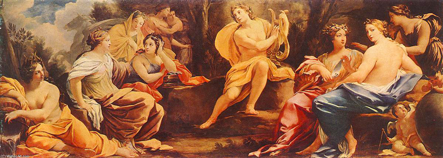

---
output:
  bookdown::pdf_document2:
    template: templates/brief_template.tex
    citation_package: biblatex
  bookdown::gitbook:
    css: templates/style.css
    config:
      download: pdf
      sharing:
        facebook: no
        twitter: no
        all: no
  bookdown::html_document2: default
  bookdown::word_document2: default
documentclass: book
#bibliography: [bibliography/references.bib, bibliography/additional-references.bib]
---

# Aproximación á Historia da Música {-}

```{=tex}
\adjustmtc
\markboth{Aproximación á Historia da Música}{}
```

<!-- IMPORTANTE, incluir despois de capítulos non numerados.
Evita que o índice de capítulos e encabezamentos amose os textos do capítulo anterior.
-->

<!-- CITA DE INICIO DE CAPÍTULO (só pdf) -->

```{block type='savequote', quote_author='(ref:cita-dante)', include=knitr::is_latex_output()}
O obxetivo de toda obra artística é axudar a cantos viven neste mundo a abandonar as súas miserias e conducilos á verdadeira felicidade...
```

(ref:cita-dante) --- Dante Alighieri. *Carta al Gran Can de la Scala de Verona*, no preámbulo ao Paraíso.

<!-- 
Notes for adding an opening quote in PDF output:
i) add the reference for the quote with the chunk option quote_author="my author name",
ii) include=knitr::opts_knit$get('rmarkdown.pandoc.to') == 'latex' means that these quotes are only included when output is latex (in HTML output, it would appear by the end of the previous page)
iii) You can't use markdown syntax inside chunk options, so if you want to e.g. italicise a book name in the quote reference use a 'text reference': Create a named piece of text with '(ref:label-name) My text', then link to this in the chunk option with quote_author='(ref:label-name)'
-->


<!-- PENDIENTE: Mover ao apartado PRESENTACIÓN!

A finalidade da Historia da Música é escoitar música, captar as características das distintas correntes estéticas de cada época, comprender a música e relacionala coas correntes estéticas, comprender e coñecer os feitos históricos e movementos socioculturais máis destacados así como o contexto no que se orixinaron, permite valorar a importancia que a música ten na sociedade e igualmente a relación entre a música e o resto de artes.

Comezamos este curso facendo un percorrido histórico, artístico e musical polas épocas anteriores á actual, coa finalidade de coñecer e comprender mellor a música e os elementos que forman parte dunha obra de arte musical. Faremos un percorrido pola música de diferentes épocas e civilizacións, centrándonos na música occidental e a súa evolución ata os nosos días, tendo en conta a importanacia da cultura musical na Península Ibérica e igualmente en Galicia.  

Nos primeiros capítulos, trataremos a orixe da música e a música na prehistoria, prestando especial atención ás primeiras evidencias conservadas de música escrita que foron descifradas e comprendidas (desde a idade da memoria); veremos as principais teorías sobre música da Antigüidade e finalmente trataremos en profundidade a evolución da música escrita desde a Idade Media (idade da notación) ata o Renacemento.
-->

## Definicións e conceptos previos {-} 

O concepto de «música» recibe diferentes tratamentos e acepcións ao longo da historia; as definicións sobre o concepto e significado son moitas e variadas. A pesares de ser algo do que vivimos rodeados, non existe polo momento unha definición única, universal e consensuada que transmita o seu significado; as diferentes culturas e sociedades do mundo actual, teñen ideas dispares sobre a música ao igual que ocorre nas civilizacións de épocas anteriores á actual.  

A música[^def:mousike], na mitoloxía grega, era considerada unha *tekné* (técnica, habilidade, destreza, arte…) que engloba tanto a artistas como teóricos. Nos períodos heleno e helenístico, a música terá un papel central na sociedade civil e relixiosa da época, promovendo o entretemento e formando parte de razoamentos científico-filosóficos. Platón, (entre os séculos V-VI a.c) concibe a música como a "arte educativa por excelencia que se insire na alma e forma a virtude"; no século VI, Boecio percibe a música como a "habilidade de examinar [...] a diversidade de sons [...] por medio da razón e os sentidos". Santo Tomás no século XIII, considera a música como "a máis noble das ciencias humanas [...] que ocupa o primeiro lugar entre as artes liberais". Xa no século XVIII, Rousseau plantea a música como "a arte de combinar sons de xeito agradable ó oído". Pau Casals (s.XIX-XX), mantiña que "a música, esa marabillosa linguaxe universal, debería ser unha fonte de comunicación". 

As percepcións sobre a música varian ao longo do tempo, a pesares de manter todas rasgos comúns. Non será ata os anos noventa do século XX, cando se establezan as primeiras definicións concretas e complexas sobre este concepto. Musicólogos, etnomusicólogos e investigadores coinciden en moitos aspectos sobre a música. Neste sentido, a profesora López Cobas afirma:

>
As definicións e conceptos sobre música eran difusos e dependían, en grande medida, da época, o lugar e sobre todo, dos diferentes puntos de vista. Durante a Idade Media os trobadores e músicos ambulantes non eran considerados músicos coma hoxe en día, senón filósofos, capaces de manexar os conceptos teóricos de harmonía. [...]  
Non obstante, [...] as definicións de música poden ser moi variadas e complexas, xa que existe unha multiplicidade de enfoques que non fan máis que apoiar o feito de que o fenómeno musical é unha manifestación de grande riqueza[^ref:lopez-cobas-musica].  

### A música como linguaxe universal {-}

O ser humano sinte a necesidade de expresarse e comunicarse. A música, como o resto de artes, é unha linguaxe a través da que expresarnos e comunicarnos. É un medio de comunicación e, ao igual que un idioma emprega a palabra para crear estruturas gramaticais, a música emprega o son e as súas múltiples combinacións para expresar ideas, sentimentos, conceptos, etc. A mensaxe musical, abrangue aspectos e disciplinas variadas:

> 
[...] en realidade, a definición de Música esténdese moito máis alá destes límites desde o mesmo momento en que por primeira vez o home emitiu un son valéndose dun instrumento. Esas harmonías e melodías non só eran un son belo, unha expresión de Beleza, senón que estableceron unha forma de linguaxe, unha nova maneira de expresarse e de sentir, así como de transmitir sensacións, imaxes e conceptos que abarcan desde a simple intención de comunicarse, ata a Filosofía, a Política, a Ética ou os complicados principios  cosmolóxicos, sen esquecer o papel tan importante que desempeñou dentro da Relixión ao longo da historia. Por todo iso, a Música é merecedora de ser considerada unha forma de linguaxe, así como unha disciplina científica e o seu estudo é necesario para coñecer o desenvolvemento dunha parcela da cultura do ser humano e comprender mellor a evolución do mesmo dentro da historia e a súa necesidade de comunicación.[^ref:gutierrez-macho]

Considerada como arte, ciencia e linguaxe universal, sabemos que é un medio de expresión sen límites capaz de chegar ao máis íntimo de cada persoa, de transmitir diferentes estados de ánimo e emocións. Escoitar e facer música, desenvolve a sensibilidade, a creatividade e a capacidade de abstracción ou análise:

>  
Propícianos a descubrir o noso propio mundo interior, a comunicación con “o outro” ou “os outros” e a captación e apreciación do mundo que nos rodea. A música, xa sexa mediante o comportamento de interpretación, de escoita ou de composición, se esta é adecuada, condúcenos a unha "reharmonización" do estado de ánimo e dos sentimentos.[^ref:josefa-moreno]

### A creación artístico-musical {-}
<!--TODO: IMAXE SOBRE ARTE ABSTRACTA, ETC.-->

A música é unha **arte abstracta** que posúe un grao de abstracción superior a calquera outra, e polo tanto, é unha **arte espiritual**, **humana** e **universal**. Precisa, certos coñecementos específicos para chegar a comprender plenamente a realidade científica que lle da forma; é unha **arte dinámica**[^cita:arte-estatica], que transcorre no tempo; o oínte, necesita ir interiorizando[^cita:memoria-auditiva] a obra a medida que a escoita, para así poder captala íntegramente; por iso, é unha **arte viva**[^cita:arte-viva] capaz de facer presente calquera tempo histórico.

>
Coas palabras dinse cousas humanas; coa música exprésase iso que ninguén coñece nin pode definir, pero que en todos existe en maior ou menor forza. A música é a arte por natureza. Podería dicirse que é o campo eterno das ideas... Para poder falar dela, necesítase unha gran preparación espiritual e, sobre todo, estar unido intimamente aos seus segredos.[^cita:Lorca-musica]

Cando afirmamos que a música é ciencia e arte ao mesmo tempo, referímonos a que dunha mesma obra podemos facer unha análise rigurosa, ténica, formal, estilística, etc. e igualmente, disfrutar do pracer estético de escoitar sen máis. Polo tanto, estes dous aspectos ---científico e artístico--- chegan nun todo: a obra de arte musical. 

### Perspectivas e significado da «música» {-}
<!--TODO: PENDIENTE DE METER IMAXES-->

Ao longo da historia, existen diversos puntos de vista ou perspectivas sobre a música. Para comprender o concepto e a importancia que esta terá sobre a sociedade de cada época, compre coñecer algunhas das reflexións que darán lugar ás diferentes concepcións sobre música que hoxe coñecemos. 

Música como ciencia.
:    Pitágoras, filósofo grego do século V a.c. afirmaba:  
"os números son as cousas; agora ben, a música é número. O mundo é música; o cosmos é unha lira sublime de sete cordas."

Música como arte.
:    Richard Wagner, compositor alemán do s. XIX, consideraba:  
"o son vén do corazón e a súa linguaxe artística natural é a música. A melodía é a lingua absoluta, a través da que o músico fala a todos os corazóns".

Música como feito musical.
:    O filósofo francés Descartes, alá polo século XVII, afirmaba sobre a música o seguinte:  
"A mesma cousa que a uns invita a bailar a outros pode facer chorar. Pois isto non provén senón da asociación de ideas na nosa mente; como aqueles que algunha vez se divertiron bailando con certa peza, tan pronto como a volvan a escoltar volverán ás ganas de bailar; pola contra, se algún só oíu gallardas cando lle aconteceu algo malo, volverá a entristecerse cando as escoite de novo".

Música en relación co tempo.
:    A definición tradicional, establece que:  
"A música é a arte que se expresa combinando os sons co tempo".

Música como expresión de sentimentos.
:    Kant, filósofo alemán do século XVIII, comentaba ao respecto:  
"A música é a linguaxe do sentimento. A música é a arte de expresar unha agradable sensación de sentimentos por medio dos sons".  

Como podemos ver, os puntos de vista sobre a música son variados e dependen da época que se trate. Hugo Riemann, musicógrafo alemán do século XIX, afonda na definición mesturando algunhas das perspectivas anteriores, afirmando o seguinte: 

>
A música é, ao mesmo tempo, unha arte e unha ciencia. Como arte, é a manifestación da *beleza* por medio dos sons; pero esta manifestación descansa nunha ciencia exacta, formada polo conxunto de leis que rexen a produción dos sons, ao mesmo tempo que as súas relacións de altura e duración.

### Temporalidade e memoria auditiva {-}
<!--TODO: IMAXE SOBRE TEMPORALIDADE E MEMORIA AUDITIVA-->

As diferentes perspectivas sobre a música, introducen un concepto fundamental: a «temporalidade».  
Para que a música exista, debe desenvolverse ao longo do tempo. Podemos afirmar, que renace cada vez que se interpreta e vive constantemente un proceso de reactivación como arte dinámica, onde o resultado depende non só dos intérpretes senón tamén do público.  

A «memoria auditiva» xoga igualmente un papel fundamental na percepción da música. Como oíntes, se non retemos na memoria algúns dos compoñentes fundamentais da música, (ritmo, melodía ou timbre, ...) difícilmente a poderemos apreciar ben e captar o significado.

```{r figura-musas-1, echo=FALSE, fig.align='center', fig.pos='ht',  fig.cap="Representación de Zeus e as nove musas fillas de Zeus. - (wikimedia)", fig.scap="Apolo e as nove musas inspiradoras das artes e as ciencias", out.width="100%"}

```

<!---DESCARTADO POLO MOMENTO:
Música
:    
A [Real Adacemia Galega da lingua][RAG], define a [«música»][rag:música] como:

> Arte de combinar harmoniosamente os sons, segundo unhas regras preestablecidas.

Outras definicións establecen que:

>A música [...] é a [arte](https://es.wikipedia.org/wiki/Arte) de organizar sensible e lóxicamente unha combinación coherente de [sons](https://es.wikipedia.org/wiki/Sonido) e [silencios](https://es.wikipedia.org/wiki/Silencio_(sonido)) respetando os principios fundamentais da [melodía](https://es.wikipedia.org/wiki/Melodía), a [harmonía](https://es.wikipedia.org/wiki/Armonía) e o [ritmo](https://es.wikipedia.org/wiki/Ritmo), [...]. [^ref:Wikipedia(Música)]

```{r figura-exemplo1, echo=FALSE, fig.align='center', fig.cap="Insertar imaxes en RStudio.", out.width="65%"}

```

```{block type='correction'}

Podemos concluír que, a música é unha combinación ordenada de ritmo, melodía e harmonía, agradable ao oído humano.

```

--->

### Relación entre historia e música {-}
<!--TODO: METER IMAXES PARA COMPLETAR O TEMA -->
<!--
O concepto de «música» varía segundo a percepción que se tiña da mesma en cada cada época.
-->
Un dos obxectivos do estudo da Historia da Música, é **coñecer a evolución da música ao longo da historia da humanidade**. Cando abordemos o seu estudo, o principal problema será atopar unha definición universal de «música», tal como vimos con anterioridade, pois o concepto de música varía dunha cultura a outra. 
Por outra banda, o estudo ---histórico ou non--- da música pode enfocarse de diferentes maneiras: centrándonos nas obras musicais ou na súa utilización, nas persoas que as desenvolveron ou no ambiente social que as propiciou e tamén atendendo aos criterios que utilizamos para seleccionar a música que será obxecto de estudo. Todas estas cuestións fan aínda máis difícil o estudo histórico da música.

<!--
> _La **Historia de la música** es el estudio de las diferentes tradiciones en la música y su orden en el planeta_.
>
> [...] _aquella disciplina que trata el estudio de la evolución de las diferentes tradiciones musicales a lo largo del tiempo_.
-->
Segundo a [Real Academia Española da lingua][RAE] (RAE) a [«historia»][rae:historia] significa:

> 1.- *Narración y exposición de los acontecimientos pasados y dignos de memoria, sean públicos o privados*.  
> 2.- *Disciplina que estudia y narra cronológicamente los acontecimientos pasados*  
> 3.- *Conjunto de los sucesos o hechos políticos, sociales, económicos, culturales, etc., de un pueblo o de una nación*.  
> 5.- *Conjunto de los acontecimientos ocurridos a alguien a lo largo de su vida o en un período de ella* [^ref:RAE(2020)]

A [Real Adacemia Galega da lingua][RAG] (RAG), define [«historia»][rag:historia] como:

> 1. Conxunto de feitos ocorridos no pasado, que afectan a toda a humanidade, a un grupo, unha persoa, unha institución, a unha faceta concreta dese pasado etc.  
> 2. Ciencia que estuda eses feitos. [^ref:RAG(2020)]

Tendo en conta o indicado pola RAE e RAG, podemos afirmar que a finalidade da Historia da Música occidental é o estudo da evolución das diferentes manifestacións musicais (tradición musical) das culturas de occidente no devir do tempo.

## Obxectivos e problemática da materia {-}

Un dos principais obxectivos da Historia da Música é o **estudo da evolución da música ao longo da historia da humanidade**. O problema fundamental consiste en atopar unha definición de «música», dado que non significa e non se refire ao mesmo en tódalas culturas. Algunhas, inclúen dentro do concepto de «música» aspectos da danza, poesía, etc. e outras culturas, pola contra, non empregan ningún término para referírense á música en sí.  

Por outra parte, a «historia da música occidental» que estudamos, exclúe moitas manifestacións musicais, entre elas a música popular e a música tradicional, (tanto europeas como non europeas) e a música clásica oriental (chinesa, xaponesa ou india), por citar algúns casos. O campo de estudo, redúcese exclusivamente á "música culta" europea, a pesares de si estudar algunha música non europea que segue certos cánones europeos.

<!-- %%% Oculto comentario de Francisco Callejo (2021/2022) %%%

Son frecuentes as discusións entre musicólogos, historiadores e grades entendidos sobre a música para lograr unha definición universal da música, pero é complicado universalizar este concepto dada a diversidade de culturas e pobos. O profesor Francisco Callejo, expón esta problemática:

> [...] el primer problema que nos encontramos es acordar una definición universal de *música*: el concepto de música varía de una cultura a otra; por ejemplo, la mayor parte de los musulmanes no considerarían música la llamada a la oración del almuédano, que a los oídos occidentales suena similar a muchas salmodias medievales; los toques de campanas de las iglesias cristianas, por el  contrario, no son considerados como manifestaciones musicales en occidente, aunque a muchos africanos les recordarían melodías suyas. [^ref:Callejo(2017)]

Como vemos no exemplo anterior, o que se considera música para unha cultura, pode non selo para outra e viceversa. Pensemos nestas dúas preguntas, relacionadas co exemplo de Callejo:

- considerdamos como música todo aquelo que alguén considera como tal? (caso do *almuédano* [^cita:almuédano] e as campás)
- consideramos como música, pola contra, só o que todos consideramos música?

-->

### A actividade musical e o produto musical {-}

Unha das cuestións que teremos en conta en primeiro lugar, será diferenciar entre música como actividade e música como resultado desa actividade. En primeiro lugar, diferenciaremos a música como **actividade**, onde unha ou máis persoas participan creando, interpretando ou escoitando música; en comparación coa música como **produto** isto é, o resultado desta actividade é algo sólido, coa posibilidade de ser escrito con sistemas de notación dando como resultado unha obra musical, por exemplo. Neste caso, obtemos un produto (obra musical) resultante dunha actividade (composición).  

A actividade musical pode considerarse como un proceso bastante complexo, que abarca varias fases: **produción**, **difusión** e **consumo**. 

Para comprender a actividade musical (como proceso creativo), vexamos o seguinte exemplo, tendo en conta as fases indicadas no parágrafo anterior. Imaxinemos que escribimos unha sinxela melodía que se nos ocorreu e non queremos olvidar (**composición**). Despois de ensaiar repetidas veces a obra (**interpretación**), decidimos compartir a nosa creación, realizando unha serie de concertos públicos (**audición**) que resultan un éxito.  

No exemplo anterior, relacionamos as diferentes fases do proceso (produción, difusión e consumo) coas súas equivalentes actividades (composición, interpretación e audición) tal que, producimos unha obra cando compoñemos unha sinxela melodía; a difusión comeza por medio da interpretación e finalmente, por medio dos concertos (audición) fomentamos o seu consumo.


| FASE       | ACTIVIDADE      |
| ---------- | --------------- |
| Produción  | Composición     |
| Difusión   | Interpretación  |
| Consumo    | Audición        |


Para estudar a actividade musical (o "proceso musical"), imos centrarnos por un igual nas tres fases do proceso, polo que trataremos a produción, facendo referencia aos intérpretes, ás técnicas e sobre todo aos contextos de escoita (audición), entre outros.

### Música de tadición oral e notación musical {-}

A posibilidade de estudar música historicamente, baséase na existencia dunha transmisión dela ao longo do tempo (tradición oral).  
En case todas as culturas e tempos, a música transmitiuse por medio da escoita e repetición. Isto é o que se chama **transmisión oral**(propio da idade da memoria)

Tamén existe a posibilidade de transmitir e almacenar a música con varios métodos de escritura musical, dando lugar a **transmisión escrita** (idade de notación).

### Música culta e música popular {-}

A actividade musical, prodúcese en todos os grupos sociais e nun gran número de situacións diferentes. Algunhas manifestacións musicais adquiriron un maior prestixio social, ben pola súa relación e vinculación coa alta sociedade, ben polas súas características de formación e profesionalización. Estamos a diferencar música académica, tamén coñecida como "clásica" ou "culta", fronte a unha enorme variedade de música popular, normalmente considerada de menos prestixio.  

O estudo da música debería abarcar todos os estilos, pero neste caso trataremos só o estudo de estilos académicos.

### O enfoque eurocéntrico {-}

Cando estudamos a historia da música, centrámonos en produtos musicais escritos de tradición académica europea. O resto ---actividade musical, transmisión oral, música popular ou non europea--- non son obxecto de estudo da historia da música, senón da Etnomusicoloxía[^cita:etnomusicoloxia], que normalmente non aplica o enfoque histórico.

Este enfoque da Historia da Música, deixa de lado numerosas manifestacións musicais, tanto académicas como populares de fóra de Europa, que nalgúns casos tiveron unha forte influencia no propio desenvolvemento da música europea; se ben teremos en consideración, que foi no continente europeo onde se crearon os principais tratados e estudos sobre música.  

### O canon e o repertorio musical {-}

No século XIX desenvolvéronse dúas ideas ou conceptos importantes: *canon* e *repertorio*. O primeiro refírese ao conxunto de compositores e obras obxecto de estudo; o segundo é o conxunto de obras que, por unha ou outra razón, seguimos interpretando e escoitando. Ámbolos dous conceptos, derivan de certos criterios de "calidade musical" malia que son á vez, produtos culturais de orixe europeo, creados en certos contextos políticos, sociais e ideolóxicos específicos de épocas concretas.

O feito de que se exclúa a música non europea ou popular, lévanos a pensar na discriminación étnica clasista, que mantiveron certos musicólogos, intérpretes, críticos, (...) do século XIX. Outro problema co que nos atopamos é o que supón a exclusión do canon, das mulleres compositoras[^cita:exclusión_muller];  ao longo da historia da música, veremos como foron sometidas ao igual que outros compositores[^cita:exclusión_compo], a unha discriminación, en parte debida a que non se axustaban ao modelo ou idea de evolución da música occidental da época. Sen dúbida, outra das ideas que marcaron este concepto de canon foi a valoración dos nacionalismos[^cita:nacionalismos], que explica así que predominase certa música sobre outra.

## A periodización na historia da música {-}

```{r child = "unidades-didacticas/unidade-00/periodizacion.md"}
```


<!---
%%%%%%%%%%%%%%%%%%%%%
CITAS E NOTAS DO TEMA
%%%%%%%%%%%%%%%%%%%%%
-->
[^def:mousike]:
O término «música» [...] deriva do grego *mousike* (*techne*) (arte das musas), feminino de *mousikos* «pertencente ás musas», de *Mousa* «Musa».

[^cita:Lorca-musica]: Para García Lorca (1977) a música tiña un carácter difícilmente explicable, máis se non coñecemos os seus elementos internos.

[^cita:arte-estatica]:  As artes estáticas como a pintura, precisan dun lugar determinado, un espazo, que permite ao espectador contemplalas o tempo que queira e captalas dun golpe coa mirada. Segundo a clasificación tradicional das belas artes, son artes estáticas ou do espazo: a pintura, a escultura e arquitectura por exemplo. Como artes dinámicas, consideramos: a poesía, danza, música e o cine por exemplo.

[^cita:memoria-auditiva]: Para que a música exista, debe desenvolverse no tempo e, permitir así que o oínte a poida apreciar. A "memoria auditiva" xoga aquí un papel importante, pois o oínte non poderá apreciar ben a música, se non retén na memoria algúns dos seus compoñentes como poden ser, a melodía, o ritmo ou timbre.

[^cita:arte-viva]: A música renace con cada interpretación, e está constantemente nun proceso de reactivación. O resultado, depende tanto dos intérpretes coma do público e por iso, podemos definir a música de dous xeitos: coma obxecto autónomo (produto) e coma proceso (actividade).  


[^cita:liberdade:creadora]: Dunha mesma obra podemos escoitar diferentes versións, de igual calidade ou non, cada unha delas con un "toque" persoal de cada intérprete ou agrupación.

[^cita:definiónhistoria]: Consulta da [RAE](https://dle.rae.es/historia#otras), ofrece varias posibles definicións de Historia.

[^cita:exclusion_muller]: As mulleres foron silenciadas e discriminadas musicalmente ao longo da historia; nunca foi aceptada dentro do canon do s. XIX.

[^cita:exclusion_compo]:  Ao longo dos diferentes períodos da historia da música, moitos compositores e obras foron discriminados e censurados. Nalgúns casos por seren demasiado conservadores ou demasiado avanzados para o seu tempo; noutros, por tomar camiños musicais que ninguén seguiu (polo menos nese momento) moi lonxe da marca do canon.

[^cita:nacionalismos]: A idea do nacional ou nacionalista tamén influíu na creación do canon. O feito de que as universidades máis importantes de finais do século XIX e principios do XX fosen as de Alemaña e que a escola historiográfica alemá dominase un período decisivo na historiografía musical, explica a abundancia de compositores xermanos no canon.

[^cita:Musas]:Os gregos definen a música como «a arte das musas»

[^cita:etnomusicoloxia]:A etnomusicoloxía, entre outras finalidades, pretende estudar a música dos pobos e tribos non occidentais, incluíndo sociedades que viven nun grado de desenvolvemento moi similar ao das civilizacións da prehistoria. Por iso, pódese facer unha comparación entre o emprego da música nesas tribos actuais (pigmeos, indíxenas do Brasil, etc...) co que se supón que se facía nos pobos prehistóricos. Este tipo de comparación recibiu o nome de “musicoloxía comparada” (en alemán *Verleigchende Musikwissenchaft*).

[^ref:lopez-cobas-musica]: López Cobas, L.: *Historia da Música*, Ed. Conservatorio Profesional de Música de Ourense, (Setembro, 2019)

[^ref:Callejo(2017)]: Callejo, F.: *Historia de la Música*, Conservatorio Profesional de Música Francisco Guerreo (2017).

[^ref:RAE(2020)]: *Definición de historia*, RAE consultado en <https://www.rae.es> , (Setembro, 2020).

[^ref:Wikipedia(Música)]: Definición de [música](https://es.wikipedia.org/wiki/M%C3%BAsica#Definici%C3%B3n) consultada na wikipedia.

[^ref:RAG(2020)]: *Definición de historia*, RAG consultado en <https://academia.gal/diccionario> , (Setembro 2020)

[^ref:gutierrez-macho]: Gutiérrez Machó, L. M. (2013). La música como lenguaje y medio de comunicación. Ecos del lejano oriente en la vanguardia musical orientalismo y japonismo musical. Entreculturas. Revista de tradución e comunicación intercultural, 5, 15–36.

[^ref:josefa-moreno]: Moreno, J. L. (2003). Psicología de la música y emoción musical. Educatio s. XXI, 20–21, 213.

[RAE]:https://dle.rae.es/ "Enlace á páxina da Real Academia Española da Língua"

[RAG]:https://academia.gal/dicionario "diccionario da Real Academia Galega da Lingua"

[rae:historia]:
https://dle.rae.es/historia#otras "definición de «historia» da Real Academia Española da Língua"

[rag:historia]:
https://academia.gal/dicionario/-/termo/busca/Historia "definición de Historia da Real Academia Galega da língua"

[rag:música]:
https://digalego.xunta.gal/es/termo/44501/m%C3%BAsica "definición de música da Real Academia Galega da língua"

[^cita:almuédano]: [...] o muecín ou almuédano ("gritador") era o musulmán que realizaba tradicionalmente a chamada á oración (_salat_) mediante a voz. Na actualidade, o almuédano foi substituído con frecuencia por un megáfono.  
(Fonte:
[wikiland](https://www.wikiwand.com/gl/Minarete?wprov=srpw1_0))

<!--- Fin de notas a pié de página --->

