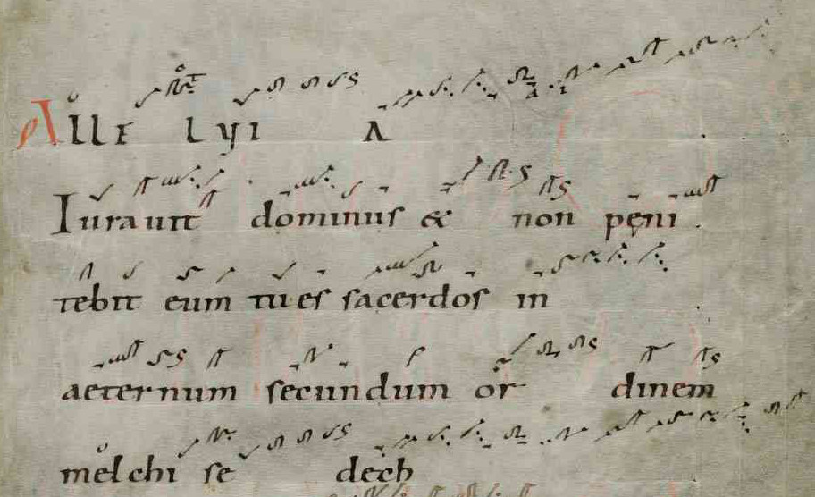
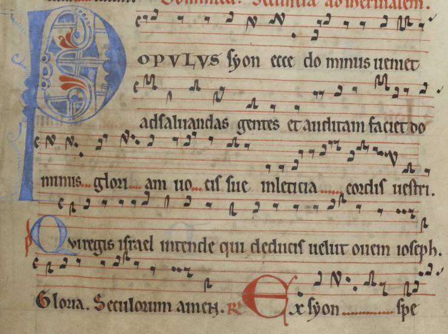

---
output:
  bookdown::pdf_document2:
    template: templates/brief_template.tex
    citation_package: biblatex
  #bookdown::word_document2: default
  #bookdown::html_document2: default
bib-humanities: true
documentclass: book
#bibliography: [bibliography/references.bib, bibliography/additional-references.bib]
---

<!-- COMENTARIOS A ESTA UNIDADE:
- Para incluir as imaxes e non se movan, incluír código seguinte:
<!--
```{r banda-caricatura-1, echo=FALSE, fig.align='center', fig.pos='ht',  fig.cap="Este é un modelo para inserir imaxes. - (fonte:pellicer.fremm.org)", fig.scap="Etiqueta da figura para índice", out.width="100%"}
knitr::include_graphics('figures/ud-00/banda-caricatura.jpg')
```
-->


# Conceptos sobre a monodia medieval {-}

\minitoc <!-- this will include a mini table of contents-->


<!--SISTEMAS MODAIS-->

## Os sistemas modais {-}

### Concepto de modo {-}

- **Modalidade**. A modalidade é un sistema de organización musical baseado nos intervalos. Este concepto está relacionado especialmente coa *melodía*, se temos en conta que esta é unha sucesión ordenada de intervalos.

- **Modo**. Nos sistemas modais, o concepto básico é o **de modo**. Consiste na organización dos intervalos en grupos nos que certas notas teñen unha importancia especial.

### Organización do modo {-}

Os modos, baséanse en pequenos grupos de notas que abarcan en total un intervalo de cuarta ou quinta (ás veces terceira). Entre as dúas notas extremas sitúanse outras que dividen o conxunto en pequenos intervalos, que non teñen por que axustarse necesariamente a tonos ou ao semitonos.


Estes pequenos grupos únense a outros, ben utilizando as notas extremas como notas comúns, ou ben cunha certa separación entre ambos (habitualmente dun tono). Este conxunto de dúas ou máis unidades, dá lugar ao ámbito completo do modo, que pode ser dunha oitava ou maior.


### O ritmo nos sistemas modais {-}

As definicións antigas da música facían referencia á arte (ou a ciencia) *de medir ben*. Esta medida debíase facer en dúas dimensións: na da **altura** dos sons, entoando correctamente os intervalos; e na da **duración** dos sons, levando adecuadamente o ritmo. Ámbalas dimensións definen a *melodía*, que é o elemento fundamental nas músicas modais.

#### Tipos de ritmo {-}

Consideramos dous estilos fundamentais de ritmo:

- Ritmo **libre**:

  As duracións dos sons non se axustan a ningún pulso, podendo alongarse ou acurtarse a vontade dos intérpretes. Na música vocal, o ritmo adoita axustarse ás necesidades do texto. Denomínaselle ás veces **ritmo *non mensural*** ou *non medido*.

- Ritmo **medido**:

  As duracións dos sons axústanse a un pulso, que pode ser regular ou flexible. Na música vocal, os elementos prosódicos (acento, cantidade silábica) poden determinar a forma de axustarse ao pulso. Denomínaselle tamén **ritmo *mensural***.

#### Os ciclos rítmicos {-}

Na música mensural, o pulso pode presentar diversas diferenzas (por ejempl, forte/débil). Estes pulsos diferentes organízanse en grupos que se repiten con regularidade, constituíndo así os*ciclos*.

A forma máis simple de ciclo rítmico é o *compás* da música occidental: grupos de dous, tres ou catro pulsos nos que o primeiro é forte e os demais débiles.


Habitualmente os ciclos rítmicos están constituídos en varios niveis:

- Un primeiro nivel constitúeno pequenos grupos de dous ou tres (ás veces máis) pulsos organizados ao redor de características como duración, acento ou timbre.
- Un segundo nivel fórmano agrupacións deses pequenos grupos en series máis longas, que poden chegar ás veces a ser *moi* longas.

Algúns exemplos de ciclos rítmicos complexos, son o *compás de doce* habitual en moitos estilos de música flamenca, ou os ritmos da música turca ou india.


#### Os modos rítmicos medievais {-}

Nos tratados medievais sobre música, xunto ao ritmo e á melodía (que habitualmente denominaban *harmonía*), incluíase a **métrica** isto é, a organización sonora das palabras propia da poesía; debido a que a música era maioritariamente vocal, e o ritmo dependía desa organización.

No século XIII estableceuse unha organización rítmica baseada en modos, do mesmo xeito que a organización melódica. Estes modos derivaban dos pés métricos da poesía latina e eran seis:


<!--SISTEMA MODAL MEDIEVAL -->
## O sistema modal medieval {-}

Os primeiros libros de teoría musical do Occidente europeo corresponden ao século IX; entre eles destacan os dous tratados anónimos titulados *Musica enchiriadis* («Manual de música») e *Scolica enchiriadis* («Comentarios ao manual»),  a partir dos cales se desenvólve unha importante corrente de literatura técnica musical, que explica o sistema sobre o que se compón a música monódica da Idade Media.

### As *especies* de intervalos {-}

O sistema modal medieval parte da **modalidade**, e tomaba como referencia os intervalos básicos de quinta e cuarta, así como a oitava. Os teóricos medievais partían das distintas **especies** destes intervalos, diferenciadas pola posición que ocupaba o semitono, como se pode ver na figura X.


### Os modos medievais {-}

As catro especies de quinta, son a base dos **catro modos básicos** da música medieval:

1. *protus* («primeiro»)
2. *deuterus* («segundo»)
3. *tritus* («terceiro»)
4. *tetrardus* («cuarto»)

Algúns teóricos, aplicaron os nomes da antiga teoría musical grega (con significado distinto) a estas catro especies da quinta, resultando: *dórico*, *frigio*, *lidio* , *mixolidio*.

Combinando cada especie de quinta cunha de cuarta, obtemos o que se coñece como modo. Segundo a súa combinación, podemos falar de **modos *auténticos*** (se a especie de cuarta vai despois da de quinta), ou **modos *plagales*** (se a especie de cuarta vai antes da especie de quinta). Para diferenciar os plagales dos anténticos, antepoñemos o prefixo *hipo-* ao nome grego correspondente (*hipo-*dórico, *hipo*-frixio, … ) tal como se indica na táboa do sistema modal medieval.

O sistema completo quedaba entón da forma:


Se ben é certo, que na práctica o máis habitual era referirse aos modos cos números do 1 ao 8,  nos tratados teóricos empregábanse tanto a denominación eclesiástica como a grega. 

### *Tenor*, *Finalis* e ámbito da melodía {-}

A melodía do canto, abarca o ámbito da oitava. Adoita utilizar unha interválica sinxela; graos conxuntos ou saltos de terceira e só ocasionalmente aparecen saltos de quinta ou de cuarta, normalmente só nos comezos de frase. 

Unha das notas da melodía, era considerada como a nota principal do modo que se coñece co nome de *final* (na que remata a melodía). Outras notas da melodía, servían de soporte –ou eixos melódicos– sobre os que se move a melodía; no canto gregoriano unha destas notas toma especial importancia e recibe o nome de *tenor* («soporte» en latín).

Para determinar o modo no sistema medieval, debemos considerar:

1. A nota **final**, que determina en cal do catro modos básicos está a melodía.
2. O **ámbito**,  por encima da final no caso dos modos auténticos e ao redor dela nos plagales.
3. A nota **tenor** e outras que puidesen servir para as cadencias.
4. O uso de certos **xiros melódicos** característicos (incluídas as cadencias).

### O estilo {-}

O estilo dunha peza viña determinado –ademais de polo modo– por outros elementos tales como a relación entre melodía e texto, que daba lugar a dous estilos principais:

1. **Estilo silábico**: a cada sílaba do texto correspóndelle unha nota ou como máximo dúas.
2. **Estilo ornamentado**: algunhas sílabas do texto, prolónganse con varias notas denominadas *melismas*.

Aínda que cada modo destaca certas notas e ten un ámbito determinado, teremos en conta que non se trata de alturas reais, senón de intervalos isto é; calquera modo podía cantarse transportado a calquera altura, sempre que se respectase a distribución dos intervalos.

### A escrita {-}

En principio, o sistema completo abarcaba dúas oitavas. Na escrita, utilizáronse as letras do alfabeto latino para designar as notas en orde ascendente. Co tempo, o sistema foise ampliando ata abarcar algo máis de dúas oitavas, diferenciadas polo uso de maiúsculas e minúsculas ou pola duplicación das letras. 

O *si* era unha nota de afinación variable: para evitar o tritono co fa podíase rebaixar medio ton, converténdoo así nun «si suave» (en latín *b molle*), que se escribía cunha «b» redonda para diferencialo do «si duro» (*b durum*) que se escribía cunha «b» cadrada (*b quadratum*); estes signos son os antecedentes dos actuais *bemol*, *becuadro* e *sostido*.


No século XI, o monxe e mestre de coro italiano **Guido d’Arezzo**, para facilitar a aprendizaxe das melodías, que seguían memorizándose, inventou un sistema que asociaba determinadas sílabas con notas e as súas combinacións con intervalos; para iso utilizou seis sílabas sacadas do texto dun himno relixioso: *ut re mi fa sol la*. Nesta sucesión de seis sílabas todos os intervalos eran dun tono excepto o intervalo central *mi-fa*, que era dun semitono. 


A serie podía comezar na nota *dó*, na nota *fa* co «*si* suave» e na nota *sol* co «*si* duro», resultando así o tres tipos **de hexacordos**:


Posto que os hexacordos podían comezar en notas diferentes, en melodías máis amplas utilizábase un sistema de paso dun hexacordo a outro chamado **solmisación**. 

<!--- NOTACIÓN MUSICAL MEDIEVAL-->

## A notación musical medieval {-}

### A notación {-}

Durante toda a Idade Media —e mesmo despois— a música seguiría transmitíndose oralmente. No século IX, en varios mosteiros de Occidente, desenvolveríase un sistema de escritura musical novo, que evolucionaría ao longo dos séculos ata desembocar no sistema actual. A principal razón deste desenvolvemento, foi a implantación do repertorio de canto chamado «gregoriano»,  pero non a única. Pretendíase tamén unificar a interpretación musical litúrxica en todos os territorios que dependían da Igrexa de Roma.

#### Os neumas {-}

As notacións máis antigas utilizaban uns signos chamados **neumas** que se escribían sobre as liñas do propio texto que se debía cantar. Estes neumas «debuxaban» o perfil melódico do canto, pero non con precisión a melodía que se aprendía por escoita e memorización.

Este primeiro sistema de notación presentaba numerosas variantes, dependendo do lugar (mosteiro ou rexión) en que se elaboraba cada manuscrito. Algunhas destas variantes, as chamadas **adiastemáticas**, centrábanse nas calidades da interpretación sen atender á interválica; outras, as chamadas **diastemáticas**, utilizaban diversos sistemas (puntos, liñas…) para tratar de indicar a amplitude relativa dos intervalos.

Na primeira metade do século XI, **Guido d’Arezzo** reuniu varias técnicas que facilitaban a lectura a primeira vista e por tanto a aprendizaxe dos cantos; as principais características da súa proposta eran as seguintes:

- Os neumas situábanse sobre unha pauta de liñas **paralelas** que marcaban a distancia dunha terceira, e a lonxitude dos seus trazos indicaba a amplitude do intervalo.
- As notas contiguas aos semitonos indicábanse con liñas de cores específicas: o *fa* en cor vermella, o *dó* en cor amarela.
- Á esquerda desas liñas escribíanse **letras crave**, que indicaban esas mesmas notas: a **F** para o *fa* e a **C** para o *dó*.
- Á dereita de cada pauta escribíase un pequeno signo, chamado **custos**, que indicaba a primeira nota da seguinte pauta e facilitaba así a entonación correcta do intervalo.

O **sistema guidoniano** tivo gran éxito e estendeuse inmediatamente por todo Occidente, aínda que as diversas notacións neumáticas seguíronse utilizando nalgúns lugares mesmo ata o século XVI. 

Da notación guidoniana derivaron outras, como a notación alemá de cravo **de ferradura** ou a **notación cadrada** francesa, que naceu no século XII e que aínda se utiliza nos libros de canto gregoriano. Esta última adaptouse posteriormente para as cancións trovadorescas e outros xéneros de música profana. A partir do século XIII, as novas técnicas da música polifónica farán evolucionar a notacións, especialmente no aspecto rítmico.


<!--

-->

<!--

-->

<!--

-->

<!-- CANTO GREGORIANO CARACTERÍSTICAS -->
\newpage
## Consideracións sobre o Canto Gregoriano {-}

### Características que definen o canto gregoriano {-}

O canto gregoriano, como todo o canto litúrxico medieval, presenta as seguintes características:

- É un **canto monódico**, é dicir, utilízase unha soa liña melódica tanto para o canto solista como para o canto a un tempo.
- O **ritmo** é **flexible**, dependendo do texto que se canta; non hai compás nin pulso regular, e tanto o fraseo como a distribución de acentos axústanse ás necesidades de declamación do texto.
- O **ámbito** non supera normalmente a **oitava** (excepto en cantos para solistas, que poden superala nunha cuarta ou quinta).
- Está baseado no **sistema modal** e foi descrito e organizado por teóricos musicais case sempre do ámbito monástico.
- A melodía móvese por graos **conxuntos** ou **saltos de terceira**; ocasionalmente aparecen saltos de cuarta ou quinta, normalmente nos comezos. Son inhabituais intervalos máis amplos.
- O perfil melódico de cada canto organízase ao redor de dous eixos: a **nota final**, na que termina e con frecuencia tamén comeza o canto, e a chamada **nota tenor** («soporte» en latín), sobre a que se desenvolve a melodía. Esta nota está normalmente unha quinta sobre a final nos modos auténticos e unha terceira por baixo desta nos plagales, excepto cando recae sobre a nota *si*, que se pasa ao do.

#### Estilos de canto {-}

Segundo a relación entre o texto e a melodía, desenvólvense tres estilos de canto:

- **Silábico:** é o estilo máis simple: a cada sílaba do texto correspóndenlle unha ou dúas notas.
- **Neumático:** estilo adornado; a cada sílaba correspóndenlle varias notas (normalmente de dúas a seis).
- **Melismático:** estilo moi adornado; algunhas sílabas teñen melismas extensos, ás veces de decenas de notas; no resto adoita predominar o estilo neumático.

Nun mesmo canto mestúranse varios estilos, pero un deles predomina e é o que caracteriza a ese canto.

#### Estilos de interpretación {-}

Hai tamén tres estilos de interpretación (chamados tamén estilos de salmodia):

- **Directa**: cántanse todos os versos (ou versículos) sen interrupción, por un coro ou máis frecuentemente un solista.
- **Antifonal**: alternan dous coros (ou dous pequenos grupos de cantantes, máis exactamente) cantando os versos impares e pares ou ben versos e un refrán.
- **Responsorial**: alternan un solista e un coro, normalmente cantando aquel os versos e este o refrán.

<!-- CANTO GREGORIANO REPERTORIO -->
### O repertorio do canto gregoriano {-}

O repertorio gregoriano está formado fundamentalmente polos cantos que se interpretaban nas dúas grandes cerimonias litúrxicas: a misa e o oficio. 

#### Cantos da misa {-}

Os cantos da misa dividíanse en dous grandes grupos: aqueles que se repetían a diario, durante todo o ano, ou en certas épocas chamados **cantos do ordinario**, interpretados polos asistentes; e aqueles que variaban en función da festa, do día ou da semana do ano litúrxico, chamados **cantos do propio**, cantados normalmente polas *scholae* (coros profesionais).

- Os cantos do propio adóitanse clasificar en dous grupos:
  1. Antifonales (ou procesionais): cantados pola *schola* durante cerimonias de duración variable; son o **introito**, o **ofertorio** e a **comunión**. Adoitan ser neumáticos e o ámbito móvese ao redor da oitava.
  2. Responsoriales (ou de meditación): cantados por solistas antes da lectura do evanxeo. Son o **gradual**, o **aleluia** e **o tracto**. Estes dous últimos eran excluíntes: cando se cantaba un non se cantaba o outro, en función da época do ano litúrxico. Todos son melismáticos e ás veces superan o ámbito da oitava.

Non debe confundirse este uso dos termos "antifonal" e "responsorial" cos estilos de interpretación citados antes.

- Os cantos do ordinario son cinco, que se coñecen polas palabras con que se inician os seus textos: **Kyrie**, **Gloria**, **Credo**, **Sanctus** e **Agnus Dei**. 

  Son cantos moi antigos e na súa orixe eran cantados por tódolos asistentes. A partir do século XI compuxéronse centenares de melodías novas para eles, posiblemente porque xa non os cantaba a comunidade senón a *schola*. Posteriormente serían tamén o núcleo principal na composición de misas polifónicas e concertadas.


#### Cantos do oficio {-}

Entre tódalas obrigas das comunidades monásticas, atopábase a de reunirse para o rezo varias veces ao día; estes momentos denominábanse *horas* e en conxunto constituían o *oficio*. Desenvolvíase normalmente en oito sesións diarias, das que as máis importantes eran **vésperas** (na posta de sol), **maitines** (na medianoite) e **laudes** (coa saída do sol).

Se ben cada hora tiña unha estrutura diferente, os cantos do oficio pódense agrupar en varios tipos:

- **Salmos e cánticos**. Entoábanse mantendo a forma salmódica. A diferenza entre salmos e cánticos é litúrxica, segundo a procedencia do texto, pero musicalmente son semellantes.

- **Antífonas**. Son o xénero máis numeroso do repertorio: eran cantos breves, de ámbito reducido, con intervalos melódicos pequenos, en estilo silábico, destinados ao canto por toda a comunidade. Cantábanse normalmente como introdución e conclusión dos salmos e cánticos.

- **Responsorios**. Cantos de meditación, habitualmente en estilo melismático ou neumático e interpretados por solistas. Forman o segundo conxunto en cantidade despois das antífonas.

- **Himnos**. Cantos estróficos, divididos habitualmente en estrofas de catro versos de oito sílabas, de igual melodía. Foron moi populares e existe un gran repertorio, malia non contar nos inicios coa aceptación das autoridades relixiosas, empregándose nunha parte marxinal da liturxia. Probablemente a súa popularidade puido deberse á súa semellanza cos cantos populares.

### Autoría dos cantos {-}

A gran maioría das melodías do repertorio gregoriano e as dos seus predecesores son anónimas, en parte debido o escaso interese que os músicos medievais –e os artistas en xeral–  tiñan en canto á cuestión da autoría. Coñecemos varios nomes de compositores: entre eles, **Notker de San Gall** (s. IX-X), ou **Hildegard de Bingen** (s.XII) destacada escritora, científica e conselleira de papas e emperadores.

<!-- EXPANSIÓNS DO CANTO -->


## Expansións do canto gregoriano {-}

Co paso do tempo, os músicos de igrexa continuaron creando música nova, que se engadía de diversas formas ás melodías gregorianas; desde pezas completamente novas, ben por novas festividades, ben para momentos que non tiñan cantos, como por exemplo as procesións. Neste último caso inclúense os cantos denominados ***conductus***.

De entre as técnicas e formas que aparecen neste contexto, destacan os **tropos**, as **secuencias** e os **dramas litúrxicos**.

### Tropos {-}

 *Tropo* designa actualmente un conxunto diverso de técnicas de ampliación dos cantos do repertorio gregoriano; na súa época, estas técnicas recibiron distintas denominacións. 

Consiste en engadir música ou música e letra a un canto da misa ou do oficio. A súa práctica comeza en Francia no s. IX e difúndese rápidamente. É habitual no [*Kyrie*](https://open.spotify.com/track/0wTT2YyDjlqmjHe1HOIacE) e no [*Benedicamus Domino*](https://es.wikipedia.org/wiki/Benedicamus_domino).

As técnicas de tropar son fundamentalmente tres:

- Adición de música.  Consiste en engadir melismas a algunha ou algunhas das sílabas dun canto (con máis frecuencia, as últimas ou as primeiras). É a máis antiga e foi en orixe unha técnica de improvisación

- Adición de texto: neste caso, non se engade un melisma senón texto nun canto, transformando este melisma nunha pasaxe en estilo silábico; recibía os nomes de prosa ou *prosula*.

- Adición de música e texto.

  É a técnica máis importante, e a que recibiu propiamente o nome de tropo . Consistía en engadir pasaxes breves (ás veces non tan breves) de texto con música, que se situaban ao comezo ou ao final dun canto, ou ben se intercalaban entre os versos de leste.

Como exemplo desta técnica atopamos o *Kyrie fons bonitatis*, resultado de tropar con texto o *Kyrie*:

```{r kyrie-1, echo=FALSE, fig.align='center', fig.pos='ht',  fig.cap="Melodía orixinal do Kyrie", fig.scap="Melodía do *Kyrie*", out.width="100%"}
knitr::include_graphics('figures/ud-03/Kyrie-1.png')
```
<!--

-->
A versión tropada, quedaría polo tanto do seguinte xeito no [*Kyrie fons bonitatis*](https://es.wikipedia.org/wiki/Kyrie_eleison "Enlace á Wikipedia"): [(audición)](https://open.spotify.com/track/74ztOxzqhvEStzW4pqZII0?si=fbe1ed03f9bf4d6c "Enlace á audición no Spotify")

```{r kyrie-fons-bonitatis, echo=FALSE, fig.align='center', fig.pos='ht',  fig.cap="Melodía tropada do Kyrie", fig.scap="Melodía tropada do Kyrie fons bonitatis", out.width="100%"}

```
<!--

-->
Os tropos tiveron un gran desenvolvemento desde o século IX ata o XVI, cando foron prohibidos polo concilio de Trento. Os cantos que se tropaban con máis frecuencia eran os cantos procesionais da misa (Introito, Ofertorio e Comunión) e os responsorios do oficio. Tamén se tropaban os cantos do ordinario da misa, a excepción do Credo.

### Secuencias {-}

As secuencias son cantos independentes de nova composición que se interpretaban despois do aleluia na misa. A súa orixe puido estar relacionada cos tropos: en principio, a *sequentia* aparece como un melisma engadido á última sílaba da palabra *aleluia*; este melisma foi despois tropado e convertido en canto silábico, para finalmente independizarse completamente. Etimolóxicamente, *sequentia* significa "o que segue" (melisma que segue ao aleluia).

As secuencias, son silábicas e consisten na repetición pareada: cada unidade melódica, repítese dúas veces con texto diferente antes de aparecer a seguinte, que pode ser totalmente distinta, salvo na primeira e última frase (a bb cc dd … n). Esta sería a forma primitiva que recibe o nome de **forma de secuencia** e relaciónase con outras formas musicais da época, non só relixiosas.

A partir do século XIII o texto estrutúrase en estrofas co mesmo esquema métrico e rítmico, ben con unha mesma melodía ou alternando varias e recibe o nome de **forma estrófica**.

Do mesmo xeito que os tropos, as secuencias foron prohibidas polo concilio de Trento, agás as seguintes:

- *Victimae paschali laudes* (Pascua)
- *Veni Sancte Spiritus* (Pentecostés)
- *Lauda Sion* (Corpus Christi)
- [*Dies Irae*](https://gl.wikipedia.org/wiki/Dies_irae "Enlace á wikipedia") (Misa de defuntos) [(audición)](https://open.spotify.com/track/7IDZBDMZEkVzqHx3gpQ9yj?si=ca6c04c67bbc4f23 "Enlace á audición no Spotify")


Un dos exemplos máis coñecidos de *sequentia* é o *Dies irae (Officium defunctorum)* da misa de defuntos.

```{r Dies-irae, echo=FALSE, fig.align='center', fig.pos='ht',  fig.cap="Exemplo da secuencia Dies Irae", fig.scap="Secuencia Dies irae", out.width="75%"}
knitr::include_graphics('figures/ud-03/Dies-irae.png')
```
<!--

-->

### O drama litúrxico {-}

O que coñecemos actualmente como *drama litúrxico* é un tipo de composición dialogada, cantada na súa totalidade, que se representaba durante algunha cerimonia relixiosa en forma teatral. Datan de entre os séculos X e XVI; son dramas relixiosos en latín, que se representan nos tempos litúrxicos de Nadal e Semana Santa e probablemente a súa orixe proceda do desarrollo dramático de tropos dialogados.

A orixe do drama litúrxico adóitase relacionar cunha composición coñecida como *Quem quaeritis*. Trátase dun breve diálogo entre uns anxos e as mulleres que buscan a Cristo no sepulcro o día de Resurrección.  Nesta representación, o texto interpretábase por dous grupos de cantores que alternaban, representando os papeis de anxos e mulleres. *Quem quaeritis* foi un referente do drama litúrxico; entre os séculos XII e XIII, comeza un importante auxe de obras musicais dialogadas e representadas, que incorporan historias bíblicas ou alegóricas, con multitude de personaxes e de extensión considerable. O *Ludus Danielis* (s.XII) é un exemplo, onde por primeira vez aparecen escenas colectivas nas que se entoan gran cantidade de melodías, a maioría imitacións do canto gregoriano e dos tropos, así com secuencias. *Ordo virtutum*, de **Hildegard de Bingen**, compositora e escritora do século XII, é outro exemplo. Como xénero non litúrxico, é máis probable que se admitise o uso de instrumentos como forma de aproximar aos fieles, os misterios das *Sagradas Escrituras*.


<!-- EXERCICIO TRANSCRICIÓN -->

\newpage

