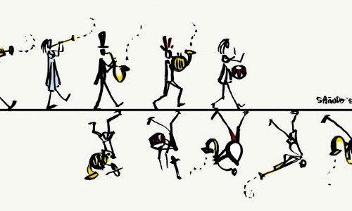

---
output:
  bookdown::pdf_document2:
    template: templates/brief_template.tex
    citation_package: biblatex
  #bookdown::word_document2: default
  #bookdown::html_document2: default
bib-humanities: true
documentclass: book
#bibliography: [bibliography/references.bib, bibliography/additional-references.bib]
---

<!-- COMENTARIOS A ESTA UNIDADE:
- Para incluir as imaxes e non se movan, incluír código seguinte:
<!--
```{r banda-caricatura-1, echo=FALSE, fig.align='center', fig.pos='ht',  fig.cap="Este é un modelo para inserir imaxes. - (fonte:pellicer.fremm.org)", fig.scap="Etiqueta da figura para índice", out.width="100%"}

```
-->


# Conceptos sobre a monodia medieval {-}

\minitoc <!-- this will include a mini table of contents-->


<!--SISTEMAS MODAIS-->

```{r child=here::here('unidades-didacticas/unidade-03/HM1-Sistemas modais.md')}
```

<!--SISTEMA MODAL MEDIEVAL -->

```{r child=here::here('unidades-didacticas/unidade-03/HM1-Sistema modal medieval.md')}
```

<!--- NOTACIÓN MUSICAL MEDIEVAL-->

```{r child=here::here('unidades-didacticas/unidade-03/HM1-Notacion musical medieval.md')}
```

<!-- CANTO GREGORIANO CARACTERÍSTICAS -->
\newpage

```{r child=here::here('unidades-didacticas/unidade-03/HM1-Canto gregoriano caracteristicas.md')}
```

<!-- CANTO GREGORIANO REPERTORIO -->

```{r child=here::here('unidades-didacticas/unidade-03/HM1-Canto gregoriano repertorio.md')}
```

<!-- EXERCICIO TRANSCRICIÓN -->

\newpage


```{r child=here::here('unidades-didacticas/unidade-03/HM1-Exemplo transcripcion.md')}
```

