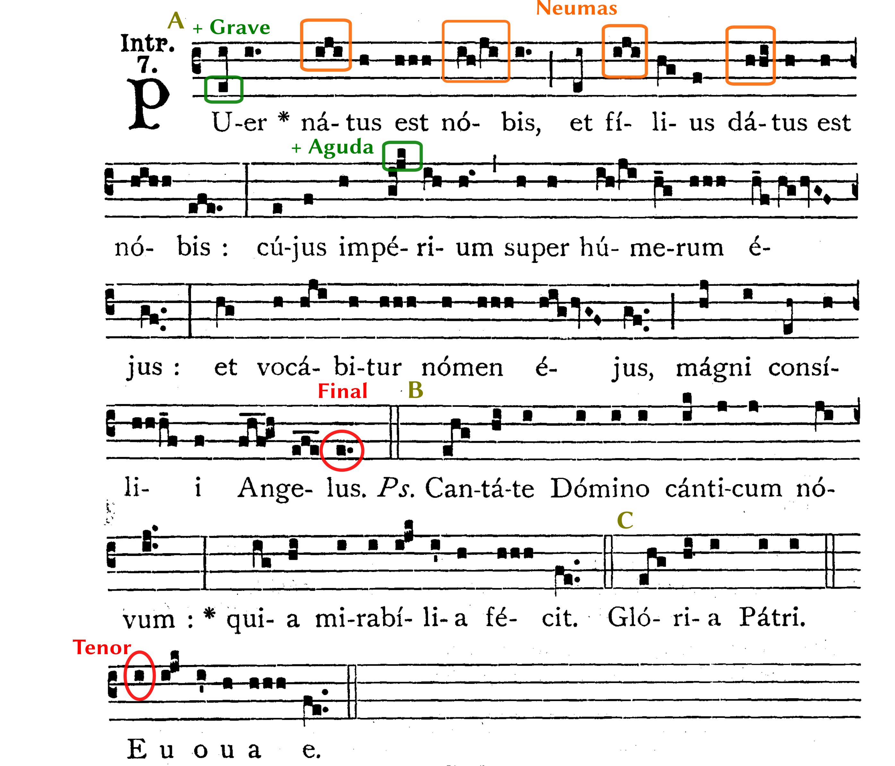

## Análise e comentario dunha audición con partitura

Na análise de audición con partitura de pezas escritas en notación cadrada do repertorio gregoriano, debemos ter en conta os puntos seguines:  

1. **Modo** ao que pertence o canto
2. **Ámbito** total
3. **Estilo** de canto
4. **Forma** ou estrutura formal
5. **Clasificación** no repertorio

---

Os exemplos seguintes, sirven de modelo para realizar unha análise e comentario de audición con partitura, de distintos tipos de cantos.

### Exemplo 1: Introito "*Puer nátus est nóbis*"

Este exemplo, corresponde á audición do Introito "*Puer nátus est nóbis*". O proceso a seguir nun comentario de audición con partitura, sería o seguinte:

1. Escoita a obra seguindo con atención a partitura (enlace á audición) 
2. Observa e analiza a partitura prestando atención ás principais caracerísticas que a definen
3. Determina o modo, ámbito, estilo, forma e clasificación segundo se indica no modelo

#### 1. Modo 

A **nota final** da peza é un *sol* no primeiro espazo en **clave** de *dó en terceira*. O modo por tanto debe ser *tetrardus*. A **nota máis aguda** (un *fa*) está unha sétima por encima da final; a **nota máis grave** (o *sol*) é a mesma nota final. O **modo** é por tanto *tetrardus auténtico*, o número 7. O **tenor**, que pode verse ao comezo da cadencia de *salmo* sobre o "E", é *re* que corresponde coa **nota tenor** do modo 7.

#### 2. Ámbito

O **ámbito total** abarca desde o nota final *sol* ata o *fa*, unha sétima en total. É un ámbito próximo ao oitava pero inferior a ela polo tanto é un ámbito máis ben pequeno.

#### 3. Estilo de canto 

O canto é neumático, dado que a maioría das sílabas cántanse adornadas; cun *neuma* de entre dúas e sete notas. A segunda sección, ao tratarse dun verso de *salmo*, ten un estilo máis *silábico*.

#### 4. Forma ou estrutura formal

A peza comeza cunha sección extensa (A) que chega ata a primeira dobre barra no cuarto *tetragrama*. De seguido cántase un verso de salmo (B) seguido da *doxología* (C) cantada coa mesma melodía do *salmo* e que aparece abreviada só co comezo (*Gloria Patri*) e o final (*seculorum amen*, escrito *Euouae*). A continuación, volve ao comezo e cántase ata o final da sección A. A forma completa sería ABCA.

#### 5. Clasificación no repertorio

Tendo en conta o **ámbito** de sétima e o **estilo** neumático do canto, a peza debía ser interpretada polos cantores profesionais e por tanto debe ser un canto *antifonal* do *propio* da misa. A estrutura formal, coa inclusión de versos de *salmo*, corresponde tamén a este tipo de cantos.

<!-- comprobar-->

### Análisis Introito "Puer natus est nobis"

**Ritmo**
a) Tipo de ritmo: No se atiene a medida regular siguiendo el ritmo del texto.
b) Compás: No tiene.
c) Tempo: No se indica en la partitura siguiendo en la audición el tempo natural de la palabra hablada.
d) Otras observaciones de interés: algunas notas aumentan su duración en la interpretación según se indican el los *punctum mora vocis* en las silabas al final de cada miembro de frase y de inciso. Estos puntos a su vez coinciden con los signos de puntuación del texto.

**Melodía**
a) Tipo de melodía: diatónica con salto significativo de quinta en la primera sílaba. El movimiento en general de las notas es por grados conjuntos con algún salto de tercera tanto ascendente como descendente. La tendencia de la frase melódica es acabar en el grave.
b) Otras observaciones de interés: El estilo de la melodía es neumático, es decir, por lo general hay un neuma por sílaba. La melodía está en modo VII por tener la final en *sol* y la dominate en *re* como puede comprobarse en el salmo que repercute sobre la nota *re* con final en *sol.* 

**Textura:** 
a) Tipo de textura: monódica
b) Otras observaciones de interés: La reverberación del recinto provoca que unas notas queden mantenidas mientras suenan las siguientes, esto es, que se solapen. Se crea pues un efecto armónico.

**Timbre**
a) Voz, instrumento, conjunto vocal e instrumental: Grupo de voces masculinas.
b) Otras observaciones de interés: El grupo de voces canta *a capella,* es decir sin acompañamiento instrumental alguno. Aunque estaba permitido el uso del órgano en la iglesia, la interpretaciòn más purista, como la que escuchamos, no lo utiliza.

**1b. Forma, género musical, periodo artístico, autor y título de la obra.**
a) Forma: Canto gregoriano. Estructura ternaria de la siguiente forma A (antífona) - B (salmo y gloria) - A (antífona)
b) Otras observaciones de interés: el Gloria no aparece en la partitura pero debe añadirse al ser costumbre añadirlo tras el salmo (Ps).

Género: Vocal religioso, canto gregoriano.
Periodo artístico: Alta Edad Media
Cronología: Siglos V al XIII
Título: Pues natus est nobis
Autor: Anónimo