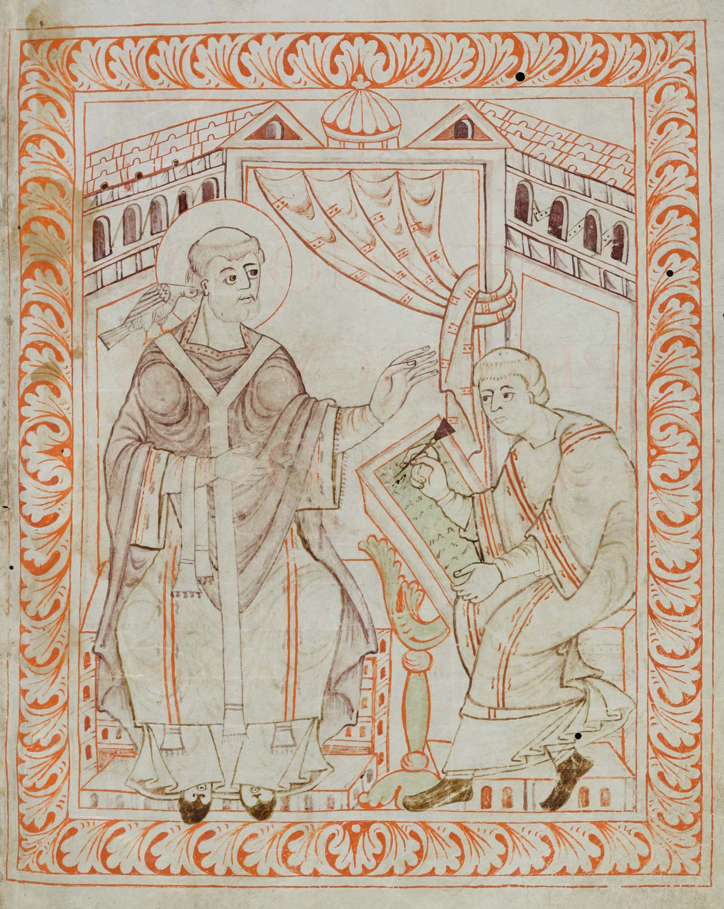

#### Orixe do canto gregoriano

A orixe do canto que chamamos **gregoriano** ten unha localización temporal e xeográfica precisa. A mediados do século VIII, a situación en Occidente era bastante confusa. O papa Esteban II víase asediado en Roma pola ameaza de invasión lombarda, desde o norte e o sur simultaneamente. Nesta situación e ante a indiferenza do emperador, dirixiuse en busca de socorro ao máis poderoso dos monarcas xermanos de Occidente, o franco Pipino o Breve. Decidiuse realizar un encontro en París no ano 754. Durante a súa estancia alí, Esteban II advertiu a profunda diferenza entre a liturxia romana e a galicana; propuxo ao rei Pipino a unificación das liturxias, e leste viu niso a ocasión de reforzar a unidade do seu reino. Decidiuse entón enviar ao reino franco un grupo de cantores romanos que ensinarían o canto aos cantores francos, coa idea de que despois se difundise polo resto do reino.

O proceso foi necesariamente lento e complexo: a formación dun cantor era entón exclusivamente oral e memorística, polo que a substitución dun repertorio por outro resultaba terriblemente difícil. Carlomagno, o fillo de Pipino, puxo un empeño especial na implantación no seu imperio do que entón se chamaba «canto romano», ou «rito romano». No proceso de difusión, realizado fundamentalmente no século IX, producíronse intercambios musicais continuos entre o canto romano e o galicano, e o resultado foi un produto híbrido que propiamente debía chamarse «canto franco-romano». Durante esta época desenvolveuse a lenda que atribuía a Gregorio o Magno a creación do canto, en Roma, no século VIN, por inspiración directa do Espírito Santo. Por iso é polo que se coñecese este canto co apelativo de «gregoriano».

San Gregorio ditando o canto a un copista.
Antifonario de Hartker de San Gall (século X)

O canto gregoriano impúxose nos territorios dominados polos reis carolinxios: as actuais Francia, Alemaña, Suíza, Bélxica e Países Baixos, xunto co sur de Italia. De alí pasou rapidamente ás illas Británicas e estendeuse aos territorios do este europeo por medio de misioneiros. Finalmente acabou impóndose tamén en Roma, aínda que os clérigos romanos vían este canto como unha forma imperfecta do romano, mal aprendido polos cantores francos. Soamente en Milán mantívose o rito antigo milanés ou ambrosiano, asociado co bispo Ambrosio, santo como Gregorio e por tanto tan aceptable como o gregoriano.

Nos territorios hispánicos, o «rito romano» fíxose oficial a finais do século XI, pero só nos reinos cristiáns do norte; na o-Ándalus seguía utilizándose o rito hispánico.
