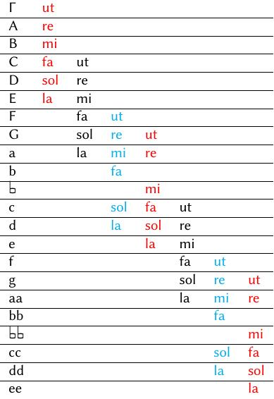

# Historia da música 1

[Páxina principal](http://traductor.dacoruna.gal/frontal_2013/urlTranslate.php?direccion3=es-gl&inurl=/../index.php)[Páxina da materia](http://traductor.dacoruna.gal/frontal_2013/urlTranslate.php?direccion3=es-gl&inurl=/index.php)[Temario](http://traductor.dacoruna.gal/frontal_2013/urlTranslate.php?direccion3=es-gl&inurl=/index.php?page=Temario4.html)

Material complementario

## A Idade Media

O concepto —e a expresión— de «Idade Media» foi creado polos humanistas europeos do Renacemento para referirse ao período que separaba a Antigüidade clásica da Modernidade que eles mesmos representaban. A súa admiración extrema pola arte e o pensamento dos *antigos* gregos e romanos e o seu desexo de recuperalos nunha idade *moderna* leváronos ao desprezo por toda a etapa *intermedia* entre ambos os mundos, ignorando ou rexeitando todos os desenvolvementos artísticos, científicos e filosóficos desa época. Sería moito máis tarde, xa no século XIX, cando os artistas e pensadores de Europa rescatarían esa «Idade Media» e converteríana nun período mítico de ideais caballerescos, amorosos e relixiosos, nun enfoque tan erróneo como o dos seus predecesores.

### Desenvolvemento histórico

Entre os séculos IV e V DC prodúcese o que se chamou «caída do Imperio Romano», é dicir, o paulatino desmantelamento das estruturas administrativas, políticas, militares, etc., do Imperio e a disgregación dos territorios occidentais en diversos reinos gobernados por elites de orixe xermánica (francos, ostrogodos, visigodos…). O proceso comeza coa decadencia da propia cidade de Roma, que se abandona como capital en beneficio da recentemente construída Constantinopla, na zona oriental do Imperio, a mediados do século IV; a zona occidental, autónoma desde fins do mesmo século, acabará dividida en diversos reinos gobernados por elites militares e políticas de orixe xermánica aliados coas elites económicas romanas.

Este proceso de descomposición política é simultáneo a unha **ruralización** progresiva e un despoboamento das cidades, que terá graves consecuencias na vida cultural e musical de Occidente. A poboación abandona as cidades desprazándose ao campo, onde hai maiores oportunidades; os centros de poder trasladaranse tamén ao campo, para estar en contacto directo coa fonte de riqueza: os gobernantes establécense en castelos illados e a Iglesia, que desde comezos do século IV habíase ido convertendo nunha institución do Imperio, centrará a súa actividade nos **mosteiros**, centros de gran actividade económica e política, pero tamén cultural: durante varios séculos practicamente toda a actividade cultural —e tamén musical— de Occidente desenvolverase fundamentalmente nos mosteiros; neles comporase boa parte da música medieval —especialmente a relixiosa, pero non só—; neles tamén se escribirán os primeiros libros de teoría musical e desenvolverase a notación musical.

Ao mesmo tempo que isto sucedía en Occidente, o Imperio continuaba en Oriente co seu capital en Constantinopla; como o emprazamento desta cidade correspondía á antiga cidade grega de Bizancio, coñecemos esta etapa do Imperio Romano como Imperio Bizantino. A partir do século VII hai un terceiro ámbito cultural, político e relixioso: o do Islam, fundado por Muhammad (Mahoma) a comezos do século, e que se expandiu tras a súa morte, estendéndose á conta do Imperio polas zonas de Siria e Exipto, e tamén por todo o norte de África e a Península Ibérica, que será coñecida como Ao-Ándalus.

A partir do século XI comeza en Occidente unha nova etapa —á que se denomina *Baixa Idade Media*, fronte á *Alta Idade Media* anterior— que se caracteriza por unha volta ao urbano: as cidades crecen; as actividades económicas urbanas, como o comercio e a industria, empezan a ter máis importancia; os gobernantes instálanse en palacios nelas; as catedrais e outros centros relixiosos urbanos toman a substitución aos mosteiros; por último, empezan a crearse centros de educación superior —as universidades— que determinarán a vida cultural, filosófica e científica desde entón.

Nesta segunda etapa aparecen novas formas e técnicas musicais, fundamentalmente polifónicas, que convivirán coas creadas na etapa anterior, maioritariamente monódicas. Todas elas baséanse nun sistema musical codificado a partir do século IX.

### O sistema modal medieval

Os primeiros libros de teoría musical do Occidente europeo corresponden ao século IX; entre eles destacan os dous tratados anónimos titulados *Musica enchiriadis* («Manual de música») e *Scolica enchiriadis* («Comentarios ao manual»). Son tamén importantes os tratados escritos polo monxe **Hucbaldo** no mesmo século. Desde entón desenvólvese unha importante corrente de literatura técnica musical que explica o sistema sobre o que se compuña a música monódica da Idade Media.

#### As *especies* de intervalos 

O sistema modal medieval parte da **modalidade**, e tomaba como referencia os intervalos básicos de quinta e cuarta, así como a oitava. Os teóricos medievais partían das distintas **especies** destes intervalos, diferenciadas pola posición que ocupaba o semitono, como se pode ver na figura X.

Figura X.- Especies da quinta e a cuarta.

#### Os modos medievais

As catro especies da quinta son a base dos catro **modos básicos** da música medieval: 

1. *protus* («primeiro»)
2. *deuterus* («segundo»)
3. *tritus* («terceiro»)
4. *tetrardus* («cuarto»)

Algúns teóricos, aplicaron os nomes da antiga teoría musical grega (con significado distinto) a estas catro especies da quinta, resultando: *dórico*, *frigio*, *lidio* , *mixolidio*.

Combinando cada especie de quinta cunha de cuarta, obtemos o que se coñece como modo. Segundo a súa combinación, podemos falar de **modos *auténticos*** (se a especie de cuarta vai despois da de quinta), ou **modos *plagales*** (se a especie de cuarta vai antes da especie de quinta). Para diferenciar os plagales dos anténticos, antepoñemos o prefixo *hipo-* ao nome grego correspondente (*hipo-*dórico, *hipo*-frixio, … ) tal como se indica na táboa do sistema modal medieval.

O sistema completo quedaba entón da forma:

Figura X.- Sistema modal medieval.

Se ben é certo, que na práctica o máis habitual era referirse aos modos cos números do 1 ao 8,  nos tratados teóricos empregábanse tanto a denominación eclesiástica como a grega. 

#### *Tenor*, *Finalis* e ámbito da melodía

A melodía do canto, abarca o ámbito da oitava. Adoita utilizar unha interválica sinxela; graos conxuntos ou saltos de terceira e só ocasionalmente aparecen saltos de quinta ou de cuarta, habitualmente nos comezos de frase. Unha das notas da melodía, era considerada como a nota principal do modo que se coñece co nome de *final* (na que remata a melodía). Outras notas da melodía, servían de soporte –ou eixos melódicos– sobre os que se move a melodía; no canto gregoriano unha destas notas toma especial importancia e recibe o nome de *tenor* («soporte» en latín).

Para determinar o modo no sistema medieval, debemos considerar:

1. A nota **final**, que determina en cal do catro modos básicos está a melodía.
2. O **ámbito**,  por encima da final no caso dos modos auténticos e ao redor dela nos plagales.
3. A nota **tenor** e outras que puidesen servir para as cadencias.
4. O uso de certos **xiros melódicos** característicos (incluídas as cadencias).

#### O estilo

O estilo dunha peza viña determinado –ademais de polo modo– por outros elementos tales como a relación entre melodía e texto, que daba lugar a dous estilos principais:

1. **Estilo silábico**: a cada sílaba do texto correspóndelle unha nota ou como máximo dúas.
2. **Estilo ornamentado**: algunhas sílabas do texto, prolónganse con varias notas denominadas *melismas*.

Aínda que cada modo destaca certas notas e ten un ámbito determinado, teremos en conta que non se trata de alturas reais, senón de intervalos isto é; calquera modo podía cantarse transportado a calquera altura, sempre que se respectase a distribución dos intervalos.

#### A escrita

En principio, o sistema completo abarcaba dúas oitavas. Na escrita, utilizáronse as letras do alfabeto latino para designar as notas en orde ascendente. Co tempo, o sistema foise ampliando ata abarcar algo máis de dúas oitavas, diferenciadas polo uso de maiúsculas e minúsculas ou pola duplicación das letras. 

O *si* era unha nota de afinación variable: para evitar o tritono co fa podíase rebaixar medio ton, converténdoo así nun «si suave» (en latín *b molle*), que se escribía cunha «b» redonda para diferencialo do «si duro» (*b durum*) que se escribía cunha «b» cadrada (*b quadratum*); estes signos son os antecedentes dos actuais *bemol*, *becuadro* e *sostido* ( ♭ ♮ ♯ ).

Figura X.- Sistema completo

No século XI, o monxe e mestre de coro italiano **Guido d’Arezzo**, para facilitar a aprendizaxe das melodías, que seguían memorizándose, inventou un sistema que asociaba determinadas sílabas con notas e as súas combinacións con intervalos; para iso utilizou seis sílabas sacadas do texto dun himno relixioso: *ut re mi fa sol la*; nesta sucesión de seis sílabas todos os intervalos eran dun tono excepto o intervalo central *mi-fa*, que era dun semitono. 

A serie podía comezar na nota *dó*, na nota *fa* co «*si* suave» e na nota *sol* co «*si* duro», resultando así o tres tipos **de hexacordos**:

Figura X.- Os hexacordos

Figura x.- Distribución dos hexacordos

Posto que os hexacordos podían comezar en notas diferentes, en melodías máis amplas utilizábase un sistema de paso dun hexacordo a outro chamado **solmisación**. 

### A notación musical medieval

#### A notación

> […] se os sons non se reteñen na memoria, pérdense, pois non se poden escribir. [^cita:Isidoro]

[^cita:Isidoro]: Recuperado de *Etimoloxías*.  Isidoro de Sevilla (s. VII)

A comezos do século VII, Isidoro de Sevilla reflexionaba sobre a importancia da memoria dos intérpretes e o seu papel como transmisores da herdanza musical, sen os cales as melodías non serían transmitidas a xeracións posteriores.  A antiga notación grega deixouse de utilizar máis de tres séculos antes, e ata uns douscentos anos despois non aparecería a notación musical occidental. 

Durante toda a Idade Media —e mesmo despois— a música seguiría transmitíndose oralmente, pero ao longo do século IX, en varios mosteiros de Occidente, desenvolveríase un sistema de escritura musical novo, que evolucionaría ao longo dos séculos ata desembocar no sistema actual. A razón deste desenvolvemento foi a implantación do repertorio de canto chamado «gregoriano». Pretendíase, por unha banda, unificar a interpretación musical litúrxica en todos os territorios que dependían da Igrexa de Roma; doutra banda, o repertorio estaba a crecer e era xa excesivo para retelo na memoria.

As notacións máis antigas utilizaban uns signos chamados **neumas** que se escribían sobre as liñas do texto que se debía cantar. Estes neumas «debuxaban» o perfil melódico do canto, pero non pretendían reflectir con precisión a melodía, que se aprendía de oído e memorizando. Este primeiro sistema de notación presentaba numerosas variantes, dependendo do lugar concreto (mosteiro ou rexión) en que se elaboraba cada manuscrito. Algunhas destas variantes, as chamadas **adiastemáticas**, centrábanse nas calidades da interpretación sen atender á interválica; outras, as chamadas **diastemáticas**, utilizaban diversos sistemas (puntos, liñas…) para tratar de indicar a amplitude relativa dos intervalos.

Na primeira metade do século XI, **Guido d’Arezzo** reuniu varias técnicas que facilitaban a lectura a primeira vista e por tanto a aprendizaxe dos cantos; as principais características da súa proposta eran as seguintes:

- Os neumas situábanse sobre unha pauta de liñas **paralelas** que marcaban a distancia dunha terceira, e a lonxitude dos seus trazos indicaba a amplitude do intervalo.
- As notas contiguas aos semitonos indicábanse con liñas de cores específicas: o fa en cor vermella, o do en cor amarela.
- Á esquerda desas liñas escribíanse **letras crave**, que indicaban esas mesmas notas: a **F** para o fa e a **C** para o do.
- Á dereita de cada pauta escribíase un pequeno signo, chamado **custos**, que indicaba a primeira nota da seguinte pauta e facilitaba así a entonación correcta do intervalo.

O sistema guidoniano tivo gran éxito e estendeuse inmediatamente por todo Occidente, aínda que as diversas notacións neumáticas seguírense utilizando nalgúns lugares mesmo ata o século XVI. Da notación guidoniana derivaron outras, como a notación alemá de cravo **de ferradura** ou a **notación cadrada** francesa, que naceu no século XII e que aínda se utiliza nos libros de canto gregoriano. Esta última adaptouse posteriormente para as cancións trovadorescas e outros xéneros de música profana. A partir do século XIII, as novas técnicas da música polifónica expuxeron novas necesidades de escritura, especialmente no aspecto rítmico, que farían evolucionar o sistema.

Notación neumática

Notación guidoniana

Notación cadrada

Os contidos orixinais deste sitio web están baixo unha [licenza de Creative Commons Recoñecemento-NoComercial-CompartirIgual 2.5 España](http://creativecommons.org/licenses/by-nc-sa/2.5/es/).

Francisco Callejo Giménez, 2008-2021
[fcallejo.hm@cpmcristobaldemorales.es](http://traductor.dacoruna.gal/frontal_2013/urlTranslate.php?direccion3=es-gl&inurl=/mailto:fcallejo.hm@cpmcristobaldemorales.es)