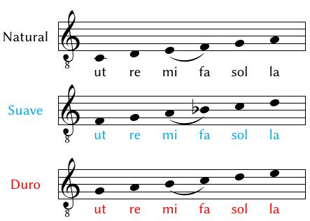

### O sistema modal medieval

Os primeiros libros de teoría musical do Occidente europeo corresponden ao século IX; entre eles destacan os dous tratados anónimos titulados *Musica enchiriadis* («Manual de música») e *Scolica enchiriadis* («Comentarios ao manual»),  a partir dos cales se desenvólve unha importante corrente de literatura técnica musical, que explica o sistema sobre o que se compón a música monódica da Idade Media.

#### As *especies* de intervalos 

O sistema modal medieval parte da **modalidade**, e tomaba como referencia os intervalos básicos de quinta e cuarta, así como a oitava. Os teóricos medievais partían das distintas **especies** destes intervalos, diferenciadas pola posición que ocupaba o semitono, como se pode ver na figura X.

Figura X.- Especies da quinta e a cuarta.

#### Os modos medievais

As catro especies de quinta, son a base dos **catro modos básicos** da música medieval:

1. *protus* («primeiro»)
2. *deuterus* («segundo»)
3. *tritus* («terceiro»)
4. *tetrardus* («cuarto»)

Algúns teóricos, aplicaron os nomes da antiga teoría musical grega (con significado distinto) a estas catro especies da quinta, resultando: *dórico*, *frigio*, *lidio* , *mixolidio*.

Combinando cada especie de quinta cunha de cuarta, obtemos o que se coñece como modo. Segundo a súa combinación, podemos falar de **modos *auténticos*** (se a especie de cuarta vai despois da de quinta), ou **modos *plagales*** (se a especie de cuarta vai antes da especie de quinta). Para diferenciar os plagales dos anténticos, antepoñemos o prefixo *hipo-* ao nome grego correspondente (*hipo-*dórico, *hipo*-frixio, … ) tal como se indica na táboa do sistema modal medieval.

O sistema completo quedaba entón da forma:

Figura X.- Sistema modal medieval.

Se ben é certo, que na práctica o máis habitual era referirse aos modos cos números do 1 ao 8,  nos tratados teóricos empregábanse tanto a denominación eclesiástica como a grega. 

#### *Tenor*, *Finalis* e ámbito da melodía

A melodía do canto, abarca o ámbito da oitava. Adoita utilizar unha interválica sinxela; graos conxuntos ou saltos de terceira e só ocasionalmente aparecen saltos de quinta ou de cuarta, normalmente só nos comezos de frase. 

Unha das notas da melodía, era considerada como a nota principal do modo que se coñece co nome de *final* (na que remata a melodía). Outras notas da melodía, servían de soporte –ou eixos melódicos– sobre os que se move a melodía; no canto gregoriano unha destas notas toma especial importancia e recibe o nome de *tenor* («soporte» en latín).

Para determinar o modo no sistema medieval, debemos considerar:

1. A nota **final**, que determina en cal do catro modos básicos está a melodía.
2. O **ámbito**,  por encima da final no caso dos modos auténticos e ao redor dela nos plagales.
3. A nota **tenor** e outras que puidesen servir para as cadencias.
4. O uso de certos **xiros melódicos** característicos (incluídas as cadencias).

#### O estilo

O estilo dunha peza viña determinado –ademais de polo modo– por outros elementos tales como a relación entre melodía e texto, que daba lugar a dous estilos principais:

1. **Estilo silábico**: a cada sílaba do texto correspóndelle unha nota ou como máximo dúas.
2. **Estilo ornamentado**: algunhas sílabas do texto, prolónganse con varias notas denominadas *melismas*.

Aínda que cada modo destaca certas notas e ten un ámbito determinado, teremos en conta que non se trata de alturas reais, senón de intervalos isto é; calquera modo podía cantarse transportado a calquera altura, sempre que se respectase a distribución dos intervalos.

#### A escrita

En principio, o sistema completo abarcaba dúas oitavas. Na escrita, utilizáronse as letras do alfabeto latino para designar as notas en orde ascendente. Co tempo, o sistema foise ampliando ata abarcar algo máis de dúas oitavas, diferenciadas polo uso de maiúsculas e minúsculas ou pola duplicación das letras. 

O *si* era unha nota de afinación variable: para evitar o tritono co fa podíase rebaixar medio ton, converténdoo así nun «si suave» (en latín *b molle*), que se escribía cunha «b» redonda para diferencialo do «si duro» (*b durum*) que se escribía cunha «b» cadrada (*b quadratum*); estes signos son os antecedentes dos actuais *bemol*, *becuadro* e *sostido* ( ♭ ♮ ♯ ).

Figura X.- Sistema completo

No século XI, o monxe e mestre de coro italiano **Guido d’Arezzo**, para facilitar a aprendizaxe das melodías, que seguían memorizándose, inventou un sistema que asociaba determinadas sílabas con notas e as súas combinacións con intervalos; para iso utilizou seis sílabas sacadas do texto dun himno relixioso: *ut re mi fa sol la*. Nesta sucesión de seis sílabas todos os intervalos eran dun tono excepto o intervalo central *mi-fa*, que era dun semitono. 

A serie podía comezar na nota *dó*, na nota *fa* co «*si* suave» e na nota *sol* co «*si* duro», resultando así o tres tipos **de hexacordos**:

Figura X.- Os hexacordos

Posto que os hexacordos podían comezar en notas diferentes, en melodías máis amplas utilizábase un sistema de paso dun hexacordo a outro chamado **solmisación**. 
