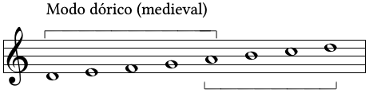
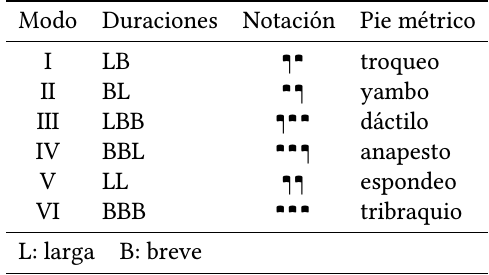

## Os sistemas modais

### Concepto de modo.

- **Modalidade**. A modalidade é un sistema de organización musical baseado nos intervalos. Este concepto está relacionado especialmente coa *melodía*, se temos en conta que esta é unha sucesión ordenada de intervalos.

- **Modo**. Nos sistemas modais, o concepto básico é o **de modo**. Consiste na organización dos intervalos en grupos nos que certas notas teñen unha importancia especial.

### Organización do modo

Os modos, baséanse en pequenos grupos de notas que abarcan en total un intervalo de cuarta ou quinta (ás veces terceira). Entre as dúas notas extremas sitúanse outras que dividen o conxunto en pequenos intervalos, que non teñen por que axustarse necesariamente a tonos ou ao semitonos.

Estes pequenos grupos únense a outros, ben utilizando as notas extremas como notas comúns, ou ben cunha certa separación entre ambos (habitualmente dun tono). Este conxunto de dúas ou máis unidades, dá lugar ao ámbito completo do modo, que pode ser dunha oitava ou maior.

### O ritmo nos sistemas modais

As definicións antigas da música facían referencia á arte (ou a ciencia) *de medir ben*. Esta medida debíase facer en dúas dimensións: na da **altura** dos sons, entoando correctamente os intervalos; e na da **duración** dos sons, levando adecuadamente o ritmo. Ámbalas dimensións definen a *melodía*, que é o elemento fundamental nas músicas modais.

#### Tipos de ritmo

Consideramos dous estilos fundamentais de ritmo:

- Ritmo **libre**:

  As duracións dos sons non se axustan a ningún pulso, podendo alongarse ou acurtarse a vontade dos intérpretes. Na música vocal, o ritmo adoita axustarse ás necesidades do texto. Denomínaselle ás veces **ritmo *non mensural*** ou *non medido*.

- Ritmo **medido**:

  As duracións dos sons axústanse a un pulso, que pode ser regular ou flexible. Na música vocal, os elementos prosódicos (acento, cantidade silábica) poden determinar a forma de axustarse ao pulso. Denomínaselle tamén **ritmo *mensural***.

#### Os ciclos rítmicos

Na música mensural, o pulso pode presentar diversas diferenzas (por ejempl, forte/débil). Estes pulsos diferentes organízanse en grupos que se repiten con regularidade, constituíndo así os*ciclos*.

A forma máis simple de ciclo rítmico é o *compás* da música occidental: grupos de dous, tres ou catro pulsos nos que o primeiro é forte e os demais débiles.

Habitualmente os ciclos rítmicos están constituídos en varios niveis:

- Un primeiro nivel constitúeno pequenos grupos de dous ou tres (ás veces máis) pulsos organizados ao redor de características como duración, acento ou timbre.
- Un segundo nivel fórmano agrupacións deses pequenos grupos en series máis longas, que poden chegar ás veces a ser *moi* longas.

Algúns exemplos de ciclos rítmicos complexos, son o *compás de doce* habitual en moitos estilos de música flamenca, ou os ritmos da música turca ou india.

#### Os modos rítmicos medievais

Nos tratados medievais sobre música, xunto ao ritmo e á melodía (que habitualmente denominaban *harmonía*), incluíase a **métrica** isto é, a organización sonora das palabras propia da poesía; debido a que a música era maioritariamente vocal, e o ritmo dependía desa organización.

No século XIII estableceuse unha organización rítmica baseada en modos, do mesmo xeito que a organización melódica. Estes modos derivaban dos pés métricos da poesía latina e eran seis:

