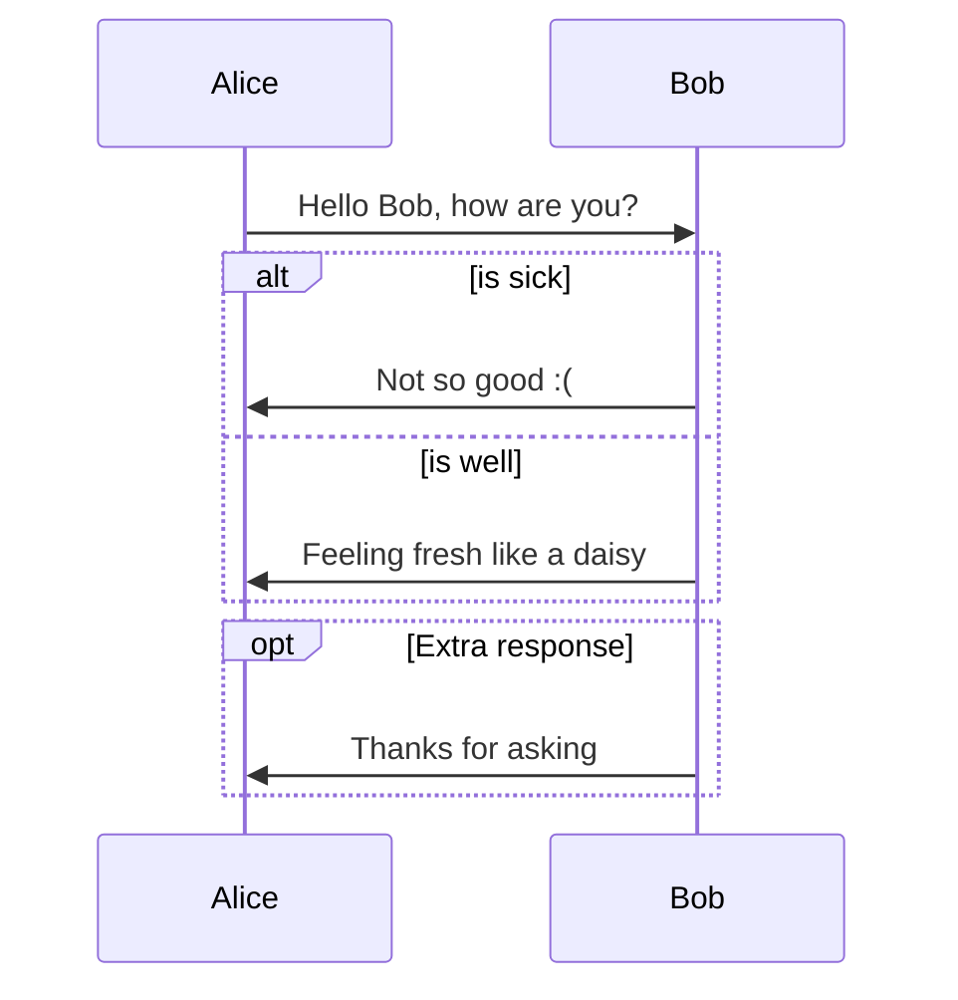

---
output:
  bookdown::word_document2: default
  bookdown::pdf_document2:
    template: templates/brief_template.tex
    citation_package: biblatex
  bookdown::html_document2: default
documentclass: book
#bibliography: [bibliography/references.bib, bibliography/additional-references.bib]
---


# Chuleta de comandos: RStudio, LaTeX e Markdown {-}

```{=tex}
\adjustmtc
\markboth{Introdución}{}
```
<!-- IMPORTANTE, incluir despois de capítulos non numerados.
 Evita que o índice de capítulos e encabezamentos amose os textos do capítulo anterior.
  -->

<!-- CITA DE INICIO DE CAPÍTULO (só pdf) -->

```{block type='savequote', quote_author='(ref:cita-dante)', include=knitr::is_latex_output()}
O obxetivo de toda obra artística é axudar a cantos viven neste mundo a abandonar as súas miserias e conducilos á verdadeira felicidade...
```
(ref:cita-dante) --- Dante Alighieri. *Carta al Gran Can de la Scala de Verona*, no preámbulo ao Paraíso.

<!-- 
Notes for adding an opening quote in PDF output:
i) add the reference for the quote with the chunk option quote_author="my author name",
ii) include=knitr::opts_knit$get('rmarkdown.pandoc.to') == 'latex' means that these quotes are only included when output is latex (in HTML output, it would appear by the end of the previous page)
iii) You can't use markdown syntax inside chunk options, so if you want to e.g. italicise a book name in the quote reference use a 'text reference': Create a named piece of text with '(ref:label-name) My text', then link to this in the chunk option with quote_author='(ref:label-name)'
-->

## Entornos persoais

### Exemplo

```{example, label="foo", name="Entornos de bookdown"}
Esto es un ejemplo.
```
### Exercicios

```{exercise, label="exercicio1", name="Exercicio sobre o tema 1"}
Esto es un ejemplo.
```

### Definicións

Un entorno un pouco máis complicado:

:::{.definition #perspectiva-ciencia name="Música como ciencia"}  
Pitágoras, filósofo grego, afirmaba aló polo s.V a.C. 

$$a^2 + b^2 = c^2$$
:::


## Táboas: creación e visualización {-}

Texto de referencia e consultas en [Pedro Luis Luque Calvo]: http://www.destio.us.es/calvo/ficheros/ComoCrearTablasRMarkdown_PedroLuque_2019Sep_librodigital.pdf

### Crear táboas introducindo datos manualmente {-}


- Exemplo de creación dunha táboa sinxela en R:

```{r}
tb01 = data.frame(stringsAsFactors=FALSE,
Columna1 = c("Fila1","Fila2","Fila3",
"Fila4","Fila5"),
Columna2 = c(1,1,2.5,3,4),
Columna3 = c(4,2,2,5,4),
Columna4 = c(12,24,13,7,17)
)
```


```{r, figures-side, fig.show="hold", out.width="50%"}
par(mar = c(4, 4, .1, .1))
plot(cars)
plot(mpg ~ hp, data = mtcars, pch = 19)
```


### Impresión e visualización de táboas {-}

Para imprimir e visualizar os datos da táboa anterior en R:

```{r}
knitr::kable(
  head(tb01), 
  caption = "Exemplo dunha táboa en RStudio"
)
```

### Figuras en LaTeX {-}

#### Insertando figuras

- Paquetes necesarios: graphicx
- comando: \includegraphics[opcions]{ruta}
  os parámetros obrigatorios van entre chaves e os opcionais entre corchetes

- Unha soa figura:

\includegraphics{ruta_a_la_figura}

  - Opcions:
    - height: a altura que debe ter a figura, escalará o gráfico ata que teña esta altura
    - width:  anchura que debe ter a figura, escalará o gráfico ata que teña esa anchura
    - scale: escalar a figura, sobre 1
    - angle: xirar a figura, en graos

  - Exemplos:
  
\includegraphics[angle=90, scale=0.5]{ruta_a_la_figura}

\includegraphics[width=\textwidth]{ruta_a_la_figura}

\includegraphics[width=0.7\textwidth]{ruta_a_la_figura}

- Figuras flotantes:

\begin{figure}[posición]
  \includegraphics[opciones]{ruta}
\end{figure}

  La opción posición puede tomar estos valores:

  - h (here), le decimos que ponga la imagen más o menos aquí 
  - t (top), preferiblemente en la parte superior de la página
  - b (bottom), preferiblemente en la parte inferior de la página
  - p (page), que junte los objetos flotantes en una página
  - ! que ignore sus reglas internas de posicionamiento
  - H que ponga la imagen justo aquí, similar a h! y con muchas papeletas de hacer cosas rarunas

  - Exemplo: 

\begin{figure}[posición]
  \includegraphics[opciones]{ruta}
  \caption{Pie de figura}
  \label{etiqueta}
\end{figure}


### Táboas en LaTeX {-}

- Cabe tamén a posibilidade de usar \LaTeX para as táboas:

\begin{center}
\begin{tabular}{|p{2cm}|c|l|r|}
\hline
Edad & Nacimientos & Mujeres & TFR por 1000 \\ \hline
20 & 20 & 100 & 200 \\ \hline
21 & 25 & 100 & 250 \\ \hline
22 & 30 & 100 & 300 \\ \hline
23 & 35 & 100 & 350 \\ \hline
24 & 40 & 100 & 400 \\ \hline
\multicolumn{1}{|c|}{Total} &
\multicolumn{1}{r|}{150} &
\multicolumn{1}{c|}{500} &
\multicolumn{1}{c|}{1500} \\ \hline
20-24 & 150 & 500 & 300 \\ \hline
\end{tabular}
\end{center}

## Citas textuais en LaTeX

\begin{center}
    \begin{minipage}{0.9\linewidth}
        \vspace{5pt}%margen superior de minipage
        {\small
            La desventaja principal de esta práctica, es que la víctima no sólo tiene que ejecutar el \textit{backdoor} sino que también cambiar los permisos de dicho archivo para ser ejecutable, y por si fuera poco, el \textit{backdoor} debe de estar en ejecución durante el ataque, si el proceso se termina la conexión se desactiva.
        }
        \begin{flushright}
            (Fonte: descoñecida)
        \end{flushright}
        \vspace{5pt}%margen inferior de la minipage
    \end{minipage}
\end{center}

## Figuras en RStudio {-}

- Para introducir unha figura en RStudio, farémolo como no seguinte exemplo:

```{r rmarkdown, fig.align='center', fig.cap="Logo de rmarkdown (desde archivo PNG).", out.width="30%"}
knitr::include_graphics('figures/ud-00/rmarkdown.png')
```

```{r pressure, echo=FALSE, fig.cap="A caption", out.width = '100%'}
knitr::include_graphics("temp.png")
```

## Diagramas de Gantt con R {-}

- Usando DiagrammeR:

```{r}
library(DiagrammeR)
mermaid("
gantt
dateFormat  YYYY-MM-DD
title A Very Nice Gantt Diagram

section Basic Tasks
This is completed             :done,          first_1,    2014-01-06, 2014-01-08
This is active                :active,        first_2,    2014-01-09, 3d
Do this later                 :               first_3,    after first_2, 5d
Do this after that            :               first_4,    after first_3, 5d

section Important Things
Completed, critical task      :crit, done,    import_1,   2014-01-06,24h
Also done, also critical      :crit, done,    import_2,   after import_1, 2d
Doing this important task now :crit, active,  import_3,   after import_2, 3d
Next critical task            :crit,          import_4,   after import_3, 5d

section The Extras
First extras                  :active,        extras_1,   after import_4,  3d
Second helping                :               extras_2,   after extras_1, 20h
More of the extras            :               extras_3,   after extras_1, 48h
")
```

## Diagramas de fluxo {-}



## Insertar arquivos en RStudio

Para incluir arquivos de texto externos:
```{r child=here::here('unidades-didacticas/unidade-00/fontes-musicais.md')}
```
