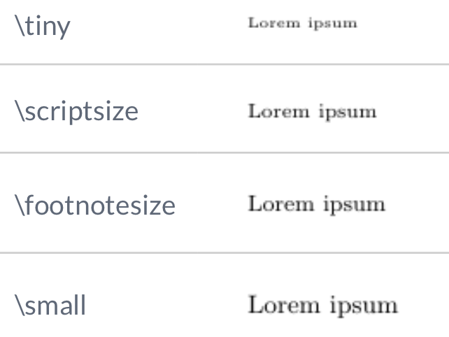

---
#####################
##  output format  ##
#####################
# The lines below makes the 'knit' button build the entire thesis 
# Edit the line 'thesis_formats <- "pdf"' to the formats you want
# The format options are: 'pdf', 'bs4', 'gitbook', 'word'
# E.g. you can build both pdf and html with 'thesis_formats <- c("pdf", "bs4")'
knit: (function(input, ...) {
    thesis_formats <- c("pdf", "gitbook");
    
    source("scripts_and_filters/knit-functions.R");
    knit_thesis(input, thesis_formats, ...)
  })

#####################
## thesis metadata ##
#####################
title: |
  Historia I \
  Apuntes e materiais didácticos
author: "Roberto Prado Martínez"
college: https://aulademusica.netlify.app
university: Conservatorios Profesionais de Música
university-logo: templates/beltcrest.pdf
university-logo-width: 5cm
submitted-text: Apuntes e materiais didácticos
degree: Ensinanzas Profesionais de Música
degreedate: 2021 - 2022
abstract: |
  `r paste(readLines("front-and-back-matter/_abstract.Rmd"), collapse = '\n  ')`
acknowledgements: |
  `r paste(readLines("front-and-back-matter/_acknowledgements.Rmd"), collapse = '\n  ')`
dedication: A todas aquelas persoas que colaboraron neste traballo
abbreviations: |
  `r paste(readLines("front-and-back-matter/_abbreviations.Rmd"), collapse = '\n  ')`

#######################
## bibliography path ##
#######################
bibliography: [bibliography/references.bib, bibliography/additional-references.bib]

########################
## PDF layout options ###
#########################
### submitting a master's thesis ###
# set masters-submission: true for an alternative, anonymous title page with 
# candidate number and word count
masters-submission: false
candidate-number: 123456
word-count: "10,052"

# if you want to use a different title page altogether, provide a path to a 
# .tex file here and it will override the default Oxford one
# alternative-title-page: templates/alt-title-page-example.tex

### abbreviations ###
abbreviations-width: 3.2cm
abbreviations-heading: Glosario


### citation and bibliography style ###
bibliography-heading-in-pdf: Bibliografía

# biblatex options #
# unless you run into 'biber' error messages, use natbib as it lets you customise your bibliography directly
use-biblatex: true
bib-latex-options: "style=authoryear, sorting=nyt, backend=biber, maxcitenames=2, useprefix, doi=true, isbn=false, uniquename=false" #for science, you might want style=numeric-comp, sorting=none for numerical in-text citation with references in order of appearance

# natbib options #
# natbib runs into fewer errors than biblatex, but to customise your bibliography you need to fiddle with .bst files
use-natbib: false # to use natbib, set this to true, and change "output:bookdown::pdf_book:citation_package:" to "natbib"
natbib-citation-style: authoryear #for science, you might want numbers,square
natbib-bibliography-style: templates/ACM-Reference-Format.bst #e.g. "plainnat", unsrtnat, or path to a .bst file

### correction highlighting ###
corrections: true

### link highlighting ###
colored-not-bordered-links: true # true = highlight text of links - false = highlight links with border

# Set the link text/bord coloring here, in RGB. 
# Comment out a variable to just use whatever the text's existing color is. 
# If you wish NOT to highlight links, set colored-not-bordered-links: true, 
# and comment out the colors below
urlcolor-rgb: "0,0,139"
citecolor-rgb: "0,33,71"
# linkcolor-rgb: "0,33,71"  # coloring normal links looks a bit excessive, as it highlights also all links in the table of contents


### binding / margins ###
# page-layout: nobind #'nobind' for equal margins (PDF output), 'twoside' for two-sided binding (mirror margins and blank pages), leave blank for one-sided binding (left margin > right margin)

page-layout: twoside #'nobind' for equal margins (PDF output), 'twoside' for two-sided binding (mirror margins and blank pages), leave blank for one-sided binding (left margin > right margin)


### position of page numbers ###
ordinary-page-number-foot-or-head: foot #'foot' puts page number in footer, 'head' in header
ordinary-page-number-position: RO, LE  #C = center, R = right, L = left. If page layout is 'twoside', O = odd pages and E = even pages. E.g. RO,LE puts the page number to the right on odd pages and left on even pages
chapter-page-number-foot-or-head: foot #you may want it to be different on the chapter pages
chapter-page-number-position: C

### position of running header ###
running-header: true #indicate current chapter/section in header?
running-header-foot-or-head: head
running-header-position-leftmark: LO #marks the chapter. If layout is 'nobind', only this is used.
running-header-position-rightmark: RE  #marks the section.


### draft mark ###
#draft-mark: false # add a DRAFT mark?
draft-mark: false # add a DRAFT mark?
draft-mark-foot-or-head: foot ##'foot' = in footer, 'head' = in header
draft-mark-position: C

### section numbering ###
section-numbering-depth: 2 # to which depth should headings be numbered?

### tables of content ###
toc-depth: 1 # to which depth should headings be included in table of contents?
lof: true # include list of figures in front matter?
lot: true # include list of tables in front matter?
mini-toc: true  # include mini-table of contents at start of each chapter? (this just prepares it; you must also add \minitoc after the chapter titles)
mini-lot: false  # include mini-list of tables by start of each chapter?
mini-lof: false  # include mini-list of figures by start of each chapter?

### code block spacing ###
space-before-code-block: 10pt
space-after-code-block: 8pt

### linespacing ###
# linespacing: 22pt plus2pt # 22pt is official for submission & library copies
linespacing: 14pt plus3pt # 22pt is official for submission & library copies
frontmatter-linespacing: 17pt plus1pt minus1pt #spacing in roman-numbered pages (acknowledgments, table of contents, etc.)

### other stuff ###
abstractseparate: false  # include front page w/ abstract for examination schools?
includeline-num: false #show line numbering in PDF?


#####################
## output details  ##
#####################
output:
  bookdown::pdf_book:
    citation_package: biblatex
    template: templates/template.tex
    keep_tex: true
    pandoc_args: "--lua-filter=scripts_and_filters/colour_and_highlight.lua"
  bookdown::bs4_book:
    css: 
      - templates/bs4_style.css
      - templates/corrections.css # remove to stop highlighting corrections
    theme:
      primary: "#6D1919"
    repo: https://github.com/ulyngs/oxforddown
    pandoc_args: "--lua-filter=scripts_and_filters/colour_and_highlight.lua"
  bookdown::gitbook:
    css: templates/style.css
    config:
      download: ["pdf"]
      sharing:
        facebook: false
        twitter: false
        all: false
  bookdown::word_document2:
    toc: true   
link-citations: true
documentclass: book
always_allow_html: true #this allows html stuff in word (.docx) output
---


```{r install_packages, include=FALSE}
source('scripts_and_filters/install_packages_if_missing.R')
```

```{r create_chunk_options, include=FALSE, eval=knitr::is_latex_output()}
source('scripts_and_filters/create_chunk_options.R')
source('scripts_and_filters/wrap_lines.R')
```

<!--
Include the create_chunk_options chunk above at the top of your index.Rmd file
This will include code to create additional chunk options (e.g. for adding author references to savequotes)
and to make sure lines in code soft wrap
If you need to create your own additional chunk options, edit the file scripts/create_chunk_options.R
-->

<!-- This chunk includes the front page content in HTML output -->
```{r ebook-welcome, child = 'front-and-back-matter/_welcome-ebook.Rmd', eval=knitr::is_html_output()}
```

<!--chapter:end:index.Rmd-->

---
output:
  bookdown::pdf_document2:
    template: templates/brief_template.tex
    citation_package: biblatex
  bookdown::gitbook:
    css: templates/style.css
    config:
      download: pdf
      sharing:
        facebook: no
        twitter: no
        all: no
  bookdown::html_document2: default
  bookdown::word_document2: default
documentclass: book
#bibliography: [bibliography/references.bib, bibliography/additional-references.bib]
---

# Aproximación á Historia da Música {-}

```{=tex}
\adjustmtc
\markboth{Aproximación á Historia da Música}{}
```

<!-- IMPORTANTE, incluir despois de capítulos non numerados.
Evita que o índice de capítulos e encabezamentos amose os textos do capítulo anterior.
-->

<!-- CITA DE INICIO DE CAPÍTULO (só pdf) -->

```{block type='savequote', quote_author='(ref:cita-dante)', include=knitr::is_latex_output()}
O obxetivo de toda obra artística é axudar a cantos viven neste mundo a abandonar as súas miserias e conducilos á verdadeira felicidade...
```

(ref:cita-dante) --- Dante Alighieri. *Carta al Gran Can de la Scala de Verona*, no preámbulo ao Paraíso.

<!-- 
Notes for adding an opening quote in PDF output:
i) add the reference for the quote with the chunk option quote_author="my author name",
ii) include=knitr::opts_knit$get('rmarkdown.pandoc.to') == 'latex' means that these quotes are only included when output is latex (in HTML output, it would appear by the end of the previous page)
iii) You can't use markdown syntax inside chunk options, so if you want to e.g. italicise a book name in the quote reference use a 'text reference': Create a named piece of text with '(ref:label-name) My text', then link to this in the chunk option with quote_author='(ref:label-name)'
-->


<!-- PENDIENTE: Mover ao apartado PRESENTACIÓN!

A finalidade da Historia da Música é escoitar música, captar as características das distintas correntes estéticas de cada época, comprender a música e relacionala coas correntes estéticas, comprender e coñecer os feitos históricos e movementos socioculturais máis destacados así como o contexto no que se orixinaron, permite valorar a importancia que a música ten na sociedade e igualmente a relación entre a música e o resto de artes.

Comezamos este curso facendo un percorrido histórico, artístico e musical polas épocas anteriores á actual, coa finalidade de coñecer e comprender mellor a música e os elementos que forman parte dunha obra de arte musical. Faremos un percorrido pola música de diferentes épocas e civilizacións, centrándonos na música occidental e a súa evolución ata os nosos días, tendo en conta a importanacia da cultura musical na Península Ibérica e igualmente en Galicia.  

Nos primeiros capítulos, trataremos a orixe da música e a música na prehistoria, prestando especial atención ás primeiras evidencias conservadas de música escrita que foron descifradas e comprendidas (desde a idade da memoria); veremos as principais teorías sobre música da Antigüidade e finalmente trataremos en profundidade a evolución da música escrita desde a Idade Media (idade da notación) ata o Renacemento.
-->

## Definicións e conceptos previos {-} 

O concepto de «música» recibe diferentes tratamentos e acepcións ao longo da historia; as definicións sobre o concepto e significado son moitas e variadas. A pesares de ser algo do que vivimos rodeados, non existe polo momento unha definición única, universal e consensuada que transmita o seu significado; as diferentes culturas e sociedades do mundo actual, teñen ideas dispares sobre a música ao igual que ocorre nas civilizacións de épocas anteriores á actual.  

A música[^def:mousike], na mitoloxía grega, era considerada unha *tekné* (técnica, habilidade, destreza, arte…) que engloba tanto a artistas como teóricos. Nos períodos heleno e helenístico, a música terá un papel central na sociedade civil e relixiosa da época, promovendo o entretemento e formando parte de razoamentos científico-filosóficos.  
Platón, (entre os séculos V-VI a.c) concibe a música como a "arte educativa por excelencia que se insire na alma e forma a virtude"; no século VI, Boecio percibe a música como a "habilidade de examinar [...] a diversidade de sons [...] por medio da razón e os sentidos".  
Santo Tomás no século XIII, considera a música como "a máis noble das ciencias humanas [...] que ocupa o primeiro lugar entre as artes liberais". Xa no século XVIII, Rousseau plantea a música como "a arte de combinar sons de xeito agradable ó oído". Pau Casals (s.XIX-XX), mantiña que "a música, esa marabillosa linguaxe universal, debería ser unha fonte de comunicación". 

As percepcións sobre a música varian ao longo do tempo, a pesares de manter todas rasgos comúns. Non será ata os anos noventa do século pasado, cando se establezan as primeiras definicións concretas e complexas sobre este concepto. Musicólogos, etnomusicólogos e investigadores coinciden en moitos aspectos sobre a música. Neste sentido, a profesora López Cobas afirma:

>
As definicións e conceptos sobre música eran difusos e dependían, en grande medida, da época, o lugar e sobre todo, dos diferentes puntos de vista. Durante a Idade Media os trobadores e músicos ambulantes non eran considerados músicos coma hoxe en día, senón filósofos, capaces de manexar os conceptos teóricos de harmonía. [...]  
Non obstante, [...] as definicións de música poden ser moi variadas e complexas, xa que existe unha multiplicidade de enfoques que non fan máis que apoiar o feito de que o fenómeno musical é unha manifestación de grande riqueza[^ref:lopez-cobas-musica].  

### A música como linguaxe universal {-}

O ser humano sinte a necesidade de expresarse e comunicarse. A música, como o resto de artes, é unha linguaxe a través da que expresarnos e comunicarnos. É un medio de comunicación e, ao igual que un idioma emprega a palabra para crear estruturas gramaticais, a música emprega o son e as súas múltiples combinacións para expresar ideas, sentimentos, conceptos, etc. A mensaxe musical, abrangue aspectos e disciplinas variadas:

> 
[...] en realidade, a definición de Música esténdese moito máis alá destes límites desde o mesmo momento en que por primeira vez o home emitiu un son valéndose dun instrumento. Esas harmonías e melodías non só eran un son belo, unha expresión de Beleza, senón que estableceron unha forma de linguaxe, unha nova maneira de expresarse e de sentir, así como de transmitir sensacións, imaxes e conceptos que abarcan desde a simple intención de comunicarse, ata a Filosofía, a Política, a Ética ou os complicados principios  cosmolóxicos, sen esquecer o papel tan importante que desempeñou dentro da Relixión ao longo da historia. Por todo iso, a Música é merecedora de ser considerada unha forma de linguaxe, así como unha disciplina científica e o seu estudo é necesario para coñecer o desenvolvemento dunha parcela da cultura do ser humano e comprender mellor a evolución do mesmo dentro da historia e a súa necesidade de comunicación.[^ref:gutierrez-macho]

Considerada como arte, ciencia e linguaxe universal, sabemos que é un medio de expresión sen límites capaz de chegar ao máis íntimo de cada persoa, de transmitir diferentes estados de ánimo e emocións. Escoitar e facer música, desenvolve a sensibilidade, a creatividade e a capacidade de abstracción ou análise:

>  
Propícianos a descubrir o noso propio mundo interior, a comunicación con “o outro” ou “os outros” e a captación e apreciación do mundo que nos rodea. A música, xa sexa mediante o comportamento de interpretación, de escoita ou de composición, se esta é adecuada, condúcenos a unha "reharmonización" do estado de ánimo e dos sentimentos.[^ref:josefa-moreno]

### A creación artístico-musical {-}
<!--TODO: IMAXE SOBRE ARTE ABSTRACTA, ETC.-->

A música é unha **arte abstracta** que posúe un grao de abstracción superior a calquera outra, e polo tanto, é unha **arte espiritual**, **humana** e **universal**. Precisa, certos coñecementos específicos para chegar a comprender plenamente a realidade científica que lle da forma; é unha **arte dinámica**[^cita:arte-estatica], que transcorre no tempo; o oínte, necesita ir interiorizando[^cita:memoria-auditiva] a obra a medida que a escoita, para así poder captala íntegramente; por iso, é unha **arte viva**[^cita:arte-viva] capaz de facer presente calquera tempo histórico.

>
Coas palabras dinse cousas humanas; coa música exprésase iso que ninguén coñece nin pode definir, pero que en todos existe en maior ou menor forza. A música é a arte por natureza. Podería dicirse que é o campo eterno das ideas... Para poder falar dela, necesítase unha gran preparación espiritual e, sobre todo, estar unido intimamente aos seus segredos.[^cita:Lorca-musica]

Cando afirmamos que a música é ciencia e arte ao mesmo tempo, significa que dunha mesma obra podemos facer unha análise rigurosa, ténica, formal, estilística, etc. e igualmente, disfrutar do pracer estético de escoitar sen máis. Polo tanto, estes dous aspectos ---científico e artístico--- chegan nun todo: a obra de arte musical. 

### Perspectivas e significado da «música» {-}
<!--TODO: PENDIENTE DE METER IMAXES-->

Ao longo da historia, existen diversos puntos de vista ou perspectivas sobre a música. Para comprender o concepto e a importancia que esta terá sobre a sociedade de cada época, compre coñecer algunhas das reflexións que darán lugar ás diferentes concepcións sobre música que hoxe coñecemos. 

Música como ciencia.
:    Pitágoras, filósofo grego do século V a.c. afirmaba:  
"os números son as cousas; agora ben, a música é número. O mundo é música; o cosmos é unha lira sublime de sete cordas."

Música como arte.
:    Richard Wagner, compositor alemán do s. XIX, consideraba:  
"o son vén do corazón e a súa linguaxe artística natural é a música. A melodía é a lingua absoluta, a través da que o músico fala a todos os corazóns".

Música como feito musical.
:    O filósofo francés Descartes, alá polo século XVII, afirmaba sobre a música o seguinte:  
"A mesma cousa que a uns invita a bailar a outros pode facer chorar. Pois isto non provén senón da asociación de ideas na nosa mente; como aqueles que algunha vez se divertiron bailando con certa peza, tan pronto como a volvan a escoltar volverán ás ganas de bailar; pola contra, se algún só oíu gallardas cando lle aconteceu algo malo, volverá a entristecerse cando as escoite de novo".

Música en relación co tempo.
:    A definición tradicional, establece que:  
"A música é a arte que se expresa combinando os sons co tempo".

Música como expresión de sentimentos.
:    Kant, filósofo alemán do século XVIII, comentaba ao respecto:  
"A música é a linguaxe do sentimento. A música é a arte de expresar unha agradable sensación de sentimentos por medio dos sons".  

Como podemos ver, os puntos de vista sobre a música son variados e dependen da época que se trate. Hugo Riemann, musicógrafo alemán do século XIX, afonda na definición mesturando algunhas das perspectivas anteriores, afirmando o seguinte: 

>
A música é, ao mesmo tempo, unha arte e unha ciencia. Como arte, é a manifestación da *beleza* por medio dos sons; pero esta manifestación descansa nunha ciencia exacta, formada polo conxunto de leis que rexen a produción dos sons, ao mesmo tempo que as súas relacións de altura e duración.

### Temporalidade e memoria auditiva {-}
<!--TODO: IMAXE SOBRE TEMPORALIDADE E MEMORIA AUDITIVA-->

As diferentes perspectivas sobre a música, introducen un concepto fundamental: a «temporalidade».  
Para que a música exista, debe desenvolverse ao longo do tempo. A «memoria auditiva» xoga un papel fundamental pois, como oíntes, se non retemos na memoria algúns dos compoñentes fundamentais da música, (ritmo, melodía ou timbre, ...) difícilmente a poderemos apreciar ben.


```{r figura-musas-1, echo=FALSE, fig.align='center', fig.pos='ht',  fig.cap="Representación de Zeus e as nove musas fillas de Zeus. - (wikimedia)", fig.scap="Apolo e as nove musas inspiradoras das artes e as ciencias", out.width="100%"}
knitr::include_graphics('figures/ud-00/musas-origen-musica.jpg')
```

### Transmisión da mensaxe musical {-}
<!--TODO: IMAXE SOBRE MENSAXE MUSICAL (CADRO COMPARATIVO, ETC.)-->

Se observamos o exemplo (referencia ao exemplo), vemos que o modo en que se transmite a mensaxe, varía segundo se trate de obras de arte estáticas ou dinámicas. No exemplo, entre o cadro de Goya e o espectador non hai intermediarios; a obra de arte permanece inalterable co paso do tempo para calquera espectador que queira contemplala. No mesmo exemplo, no caso da obra de Beethoven a mensaxe, non chega de maneira tan directa: o compositor, escribe a partitura que ha ser executada por un ou varios intérpretes, que dan vida á obra; o oínte recibe a música interpretada e polo tanto a obra musical ideada polo autor. O intérprete, neste caso debe ser capaz de conxugar por unha parte, a liberdade creadora[^cita:liberdade-creadora] e por outra a fidelidade ao escrito polo compositor: influirá aquí, polo tanto, a calidade do instrumento e as cualidades do propio instrumentista. A boa recepción da mensaxe, non depende únicamente do escrito polo autor da obra no momento da creación, senón tamén da interpretación ---recreación--- que se faga en cada momento:

>
Non quero que se interprete a miña música, só é preciso tocar o que está escrito.

<!--%%%%%%%%%%%%%%%% CITAS TEXTUAIS:%%%%%%%%%%%%%%--->

<!-- Definición de música (Wikipedia)-->

### Algunhas definicións aceptadas {-}

Música
:    
>La música [...] es el [arte](https://es.wikipedia.org/wiki/Arte) de organizar sensible y lógicamente una combinación coherente de [sonidos](https://es.wikipedia.org/wiki/Sonido) y [silencios](https://es.wikipedia.org/wiki/Silencio_(sonido)) respetando los principios fundamentales de la [melodía](https://es.wikipedia.org/wiki/Melodía), la [armonía](https://es.wikipedia.org/wiki/Armonía) y el [ritmo](https://es.wikipedia.org/wiki/Ritmo), [...]. [^ref:Wikipedia(Música)]


```{r figura-exemplo1, echo=FALSE, fig.align='center', fig.cap="Insertar imaxes en RStudio.", out.width="65%"}

```

- A [Real Adacemia Galega da lingua][RAG], define a [«música»][rag:música] como:

> Arte de combinar harmoniosamente os sons, segundo unhas regras preestablecidas.

```{block type='correction'}

Podemos concluír que, a música é unha combinación ordenada de ritmo, melodía e harmonía, agradable ao oído humano.

```
## Relación entre historia e música {-}

Se ben o concepto de «música» pode estar máis ou menos claro, abordaremos agora o significado de «historia da música».

> _La **Historia de la música** es el estudio de las diferentes tradiciones en la música y su orden en el planeta_.
>
> [...] _aquella disciplina que trata el estudio de la evolución de las diferentes tradiciones musicales a lo largo del tiempo_.

Estas son algunhas ideas sobre o concepto de «historia da música», que nos aproximan ao concepto que estamos a buscar. De xeito formal, atopamos as seguintes definicións:  

- a [Real Academia Española da lingua][RAE] (RAE) define textualmente [«historia»][rae:historia] como:

> 1.- *Narración y exposición de los acontecimientos pasados y dignos de memoria, sean públicos o privados*.
>
> 2.- *Disciplina que estudia y narra cronológicamente los acontecimientos pasados*
>
> 3.- *Conjunto de los sucesos o hechos políticos, sociales, económicos, culturales, etc., de un pueblo o de una nación*.
>
> 5.- *Conjunto de los acontecimientos ocurridos a alguien a lo largo de su vida o en un período de ella* [^ref:RAE(2020)]

- a [Real Adacemia Galega da lingua][RAG] (RAG), define [«historia»][rag:historia]:

> 1. Conxunto de feitos ocorridos no pasado, que afectan a toda a humanidade, a un grupo, unha persoa, unha institución, a unha faceta concreta dese pasado etc.  
>
> 2. Ciencia que estuda eses feitos. [^ref:RAG(2020)]

Concluiremos entón, que a finalidade da Historia da Música occidental é, entre outras:

```{block type='correction'}

- o estudo da evolución das diferentes manifestacións musicais (a tradición musical) das culturas de occidente (neste caso as culturas e sociedades musicais europeas) ao longo do tempo.

```

## Obxectivos e problemática da materia {-}

O principal obxectivo da Historia da Música é o **estudo da evolución da música ao longo da historia da humanidade**.

Un dos principais problemas, como vemos no punto \@ref(definicions-e-conceptos-previos), que debemos afrontar na historia da música, é atopar unha definición máis ou menos aceptada e consensuada do que se entende por «música», dado que non significa e non se refire ao mesmo en tódalas culturas. Algunhas, inclúen dentro do concepto de «música» aspectos da danza, poesía, etc. e outras culturas, pola contra, non empregan ningún término para referírense á música en sí.  

<!-- %%% Oculto comentario de Francisco Callejo (2021/2022) %%%

Son frecuentes as discusións entre musicólogos, historiadores e grades entendidos sobre a música para lograr unha definición universal da música, pero é complicado universalizar este concepto dada a diversidade de culturas e pobos. O profesor Francisco Callejo, expón esta problemática:

> [...] el primer problema que nos encontramos es acordar una definición universal de *música*: el concepto de música varía de una cultura a otra; por ejemplo, la mayor parte de los musulmanes no considerarían música la llamada a la oración del almuédano, que a los oídos occidentales suena similar a muchas salmodias medievales; los toques de campanas de las iglesias cristianas, por el  contrario, no son considerados como manifestaciones musicales en occidente, aunque a muchos africanos les recordarían melodías suyas. [^ref:Callejo(2017)]

Como vemos no exemplo anterior, o que se considera música para unha cultura, pode non selo para outra e viceversa. Pensemos nestas dúas preguntas, relacionadas co exemplo de Callejo:

- considerdamos como música todo aquelo que alguén considera como tal? (caso do *almuédano* [^cita:almuédano] e as campás)
- consideramos como música, pola contra, só o que todos consideramos música?

-->

Por outra parte, a «historia da música occidental» exclúe moitas manifestacións musicais como a música popular actual, a música tradicional europea e non europea. Exclúe tamén do seu ámbito de estudo, a música clásica oriental chinesa, xaponesa ou india. Así o seu campo de estudo redúcese, exclusivamente á "música culta" europea, a pesares de si estudar algunha música non europea que segue certos cánones europeos.

Outra cuestión que influirá no concepto é a «orixe da cultura occidental». Cando comeza a cultura occidental? ou mellor dito, desde cando consideramos que comeza a cultura occidental?

### A actividade musical e o produto musical {-}

Unha das cuestións que teremos en conta en primeiro lugar, será diferenciar entre música como actividade e música como resultado desa actividade.

En primeiro lugar, diferenciaremos a música como **actividade**, onde unha ou máis persoas participan creando, interpretando ou escoitando música; en comparación coa música como **produto** isto é, o resultado desta actividade é algo sólido, coa posibilidade de ser escrito con sistemas de notación dando como resultado unha obra musical, por exemplo. Neste caso, obtemos un produto (obra musical) resultante dunha actividade (composición).  

A actividade musical pode considerarse como un proceso bastante complexo, que abarca varias fases: **produción**, **difusión** e **consumo**. 

Para comprender a actividade musical, como proceso creativo, vexamos o seguinte exemplo tendo en conta as fases indicadas no parágrafo anterior:  
imaxinemos por un momento, que como resultado dun intre de inspiración, escribimos unha sinxela melodía que nos gusta moito e non queremos esquencer (**composición**) . Despois de interpretala repetidas veces, decidimos compartila en público o cal resulta todo un éxito (**interpretación**). Chegados a este punto, e despois do éxito da nosa creación, decidimos realizar unha xira de concertos (**audición**).  

O exemplo anterior, lévanos a relacionar as diferentes fases do proceso (produción, difusión e consumo) coas súas equivalentes actividades (composición, interpretación e audición) tal que, producimos o noso grande éxito cando compoñemos unha sinxela melodía, que difundiremos ao público por medio da interpretación e, finalmente, por medio dos concertos (audición) fomentamos o seu consumo.


| FASE       | ACTIVIDADE      |
| ---------- | --------------- |
| Produción  | Composición     |
| Difusión   | Interpretación  |
| Consumo    | Audición        |


Para estudar a actividade musical historicamente (o "proceso musical"), imos centrarnos por un igual nas tres fases do proceso, polo que trataremos a produción, facendo referencia aos intérpretes, ás técnicas e sobre todo aos contextos de escoita (audición), entre outros.

### Música de tadición oral e notación musical {-}

A posibilidade de estudar música historicamente, baséase na existencia dunha transmisión dela ao longo do tempo (tradición oral).  
En case todas as culturas e tempos, a música transmitiuse por medio da escoita e posterior repetición. Isto é o que se chama **transmisión oral**(propio da idade da memoria)

Tamén existe a posibilidade de transmitir - e almacenar - música con varios métodos de escritura musical, dando lugar a transmisión escrita (idade de notación).

### Música popular e «música culta» {-}

A actividade musical, prodúcese en todos os grupos sociais e nun gran número de situacións diferentes. Algunhas manifestacións musicais adquiriron un maior prestixio social, ben pola súa relación e vinculación coa alta sociedade, ben polas súas características de formación e profesionalización. Estamos a diferencar música académica, tamén coñecida como "clásica" ou "culta", fronte a unha enorme variedade de música popular, normalmente considerada de menor prestixio.  

O estudo da música debería abarcar todos os estilos, pero neste caso trataremos só o estudo dos estilos académicos.

### O enfoque eurocéntrico {-}

Cando estudamos a historia da música, adoitamos centrarnos en produtos musicais escritos da tradición académica europea, polo que acurtamos drasticamente o obxecto de estudo. O resto - actividade musical, transmisión oral, música popular ou non europea - son obxecto de estudo da etnomusicoloxía, que normalmente non aplica o enfoque histórico.

Este enfoque "eurocéntrico" da Historia da Música, deixa fóra numerosas manifestacións musicais, tanto académicas como populares de fóra de Europa, que nalgúns casos tiveron unha forte influencia no propio desenvolvemento da música europea; se ben teremos en consideración, que foi no continente europeo onde se crearon os principais tratados e estudos sobre música.  

### Cánon e repertorio

Ao longo do século XIX desenvolvéronse dúas ideas ou conceptos importantes: *o canon* e o *repertorio*. O primeiro refírese ao conxunto de compositores e obras obxecto de estudo; o segundo é o conxunto de obras que, por unha ou outra razón, seguimos interpretando e escoitando. Ámbolos dous conceptos derivan de certos criterios de "calidade musical" malia que é certo que son, á súa vez, produtos culturais europeos creados en contextos políticos, sociais e ideolóxicos específicos.

O feito de que se exclúa a música non europea ou popular, fainos pensar na discriminación étnica e de clase, que mantiveron certos musicólogos, intérpretes, críticos, (...) do século XIX. A exclusión do canon da muller como compositora, é outro exemplo destes prexuízos e discriminación [^cita:exclusión_muller], así como o silencio ao que foron sometidos aqueles compositores [^cita:exclusión_compo] que non se axustaban ao modelo ou idea de evolución da música occidental da época. Sen dúbida, outra das ideas que marcaron este concepto de canon foi a valoración dos nacionalismos, [^cita:nacionalismos] que explica así que predominase certa música sobre outra.

<!-- Oculto curso 21/22:
A modo de conclusión, o concepto de *historia da música* redúcese ao estudo dunha serie de compositores e obras musicais da música culta (académica) occidental, que foron seleccionados seguindo certos criterios impostos en certas ocasións polas "modas musicais" da época.
-->

<!---
%%%%%%%%%%%%%%%%%%%%%
CITAS E NOTAS DO TEMA
%%%%%%%%%%%%%%%%%%%%%
-->
[^def:mousike]:
O término «música» [...] deriva do grego *mousike* (*techne*) (arte das musas), feminino de *mousikos* «pertencente ás musas», de *Mousa* «Musa».

[^cita:Lorca-musica]: Para García Lorca (1977) a música tiña un carácter difícilmente explicable, máis se non coñecemos os seus elementos internos.

[^cita:arte-estatica]:  As artes estáticas como a pintura, precisan dun lugar determinado, un espazo, que permite ao espectador contemplalas o tempo que queira e captalas dun golpe coa mirada. Segundo a clasificación tradicional das belas artes, son artes estáticas ou do espazo: a pintura, a escultura e arquitectura por exemplo. Como artes dinámicas, consideramos: a poesía, danza, música e o cine por exemplo.

[^cita:memoria-auditiva]: Para que a música exista, debe desenvolverse no tempo e, permitir así que o oínte a poida apreciar. A "memoria auditiva" xoga aquí un papel importante, pois o oínte non poderá apreciar ben a música, se non retén na memoria algúns dos seus compoñentes como poden ser, a melodía, o ritmo ou timbre.

[^cita:arte-viva]: A música renace con cada interpretación, e está constantemente nun proceso de reactivación. O resultado, depende tanto dos intérpretes coma do público e por iso, podemos definir a música de dous xeitos: coma obxecto autónomo (produto) e coma proceso (actividade).  


[^cita:liberdade:creadora]: Dunha mesma obra podemos escoitar diferentes versións, de igual calidade ou non, cada unha delas con un "toque" persoal de cada intérprete ou agrupación.

[^cita:definiónhistoria]: Consulta da [RAE](https://dle.rae.es/historia#otras), ofrece varias posibles definicións de Historia.

[^cita:exclusion_muller]: As mulleres foron silenciadas e discriminadas musicalmente ao longo da historia; nunca foi aceptada dentro do canon do s. XIX.

[^cita:exclusion_compo]:  Ao longo dos diferentes períodos da historia da música, moitos compositores e obras foron discriminados e censurados. Nalgúns casos por seren demasiado conservadores ou demasiado avanzados para o seu tempo; noutros, por tomar camiños musicais que ninguén seguiu (polo menos nese momento) moi lonxe da marca do canon.

[^cita:nacionalismos]: A idea do nacional ou nacionalista tamén influíu na creación do canon. O feito de que as universidades máis importantes de finais do século XIX e principios do XX fosen as de Alemaña e que a escola historiográfica alemá dominase un período decisivo na historiografía musical, explica a abundancia de compositores xermanos no canon.

[^cita:Musas]:Os gregos definen a música como «a arte das musas»

[^ref:lopez-cobas-musica]: López Cobas, L.: *Historia da Música*, Ed. Conservatorio Profesional de Música de Ourense, (Setembro, 2019)

[^ref:Callejo(2017)]: Callejo, F.: *Historia de la Música*, Conservatorio Profesional de Música Francisco Guerreo (2017).

[^ref:RAE(2020)]: *Definición de historia*, RAE consultado en <https://www.rae.es> , (Setembro, 2020).

[^ref:Wikipedia(Música)]: Definición de [música](https://es.wikipedia.org/wiki/M%C3%BAsica#Definici%C3%B3n) consultada na wikipedia.

[^ref:RAG(2020)]: *Definición de historia*, RAG consultado en <https://academia.gal/diccionario> , (Setembro 2020)

[^ref:gutierrez-macho]: Gutiérrez Machó, L. M. (2013). La música como lenguaje y medio de comunicación. Ecos del lejano oriente en la vanguardia musical orientalismo y japonismo musical. Entreculturas. Revista de tradución e comunicación intercultural, 5, 15–36.

[^ref:josefa-moreno]: Moreno, J. L. (2003). Psicología de la música y emoción musical. Educatio s. XXI, 20–21, 213.

[RAE]:https://dle.rae.es/ "Enlace á páxina da Real Academia Española da Língua"

[RAG]:https://academia.gal/dicionario "diccionario da Real Academia Galega da Lingua"

[rae:historia]:
https://dle.rae.es/historia#otras "definición de «historia» da Real Academia Española da Língua"

[rag:historia]:
https://academia.gal/dicionario/-/termo/busca/Historia "definición de Historia da Real Academia Galega da língua"

[rag:música]:
https://digalego.xunta.gal/es/termo/44501/m%C3%BAsica "definición de música da Real Academia Galega da língua"

[^cita:almuédano]: [...] o muecín ou almuédano ("gritador") era o musulmán que realizaba tradicionalmente a chamada á oración (_salat_) mediante a voz. Na actualidade, o almuédano foi substituído con frecuencia por un megáfono.  
(Fonte:
[wikiland](https://www.wikiwand.com/gl/Minarete?wprov=srpw1_0))

<!--- Fin de notas a pié de página --->


<!--chapter:end:00-intro.Rmd-->

---
output:
  bookdown::pdf_document2:
    template: templates/brief_template.tex
    citation_package: biblatex
  bookdown::html_document2: default
  bookdown::word_document2: default
  bookdown::gitbook:
    css: templates/style.css
    config:
      download: pdf
      sharing:
        facebook: no
        twitter: no
        all: no
documentclass: book
---

# Orixes da Música Occidental

\minitoc <!-- this will include a mini table of contents-->


```{r child=here::here('unidades-didacticas/unidade-00/fontes-musicais.md')}
```

## A orixe da música

```{r child=here::here('unidades-didacticas/unidade-00/fontes-musicais.md')}
```

## A música durante a Prehistoria

```{r child=here::here('unidades-didacticas/unidade-01/prehistoria.md')}
```

## A música nas primeiras civilizacións

### Exipto

### Mesopotamia

### O antigo Oriente

### O pobo Hebreo

## A música no mundo clásico

### Grecia

### Roma

## Actividades

## Resumo

<!--chapter:end:01-unidade-01.Rmd-->

---
#########################################
# options for knitting a single chapter #
#########################################
output:
  bookdown::pdf_document2:
    template: templates/brief_template.tex
    citation_package: biblatex
  bookdown::html_document2: default
  bookdown::word_document2: default
documentclass: book
#bibliography: [bibliography/references.bib, bibliography/additional-references.bib]
---

<!-- 
Notes for adding an opening quote in PDF output:
i) add the reference for the quote with the chunk option quote_author="my author name",
ii) include=knitr::opts_knit$get('rmarkdown.pandoc.to') == 'latex' means that these quotes are only included when output is latex (in HTML output, it would appear by the end of the previous page)
iii) You can't use markdown syntax inside chunk options, so if you want to e.g. italicise a book name in the quote reference use a 'text reference': Create a named piece of text with '(ref:label-name) My text', then link to this in the chunk option with quote_author='(ref:label-name)'
-->

# R Markdown basics {#rmd-basics}
\minitoc <!-- this will include a mini table of contents-->

<!-- LaTeX normally does not indent the first line after a heading - however, it does so after the mini table of contents. You can manually tell it not to with \noindent -->
\noindent Here is a brief introduction to using *R Markdown*. 
*Markdown* is a simple formatting syntax for authoring HTML, PDF, and MS Word documents and much, much more. 
*R Markdown* provides the flexibility of *Markdown* with the implementation of **R** input and output.  For more details on using *R Markdown* see <http://rmarkdown.rstudio.com>.


## Basic markdown syntax
### Whitespace
Be careful with your spacing. 
While whitespace largely is ignored, it does at times give markdown signals as to how to proceed. 
As a habit, try to keep everything left aligned whenever possible, especially as you type a new paragraph. 
In other words, there is no need to indent basic text in the Rmd document (in fact, it might cause your text to do funny things if you do).

### Italics and bold
- *Italics* are done like \*this\* or \_this\_
- **Bold** is done like \*\*this\*\* or \_\_this\_\_
- **_Bold and italics_** is done like \*\*\*this\*\*\*, \_\_\_this\_\_\_, or (the most transparent solution, in my opinion) \*\*\_this\_\*\*

### Inline code
- `Inline code` is created with backticks like `` `this` ``

### Sub and superscript 
Sub~2~ and super^2^ script is created like this\~2\~ and this\^2\^

### Strikethrough
- ~~Strikethrough~~ is done \~\~like this\~\~

### 'Escaping' (aka "What if I need an actual asterisk?")
- To include an actual \*, \_ or \\, add another \\ in front of them: \\\*, \\\_, \\\\

### Endash (--), emdash (---)
- -- and --- with \-\- and \-\-\-

### Blockquotes
Do like this:

> Put a \> in front of the line.

### Headings
Section headers are created with \#'s of increasing number, i.e. 
  
- \# First-level heading
- \#\# Second-level heading
- \#\#\# Etc.

In PDF output, a level-five heading will turn into a paragraph heading, i.e. `\paragraph{My level-five heading}`, which appears as bold text on the same line as the subsequent paragraph.


### Lists
Unordered list by starting a line with an \* or a \-:

* Item 1
* Item 2

Ordered lists by starting a line with a number.
Notice that you can mislabel the numbers and *Markdown* will still make the order right in the output:

1. Item 1
4. Item 2


To create a sublist, indent the values a bit (at least four spaces or a tab):

1. Item 1
1. Item 2
1. Item 3
    - Item 3a
    - Item 3b

### Line breaks

The official *Markdown* way to create line breaks is by ending a line with more than two spaces.

Roses are red.
Violets are blue.

This appears on the same line in the output, because we didn't add spaces after red.

Roses are red.   
Violets are blue.

This appears with a line break because I added spaces after red.

I find this is confusing, so I recommend the alternative way: Ending a line with a backslash will also create a linebreak:

Roses are red.\
Violets are blue.

To create a new paragraph, you put a blank line.

Therefore, this line starts its own paragraph.

### Hyperlinks
- [This is a hyperlink](https://www.google.com) created by writing the text you want turned into a clickable link in `[square brackets followed by a](https://hyperlink-in-parentheses)`

### Footnotes
- Are created^[my footnote text] by writing either \^[my footnote text] for supplying the footnote content inline, or something like `[^a-random-footnote-label]` and supplying the text elsewhere in the format shown below [^test-footnote]:

`[^a-random-footnote-label]: This is a random test.`

[^test-footnote]: This is a random test.

### Comments
To write comments within your text that won't actually be included in the output, use the same syntax as for writing comments in HTML. That is, \<!\-\- this will not be included in the output \-\->.

<!-- It is super useful to use comments! -->

### Math
The syntax for writing math is stolen from LaTeX. To write a math expression that will be shown **inline**, enclose it in dollar signs.
  - This: \$A = \\pi*r^{2}\$  Becomes: $A = \pi*r^{2}$
  
To write a math expression that will be shown in a block, enclose it in two dollar signs.\
This: `r ifelse(knitr::opts_knit$get('rmarkdown.pandoc.to') == 'latex', "\\$\\$A = \\\\pi*r^{2}\\$\\$", "<span>&#36;</span>\\$A = \\\\pi*r^{2}\\$\\$")`

Becomes: 
$$A = \pi*r^{2}$$

To create numbered equations, put them in an 'equation' environment and give them a label with the syntax `(\#eq:label)`, like this:

```latex
\begin{equation} 
  f\left(k\right) = \binom{n}{k} p^k\left(1-p\right)^{n-k}
  (\#eq:binom)
\end{equation} 
```

Becomes:
\begin{equation}
f\left(k\right)=\binom{n}{k}p^k\left(1-p\right)^{n-k}
(\#eq:binom)
\end{equation}


For more (e.g. how to theorems), see e.g. the documentation on [bookdown.org](https://bookdown.org/yihui/bookdown/markdown-extensions-by-bookdown.html#equations)


## Executable code chunks {#code}
The magic of R Markdown is that we can add executable code within our document to make it dynamic.

We do this either as *code chunks* (generally used for loading libraries and data, performing calculations, and adding images, plots, and tables), or *inline code* (generally used for dynamically reporting results within our text).

The syntax of a code chunk is shown in Figure \@ref(fig:chunk-parts).

```{r chunk-parts, echo=FALSE, fig.cap="Code chunk syntax", out.width="100%", message=FALSE, fig.pos='H'}
library(tidyverse)
knitr::include_graphics("figures/sample-content/chunk-parts.png")
```

Common chunk options include (see e.g. [bookdown.org](https://bookdown.org/yihui/rmarkdown/r-code.html)):

- `echo`: whether or not to display code in knitted output
- `eval`: whether or to to run the code in the chunk when knitting
- `include`: whether to include anything from the from a code chunk in the output document
- `fig.cap`: figure caption
- `fig.scap`: short figure caption, which will be used in the 'List of Figures' in the PDF front matter

**IMPORTANT**: Do *not* use underscoores in your chunk labels - if you do, you are likely to get an error in PDF output saying something like "! Package caption Error: \\caption outside float".

### Setup chunks - setup, images, plots
An R Markdown document usually begins with a chunk that is used to **load libraries**, and to **set default chunk options** with `knitr::opts_chunk$set`.

In your thesis, this will probably happen in **index.Rmd** and/or as opening chunks in each of your chapters.

````
`r ''````{r setup, include=FALSE}
# don't show code unless we explicitly set echo = TRUE
knitr::opts_chunk$set(echo = FALSE)

library(tidyverse)
```
````

### Including images
Code chunks are also used for including images, with `include_graphics` from the `knitr` package, as in Figure \@ref(fig:oxford-logo)

```{r oxford-logo, fig.cap="Oxford logo", out.width='50%', fig.align='center'}
knitr::include_graphics("figures/sample-content/beltcrest.png")
```

Useful chunk options for figures include:

- `out.width` (use with a percentage) for setting the image size 
- if you've got an image that gets waaay to big in your output, it will be constrained to the page width by setting `out.width = "100%"`


#### Figure rotation {-}
You can use the chunk option `out.extra` to rotate images.

The syntax is different for LaTeX and HTML, so for ease we might start by assigning the right string to a variable that depends on the format you're outputting to:

```{r}
if (knitr::is_latex_output()){
  rotate180 <- "angle=180"
} else {
  rotate180 <- "style='transform:rotate(180deg);'"
}
```

Then you can reference that variable as the value of `out.extra` to rotate images, as in Figure \@ref(fig:oxford-logo-rotated).

```{r oxford-logo-rotated, out.extra=rotate180, fig.cap="Oxford logo, rotated", out.width='50%', fig.align='center', echo=FALSE}
knitr::include_graphics("figures/sample-content/beltcrest.png")
```


### Including plots
Similarly, code chunks are used for including dynamically generated plots.
You use ordinary code in R or other languages - Figure \@ref(fig:cars-plot) shows a plot of the `cars` dataset of stopping distances for cars at various speeds (this dataset is built in to **R**).

```{r cars-plot, fig.cap = "A ggplot of car stuff"}
cars %>% 
  ggplot() +
    aes(x = speed, y = dist) +
    geom_point()
```

Under the hood, plots are included in your document in the same way as images - when you build the book or knit a chapter, the plot is automatically generated from your code, saved as an image, then included into the output document.

### Including tables
Tables are usually included with the `kable` function from the `knitr` package.

Table \@ref(tab:cars-table) shows the first rows of that cars data - read in your own data, then use this approach to automatically generate tables.

```{r cars-table}
cars %>% 
  head() %>% 
  knitr::kable(caption = "A knitr kable table")
```

- Gotcha: when using [`kable`](https://www.rdocumentation.org/packages/knitr/versions/1.21/topics/kable), captions  are set inside the `kable` function
- The `kable` package is often used with the [`kableExtra`](https://cran.r-project.org/web/packages/kableExtra/vignettes/awesome_table_in_html.html) package

### Control positioning
One thing that may be annoying is the way *R Markdown* handles "floats" like tables and figures.
In your PDF output, LaTeX will try to find the best place to put your object based on the text around it and until you're really, truly done writing you should just leave it where it lies.

In general, you should allow LaTeX to do this, but if you really *really* need a figure to be positioned where you put in the document, then you can make LaTeX attempt to do this with the chunk option `fig.pos="H"`, as in Figure \@ref(fig:oxford-logo-controlled):

```{r oxford-logo-controlled, fig.cap="An Oxford logo that LaTeX will try to place at this position in the text", out.width='50%', fig.align='center', fig.pos="H"}
knitr::include_graphics("figures/sample-content/beltcrest.png")
```

As anyone who has tried to manually play around with the placement of figures in a Word document knows, this can have lots of side effects with extra spacing on other pages, etc.
Therefore, it is not generally a good idea to do this - only do it when you really need to ensure that an image follows directly under text where you refer to it (in this document, I needed to do this for Figure \@ref(fig:latex-font-sizing) in section \@ref(max-power)).
For more details, read the relevant section of the [R Markdown Cookbook](https://bookdown.org/yihui/rmarkdown-cookbook/figure-placement.html).


## Executable inline code
'Inline code' simply means inclusion of code inside text. 
The syntax for doing this is `` ``r ''`r R_CODE` ``
For example, `` ``r ''`r 4 + 4` `` will output `r 4 + 4` in your text.

You will usually use this in parts of your thesis where you report results - read in data or results in a code chunk, store things you want to report in a variable, then insert the value of that variable in your text.
For example, we might assign the number of rows in the `cars` dataset to a variable:

```{r}
num_car_observations <- nrow(cars)
```

We might then write:\
"In the `cars` dataset, we have `` ``r ''`r num_car_observations` `` observations."

Which would output:\
"In the `cars` dataset, we have `r num_car_observations` observations."


## Executable code in other languages than R
If you want to use other languages than R, such as Python, Julia C++, or SQL, see [the relevant section of the *R Markdown Cookbook*](https://bookdown.org/yihui/rmarkdown-cookbook/other-languages.html) 

<!--chapter:end:02-unidade-02.Rmd-->

---
output:
  #bookdown::html_document2: default
  #bookdown::word_document2: default
  bookdown::pdf_document2:
    template: templates/brief_template.tex
    citation_package: biblatex
bib-humanities: true
documentclass: book
#bibliography: [bibliography/references.bib, bibliography/additional-references.bib]
---

# Citations, cross-references, and collaboration {#cites-and-refs} 
\chaptermark{Citations and cross-refs}
\minitoc <!-- this will include a mini table of contents-->

## Citations
The usual way to include citations in an *R Markdown* document is to put references in a plain text file with the extension **.bib**, in **BibTex** format.[^bib-formats]
Then reference the path to this file in **index.Rmd**'s YAML header with `bibliography: example.bib`.

[^bib-formats]: The bibliography can be in other formats as well, including EndNote (**.enl**) and RIS (**.ris**), see [rmarkdown.rstudio.com/authoring_bibliographies_and_citations](https://rmarkdown.rstudio.com/authoring_bibliographies_and_citations.html).

Most reference managers can create a .bib file with you references automatically.
However, the **by far** best reference manager to use with *R Markdown* is [Zotero](https://www.zotero.org) with the [Better BibTex plug-in](https://retorque.re/zotero-better-bibtex/), because the `citr` plugin for RStudio (see below) can read references directly from your Zotero library!

Here is an example of an entry in a **.bib** file:
```bibtex
@article{Shea2014,
  author =        {Shea, Nicholas and Boldt, Annika},
  journal =       {Trends in Cognitive Sciences},
  pages =         {186--193},
  title =         {{Supra-personal cognitive control}},
  volume =        {18},
  year =          {2014},
  doi =           {10.1016/j.tics.2014.01.006},
}
```

In this entry highlighed section, 'Shea2014' is the **citation identifier**.
To default way to cite an entry in your text is with this syntax: `[@citation-identifier]`.

So I might cite some things [@Shea2014; @Lottridge2012].

### PDF output
In PDF output, the bibliography is handled by the OxThesis LaTeX template.
If you set `bib-humanities: true` in **index.Rmd**, then in-text references will be formatted as author-year; otherwise references will be shown as numbers.

If you choose author-year formatting, a number of variations on the citation syntax are useful to know:

- Put author names outside the parenthesis
  - This: `@Shea2014 says blah.`
  - Becomes: @Shea2014 says blah.
- Include only the citation-year (in parenthesis)
  - This: `Shea et al. says blah [-@Shea2014]`
  - Becomes: Shea et al. says blah [-@Shea2014]
- Add text and page or chapter references to the citation
  - This: `[see @Shea2014, pp. 33-35; also @Wu2016, ch. 1]`
  - Becomes: Blah blah [see @Shea2014, pp. 33-35; also @Wu2016, ch. 1].

### Gitbook output
In gitbook output, citations are by default inserted in the Chicago author-date format.

To change the format, add `csl: some-other-style.csl` in **index.Rmd**'s YAML header. 
You can browse through and download styles at [zotero.org/styles](https://www.zotero.org/styles).


\clearpage

<!-- clearpage ends the page, and also dumps out all floats.
  Floats are things like tables and figures. -->

### Insert references easily with the `citr` add-in
For an easy way to insert citations, try the [`citr`](https://github.com/crsh/citr) RStudio add-in (Figure \@ref(fig:citr)).
You can install this add-in by typing `install.packages("citr")` in the R Console.

```{r citr, echo=FALSE, fig.cap="The `citr` add-in", out.width="80%", fig.align='center'}
# include dynamic gif if output is HTML; otherwise screenshot
if (knitr::opts_knit$get('rmarkdown.pandoc.to') == 'html'){
  knitr::include_graphics("https://raw.githubusercontent.com/crsh/citr/master/tools/images/addin_demo.gif")
} else {
  knitr::include_graphics("figures/sample-content/citr.png")
}
```

## Cross-referencing
We can make cross-references to **sections** within our document, as well as to **figures** (images and plots) and **tables**.

The general cross-referencing syntax is **`\@ref(label)`**

### Section references
Headers are automatically assigned a reference label, which is the text in lower caps separated by dashes. For example, `# My header` is automatically given the label `my-header`. So `# My header` can be referenced with `\@ref(my-section)`

Remember what we wrote in section \@ref(citations)?

We can also use **hyperlink syntax** and add \# before the label, though this is only guaranteed to work properly in HTML output:

- So if we write `Remember what we wrote up in [the previous section](#citations)?`
- It becomes Remember what we wrote up in [the previous section](#citations)?

#### Creating custom labels
It is a very good idea to create **custom labels** for our sections. This is because the automatically assigned labels will change when we change the titles of the sections - to avoid this, we can create the labels ourselves and leave them untouched if we change the section titles.

We create custom labels by adding `{#label}` after a header, e.g. `# My section {#my-label}`.
See [our chapter title](#cites-and-refs) for an example. That was section \@ref(cites-and-refs).

### Figure (image and plot) references
- To refer to figures (i.e. images and plots) use the syntax `\@ref(fig:label)`
- **GOTCHA**: Figures and tables must have captions if you wish to cross-reference them.

Let's add an image:
```{r captain, fig.align='center', fig.cap="A marvel-lous meme", out.width="65%"}
knitr::include_graphics("figures/sample-content/captain.jpeg")
```

We refer to this image with `\@ref(fig:captain)`.
So Figure \@ref(fig:captain) is [this image](#fig:captain).

And in Figure \@ref(fig:cars-plot) we saw a [cars plot](#fig:cars-plot).


### Table references
- To refer to tables use the syntax `\@ref(tab:label)`

Let's include a table:
```{r cars-table2}
knitr::kable(cars[1:5,],
            caption="Stopping cars")
```

We refer to this table with `\@ref(tab:cars-table2)`. 
So Table \@ref(tab:cars-table2) is [this table](#tab:cars-table2).

And in Table \@ref(tab:cars-table) we saw more or less [the same cars table](#tab:cars-table).

### Including page numbers
Finally, in the PDF output we might also want to include the page number of a reference, so that it's easy to find in physical printed output.
LaTeX has a command for this, which looks like this: `\pageref{fig/tab:label}` (note: curly braces, not parentheses)

When we output to PDF, we can use raw LaTeX directly in our .Rmd files. So if we wanted to include the page of the cars plot we could write:

- This: `Figure \@ref(fig:cars-plot) on page \pageref(fig:cars-plot)`
- Becomes: Figure \@ref(fig:cars-plot) on page \pageref{fig:cars-plot}

#### Include page numbers only in PDF output
A problem here is that LaTeX commands don't display in HTML output, so in the gitbook output we'd see simply "Figure \@ref(fig:cars-plot) on page ".

One way to get around this is to use inline R code to insert the text, and use an `ifelse` statement to check the output format and then insert the appropriate text.

- So this: `` ``r ''`r ifelse(knitr::is_latex_output(), "Figure \\@ref(fig:cars-plot) on page \\pageref{fig:cars-plot}", "")` ``
- Inserts this (check this on both PDF and gitbook): `r ifelse(knitr::is_latex_output(), "Figure \\@ref(fig:cars-plot) on page \\pageref{fig:cars-plot}", "")`

Note that we need to escape the backslash with another backslash here to get the correct output.


## Collaborative writing

Best practices for collaboration and change tracking when using R Markdown are still an open question. 
In the blog post [**One year to dissertate**](https://livefreeordichotomize.com/2018/09/14/one-year-to-dissertate/) by Lucy D'Agostino, which I highly recommend, the author notes that she knits .Rmd files to a word document, then uses the `googledrive` R package to send this to Google Drive for comments / revisions from co-authors, then incorporates Google Drive suggestions *by hand* into the .Rmd source files. 
This is a bit clunky, and there are ongoing discussions among the _R Markdown_ developers about what the best way is to handle collaborative writing (see [issue #1463](https://github.com/rstudio/rmarkdown/issues/1463) on GitHub, where [CriticMarkup](http://criticmarkup.com) is among the suggestions).

For now, this is an open question in the community of R Markdown users. 
I often knit to a format that can easily be imported to Google Docs for comments, then go over suggested revisions and manually incorporate them back in to the .Rmd source files. 
For articles, I sometimes upload a near-final draft to [Overleaf](https://www.overleaf.com/), then collaboratively make final edits to the LaTeX file there. 
I suspect some great solution will be developed in the not-to-distant future, probably by the RStudio team.


## Additional resources

- *R Markdown: The Definitive Guide* - <https://bookdown.org/yihui/rmarkdown/>

- *R for Data Science* - <https://r4ds.had.co.nz>

<!--chapter:end:03-unidade-03.Rmd-->

---
output:
  #bookdown::html_document2: default
  #bookdown::word_document2: default
  bookdown::pdf_document2:
    template: templates/brief_template.tex
    citation_package: biblatex
documentclass: book
#bibliography: [bibliography/references.bib, bibliography/additional-references.bib]
---

# Tables {#tables} 
\minitoc <!-- this will include a mini table of contents-->

## Making LaTeX tables play nice
Dealing with tables in LaTeX can be painful.
This section explains the main tricks you need to make the pain go away.

(Note: if you are looking at the ebook version, you will not see much difference in this section, as it is only relevant for PDF output!)

### Making your table pretty
When you use `kable` to create tables, you will almost certainly want to set the option `booktabs = TRUE`.
This makes your table look a million times better:

```{r, message=FALSE}
library(knitr)
library(tidyverse)

head(mtcars) %>% 
  kable(booktabs = TRUE)
```

\vspace{4mm}

Compare this to the default style, which looks terrible:


```{r}
head(mtcars) %>% 
  kable()
```


### If your table is too wide
You might find that your table expands into the margins of the page, like the tables above.
Fix this with the `kable_styling` function from the [`kableExtra`](https://haozhu233.github.io/kableExtra/) package:

```{r, message=FALSE}
library(kableExtra)

head(mtcars) %>% 
  kable(booktabs = TRUE) %>% 
  kable_styling(latex_options = "scale_down")
```

This scales down the table to fit the page width.


### If your table is too long
If your table is too long to fit on a single page, set `longtable = TRUE` in the `kable` function to split the table across multiple pages.

```{r}
a_long_table <- rbind(mtcars, mtcars)

a_long_table %>% 
  select(1:8) %>% 
  kable(booktabs = TRUE, longtable = TRUE)
```

When you do this, you'll probably want to make the header repeat on new pages.
Do this with the `kable_styling` function from `kableExtra`:

```{r}
a_long_table %>% 
  kable(booktabs = TRUE, longtable = TRUE) %>% 
  kable_styling(latex_options = "repeat_header")
```

Unfortunately, we cannot use the `scale_down` option with a `longtable`. 
So if a `longtable` is too wide, you can either manually adjust the font size, or show the table in landscape layout. 
To adjust the font size, use kableExtra's `font_size` option:

```{r}
a_long_table %>% 
  kable(booktabs = TRUE, longtable = TRUE) %>% 
  kable_styling(font_size = 9, latex_options = "repeat_header")
```

To put the table in landscape mode, use kableExtra's `landscape` function:

```{r}
a_long_table %>% 
  kable(booktabs = TRUE, longtable = TRUE) %>% 
  kable_styling(latex_options = "repeat_header") %>% 
  landscape()
```

### Max power: manually adjust the raw LaTeX output {#max-power}
For total flexibility, you can adjust the raw LaTeX output from `kable`/`kableExtra` that generates the table.
Let us consider how we would do this for the example of adjusting the font size if our table is too wide:
Latex has a bunch of standard commands that set an approximate font size, as shown below in Figure \@ref(fig:latex-font-sizing).

```{r latex-font-sizing, echo=FALSE, out.width='50%', fig.cap="Font sizes in LaTeX", fig.pos="H", fig.align='center'}

```

You could use these to manually adjust the font size in your longtable in two steps:

1. Wrap the longtable environment in, e.g., a `scriptsize` environment, by doing a string replacement in the output from `kable`/`kableExtra`
2. Add the attributes that make R Markdown understand that the table is a table (it seems R drops these when we do the string replacement)

```{r}
our_adjusted_table <- a_long_table %>% 
  kable(booktabs = TRUE, longtable = TRUE) %>% 
  kable_styling(latex_options = "repeat_header") %>% 
  # wrap the longtable in a tiny environment
  str_replace('\\\\begin\\{longtable\\}', 
              '\\\\begin\\{scriptsize\\}\n\\\\begin\\{longtable\\}') %>%
  str_replace('\\\\end\\{longtable\\}', 
              '\\\\end\\{longtable\\}\n\\\\end\\{scriptsize\\}')

#add attributes to make R Markdown treat this as a kable LaTeX table again
our_adjusted_table %>% 
  structure(format = "latex", class = "knitr_kable")
```

<!--chapter:end:04-unidade-04.Rmd-->

---
output:
  #bookdown::html_document2: default
  #bookdown::word_document2: default
  bookdown::pdf_document2: 
    template: templates/brief_template.tex
    citation_package: biblatex
documentclass: book
#bibliography: [bibliography/references.bib, bibliography/additional-references.bib]
---

  
# Customisations and extensions
\minitoc <!-- this will include a mini table of contents-->

<!-- LaTeX normally does not indent the first line after a heading - however, it does so after the mini table of contents. You can manually tell it not to with \noindent -->

\noindent This chapter describes a number of additional tips and tricks as well as possible customizations to the `oxforddown` thesis.

## Front matter
### Shorten captions shown in the list of figures (PDF)
You might want your list of figures (which follows the table of contents) to have shorter (or just different) figure descriptions than the actual figure captions.

Do this using the chunk option `fig.scap` ('short caption'), for example `{r captain-image, fig.cap="A very long and descriptive (and potentially boring) caption that doesn't fit in the list of figures, but helps the reader understand what the figure communicates.", fig.scap="A concise description for the list of figures"`


### Shorten captions shown in the list of tables (PDF)
You might want your list of tables (which follows the list of figures in your thesis front matter) to have shorter (or just different) table descriptions than the actual table captions.

If you are using `knitr::kable` to generate a table, you can do this with the argument `caption.short`, e.g.:

```r
knitr::kable(mtcars,
              caption = "A very long and descriptive (and potentially
              boring) caption that doesn't fit in the list of figures,
              but helps the reader understand what the figure 
              communicates.",
              caption.short = "A concise description for the list of tables")
```

## Shorten running header (PDF)
You might want a chapter's running header (i.e. the header showing the title of the current chapter at the top of page) to be shorter (or just different) to the actual chapter title.

Do this by adding the latex command `\chaptermark{My shorter version}` after your chapter title.

For example, chapter \@ref(cites-and-refs)'s running header is simply 'Cites and cross-refs', because it begins like this:

```markdown
# Citations, cross-references, and collaboration {#cites-and-refs} 
\chaptermark{Cites and cross-refs}
```

## Unnumbered chapters
To make chapters unnumbered (normally only relevant to the Introduction and/or the Conclusion), follow the chapter header with `{-}`, e.g. `# Introduction {-}`.

When you do this, you must also follow the heading with these two latex commands:
```latex
\adjustmtc
\markboth{The Name of Your Unnumbered Chapter}{}
```

Otherwise the chapter's mini table of contents and the running header will show the previous chapter.


## Beginning chapters with quotes (PDF)
The OxThesis LaTeX template lets you inject some wittiness into your thesis by including a block of type `savequote` at the beginning of chapters. 
To do this, use the syntax ```` ```{block type='savequote'} ````.^[For more on custom block types, see the relevant section in [_Authoring Books with R Markdown_](https://bookdown.org/yihui/bookdown/custom-blocks.html).]

Add the reference for the quote with the chunk option `quote_author="my author name"`. 
You will also want to add the chunk option `include=knitr::is_latex_output()` so that quotes are only included in PDF output.

It's not possible to use markdown syntax inside chunk options, so if you want to e.g. italicise a book name in the reference use a ['text reference'](https://bookdown.org/yihui/bookdown/markdown-extensions-by-bookdown.html#text-references): Create a named piece of text with '(ref:label-name) My text', then point to this in the chunk option with `quote_author='(ref:label-name)'`.


## Highlighting corrections (HTML & PDF)
For when it comes time to do corrections, you may want to highlight changes made when you submit a post-viva, corrected copy to your examiners so they can quickly verify you've completed the task. 
You can do so like this:

### Short, inline corrections
Highlight **short, inline corrections** by doing `[like this]{.correction}` --- the text between the square brackets will then [be highlighted in blue]{.correction} in the output.

Note that pandoc might get confused by citations and cross-references inside inline corrections.
In particular, it might get confused by `"[what @Shea2014 said]{.correction}"` which becomes [what @Shea2014 said]{.correction}
In such cases, you can use LaTeX syntax directly. 
The correction highlighting uses the [soul](https://ctan.org/pkg/soul) package, so you can do like this:

- If using biblatex for references, use `"\hl{what \textcite{Shea2014} said}`
- If using natbib for references, use `"\hl{what \cite{Shea2014} said}`

Using raw LaTeX has the drawback of corrections then not showing up in HTML output at all, but you might only care about correction highlighting in the PDF for your examiners anyway!


### Blocks of added or changed material
Highlight entire **blocks of added or changed material** by putting them in a block of type `correction`, using the syntax ```` ```{block type='correction'} ````.^[In the **.tex** file for PDF output, this will put the content between `\begin{correction}` and `\end{correction}`; in gitbook output it will be put between `<div class="correction">` and `</div>`.]
Like so:

```{block type='correction', include=knitr::is_latex_output() | knitr::is_html_output()}
For larger chunks, like this paragraph or indeed entire figures, you can use the `correction` block type. This environment **highlights paragraph-sized and larger blocks** with the same blue colour.
```

*Note that correction blocks cannot be included in word output.*

### Stopping corrections from being highlighted
To turn off correction highlighting, go to the YAML header of **index.Rmd**, then:

- PDF output: set `corrections: false` \
- HTML output: remove or comment out `- templates/corrections.css`


## Apply custom font color and highlighting to text (HTML & PDF)
The lua filter that adds the functionality to highlight corrections adds two more tricks:
you can apply your own choice of colour to highlight text, or change the font color.
The syntax is as follows:

> Here's `[some text in pink highlighting]{highlight="pink"}` \
> Becomes: Here's [some text in pink highlighting]{highlight="pink"}.

> `[Here's some text with blue font]{color="blue"}` \
> Becomes: [Here's some text with blue font]{color="blue"}

> Finally --- never, ever actually do this -- `[here's some text with black highlighting and yellow font]{highlight="black" color="yellow"}` \
> Becomes: [here's some text with black highlighting and yellow font]{highlight="black" color="yellow"}

The file **scripts_and_filters/colour_and_highlight.lua** implements this, if you want to fiddle around with it.
It works with both PDF and HTML output.


## Including another paper in your thesis - embed a PDF document {#embed-pdf}

You may want to embed existing PDF documents into the thesis, for example if your department allows a 'portfolio' style thesis and you need to include an existing typeset publication as a chapter. 

In gitbook output, you can simply use `knitr::include_graphics` and it should include a scrollable (and downloadable) PDF.
You will probably want to set the chunk options `out.width='100%'` and `out.height='1000px'`:

```{r, eval=knitr::is_html_output(), out.width='100%', out.height='1000px'}
knitr::include_graphics("figures/sample-content/pdf_embed_example/Lyngs2020_FB.pdf")
```
<br>

In LaTeX output, however, this approach can cause odd behaviour.
Therefore, when you build your thesis to PDF, split the PDF into an alphanumerically sorted sequence of **single-page** PDF files (you can do this automatically with the package `pdftools`). You can then use the appropriate LaTeX command to insert them, as shown below (for brevity, in the `oxforddown` PDF sample content we're only including two pages).
*Note that the chunk option `results='asis'` must be set.*
You may also want to remove margins from the PDF files, which you can do with Adobe Acrobat (paid version) and likely other software.

```{r, echo=TRUE, results='asis', eval=knitr::is_latex_output(), linewidth = 70}
# install.packages(pdftools)
# split PDF into pages stored in figures/sample-content/pdf_embed_example/split/
# pdftools::pdf_split("figures/sample-content/pdf_embed_example/Lyngs2020_FB.pdf",
#        output = "figures/sample-content/pdf_embed_example/split/")

# grab the pages
pages <- list.files("figures/sample-content/pdf_embed_example/split", full.names = TRUE)

# set how wide you want the inserted PDFs to be: 
# 1.0 is 100 per cent of the oxforddown PDF page width;
# you may want to make it a bit bigger
pdf_width <- 1.2

# for each PDF page, insert it nicely and
# end with a page break
cat(stringr::str_c("\\newpage \\begin{center} \\makebox[\\linewidth][c]{\\includegraphics[width=", pdf_width, "\\linewidth]{", pages, "}} \\end{center}"))

```


## Including another paper in your thesis - R Markdown child document {#embed-rmd}

Sometimes you want to include another paper you are currently writing as a chapter in your thesis.
Above \@ref(embed-pdf), we described the simplest way to do this: include the other paper as a pdf.
However, in some cases you instead want to include the R Markdown source from this paper, and have it compiled within your thesis.
This is a little bit more tricky, because you need to keep careful track of your file paths, but it is possible by [including the paper as a child document](https://bookdown.org/yihui/rmarkdown-cookbook/child-document.html).
There are four main steps: 

1. Include the paper as a child document
1. Make file paths compatible with knitting the article on its own, as well as when it's include in your thesis
1. Make header levels correct
1. Make figure widths correct

### An example paper in another folder
Take this simple example (files for this are in [this GitHub repository](https://github.com/ulyngs/oxforddown-external-article)):

```markdown 
|--paper_to_include
|  |--my_paper.Rmd
|  |--data
|  |  |--cat_salt.csv
|  |--figures
|  |  |--cat.jpg
|
|--thesis
```

As the chart suggests, you have another folder, **paper_to_include/** living in the same containing folder as your thesis folder.
In the **paper_to_include** folder, the file **my_paper.Rmd** is where you write the paper.
In **my_paper.Rmd**, you read in a CSV file found in the subfolder **data/cats.csv**, and also an image from the subfolder **figures/cat.jpg**.

### Step 1: Include paper as a child document
In your thesis folder, create an Rmd file for the chapter where you want to include another paper. 
Add one or more code chunks that include R Markdown files from that paper as child documents:

````markdown
# Including an external chapter 

`r ''````{r child = "../paper_to_include/my_paper.Rmd"}
```
````


### Step 2: Make file paths compatible
Use [parameters](https://rmarkdown.rstudio.com/lesson-6.html) to adjust the file path of images based on values you set in the YAML header of an R Markdown file.
In **my_paper.Rmd**, create a parameter called `other_path` and set it to an empty string:

```yaml
---
title: "A fabulous article in a different folder"
params:
  other_path: ""
---
```

In **my_paper.Rmd**, put this at the start of the filepath when you read in data or include images:

```r
library(tidyverse)
library(knitr)

cat_data <- read_csv(str_c(params$other_path, "data/cats.csv"))
include_graphics(str_c(params$other_path, "figures/cat.jpg"))
```

Finally, in your thesis folder's **index.Rmd** file, also create the parameter `other_path`.
But here, set it to where the **paper_to_include/** folder is relative to your thesis folder:

```yaml
params:
  other_path: "../paper_to_include/"
```

#### Note on HTML output
Note that if you want to host an HTML version on your thesis online, you will need to include graphics in the content that you host online - the internet obviously won't be able to see filepaths that are just referring to stuff in another folder on your computer!


### Step 3: Make sure header levels are correct
Unless the paper you want to include is also written as a book, your header levels are probably going to be off.
That is, the level 1 headers (\# Some header) you use for main sections in the other paper turns into chaper titles when included in your thesis.

To avoid this, first _increment all heading levels by one in **paper_to_include/my_paper.Rmd**_ (\# Some header -> \#\# Some header).
Then in **paper_to_include/** create a [lua filter](https://bookdown.org/yihui/rmarkdown-cookbook/lua-filters.html#lua-filters) that decrements header levels by one: Create a text file, save it as **reduce_header_level.lua**, and give it the content below.

```lua
function Header(el)
  if (el.level <= 1) then
    error("I don't know how to decrease the level of h1")
  end
  el.level = el.level - 1
  return el
end
```

In the YAML header of **paper_to_include/my_paper.Rmd**, use this filter:

```yaml
---
title: "A fabulous article in a different folder"
params:
  other_path: ""
output:
  pdf_document: 
    pandoc_args: ["--lua-filter=reduce_header_level.lua"]
---
```

Now, your header levels will be correct both when you knit the paper on its own and when its included in your thesis.

NOTE: There might be no need to use a lua filter to shift heading - it seems you could simply use `pandoc_args: ["--shift-heading-level-by=-1"]` (see https://pandoc.org/MANUAL.html#reader-options)

### Step 4. Make sure figure widths are correct
It might be that your figure widths when knitting your paper on its own, and when including it in your thesis, need to be different.
You can again use parameters to set figure widths.

Imagine you want figure width to be 80% of the page width when knitting your paper on its own, but 100% in your thesis.
In **paper_to_include/my_paper.Rmd**, first add a parameter we could call `out_width` and set it to the string "80%":

```yaml
---
title: "A fabulous article in a different folder"
params:
  other_path: ""
  out_width: "80%"
output:
  pdf_document: 
    pandoc_args: ["--lua-filter=reduce_header_level.lua"]
---
```

Then, make sure use that parameter to set the output width when you include figures in **paper_to_include/my_paper.Rmd**:

````markdown
`r ''````{r, out.width=params$out_width, fig.cap="A very funny cat"}
include_graphics(str_c(params$other_path, "figures/cat.jpg"))
```
````

Finally, create the parameter `out_width` in your thesis' **index.Rmd** file:

```yaml
params:
  other_path: "../paper_to_include/"
  out_width: "80%"
```

Now, the output width of your figure will be 80% when knitting your paper on its own, and 100% when knitting it as child document of your thesis.


## Customizing referencing 

### Using a .csl file with pandoc instead of biblatex
The `oxforddown` package uses biblatex in LaTeX for referencing. 
It is also possible to use pandoc for referencing by providing a .csl file in the YAML header of **index.Rmd** (likely requiring commenting out the biblatex code in **templates/template.tex**). 
This may be helpful for those who have a .csl file describing the referencing format for a particular journal. 
However, note that this approach does not support chapter bibliographies (see Section \@ref(biblatex-custom)).

```YAML
csl: ecology.csl
```

### Customizing biblatex and adding chapter bibliographies {#biblatex-custom}

This section provides one example of customizing biblatex. Much of this code was combined from searches on Stack Exchange and other sources (e.g. [here](https://tex.stackexchange.com/questions/10682/suppress-in-biblatex)).

In **templates/template.tex**, one can replace the existing biblatex calls with the following to achieve referencing that looks like this: 

(Charmantier and Gienapp 2014)

Charmantier, A. and P. Gienapp (2014). Climate change and timing of avian breeding and migration: evolutionary versus plastic changes. Evolutionary Applications 7(1):15–28. doi: 10.1111/eva.12126.


```latex
\usepackage[backend=biber,
    bibencoding=utf8,
    refsection=chapter, % referencing by chapter
    style=authoryear, 
    firstinits=true,
    isbn=false,
    doi=true,
    url=false,
    eprint=false,
    related=false,
    dashed=false,
    clearlang=true,
    maxcitenames=2,
    mincitenames=1,
    maxbibnames=10,
    abbreviate=false,
    minbibnames=3,
    uniquelist=minyear,
    sortcites=true,
    date=year
]{biblatex}
\AtEveryBibitem{%
  \clearlist{language}%
  \clearfield{note}
}

\DeclareFieldFormat{titlecase}{\MakeTitleCase{#1}}

\newrobustcmd{\MakeTitleCase}[1]{%
  \ifthenelse{\ifcurrentfield{booktitle}\OR\ifcurrentfield{booksubtitle}%
    \OR\ifcurrentfield{maintitle}\OR\ifcurrentfield{mainsubtitle}%
    \OR\ifcurrentfield{journaltitle}\OR\ifcurrentfield{journalsubtitle}%
    \OR\ifcurrentfield{issuetitle}\OR\ifcurrentfield{issuesubtitle}%
    \OR\ifentrytype{book}\OR\ifentrytype{mvbook}\OR\ifentrytype{bookinbook}%
    \OR\ifentrytype{booklet}\OR\ifentrytype{suppbook}%
    \OR\ifentrytype{collection}\OR\ifentrytype{mvcollection}%
    \OR\ifentrytype{suppcollection}\OR\ifentrytype{manual}%
    \OR\ifentrytype{periodical}\OR\ifentrytype{suppperiodical}%
    \OR\ifentrytype{proceedings}\OR\ifentrytype{mvproceedings}%
    \OR\ifentrytype{reference}\OR\ifentrytype{mvreference}%
    \OR\ifentrytype{report}\OR\ifentrytype{thesis}}
    {#1}
    {\MakeSentenceCase{#1}}}
    
% \renewbibmacro{in:}{}
% suppress "in" for articles
% 
\renewbibmacro{in:}{%
  \ifentrytype{article}{}{\printtext{\bibstring{in}\intitlepunct}}}
%-- no "quotes" around titles of chapters/article titles
\DeclareFieldFormat[article, inbook, incollection, inproceedings, misc, thesis, unpublished]
{title}{#1}
%-- no punctuation after volume
\DeclareFieldFormat[article]
{volume}{{#1}}
%-- puts number/issue between brackets
\DeclareFieldFormat[article, inbook, incollection, inproceedings, misc, thesis, unpublished]
{number}{\mkbibparens{#1}} 
%-- and then for articles directly the pages w/o any "pages" or "pp." 
\DeclareFieldFormat[article]
{pages}{#1}
%-- for some types replace "pages" by "p."
\DeclareFieldFormat[inproceedings, incollection, inbook]
{pages}{p. #1}
%-- format 16(4):224--225 for articles
\renewbibmacro*{volume+number+eid}{
  \printfield{volume}%
  \printfield{number}%
  \printunit{\addcolon}
}
```

If you would like chapter bibliographies, in addition insert the following code at the end of each chapter, and comment out the entire REFERENCES section at the end of template.tex.

```latex
\printbibliography[segment=\therefsection,heading=subbibliography]
```

## Customizing the page headers and footers (PDF)

This can now be done directly in **index.Rmd**'s YAML header.
If you are a LaTeX expert and need further customisation that what's currently provided, you can tweak the relevant sections of **templates/template.tex** - the relevant code is beneath the line that begins `\usepackage{fancyhdr}`.

## Diving in to the OxThesis LaTeX template (PDF)
For LaTeX minded people, you can read through **templates/template.tex** to see which additional customisation options are available as well as **templates/ociamthesis.cls** which supplies the base class.
For example, **template.tex** provides an option for master's degree submissions, which changes identifying information to candidate number and includes a word count. 
At the time of writing, you must set this directly in **template.tex** rather than from the YAML header in **index.Rmd**.


## Customising to a different university
### The minimal route
If the front matter in the OxThesis LaTeX template is suitable to your university, customising `oxforddown` to your needs could be as simple as putting the name of your institution and the path to your university's logo in **index.Rmd**:

```yaml
university: University of You
university-logo: figures/your-logo-here.pdf
```

### Replacing the entire title page with your required content
If you have a **.tex** file with some required front matter from your university that you want to replace the OxThesis template's title page altogether, you can provide a filepath to this file in **index.Rmd**.
`oxforddown`'s sample content includes and example of this --- if you use the YAML below, your front matter will look like this:

```yaml
alternative-title-page: front-and-back-matter/alt-title-page-example.tex
````

```{r, echo=FALSE, eval=knitr::is_html_output(), out.width='100%', out.height='1000px'}
knitr::include_graphics("figures/sample-content/alt_frontmatter_example/alt-frontmatter-example.pdf")
```

\noindent
```{r, echo=FALSE, out.width='100%', out.height='1000px', results='asis', eval=knitr::is_latex_output}
# grab the pages
pages <- list.files("figures/sample-content/alt_frontmatter_example/split", full.names = TRUE)

pdf_width <- 0.32

cat(stringr::str_c("\\fbox{\\includegraphics[width=", pdf_width, "\\linewidth]{", pages, "}}"))
```

<!--chapter:end:05-unidade-05.Rmd-->

---
output:
  #bookdown::html_document2: default
  #bookdown::word_document2: default
  bookdown::pdf_document2: 
    template: templates/brief_template.tex
    citation_package: biblatex
documentclass: book
#bibliography: [bibliography/references.bib, bibliography/additional-references.bib]
---
  
# Troubleshooting

This chapter describes common errors you may run into, and how to fix them.

## Error: Failed to build the bibliography via biber
This can happen if you've had a failed build, perhaps in relation to RStudio shutting down abruptly.

Try doing this:

1. type `make clean-knits` in the terminal tab (or run `file.remove(list.files(pattern = "*.(log|mtc|maf|aux|bbl|blg|xml)"))` in the R console) to clean up files generated by LaTeX during a build
2. restart your computer 

If this does not solve the problem, try using the [natbib](https://www.overleaf.com/learn/latex/Bibliography_management_with_natbib) LaTeX package instead of [biblatex](https://www.overleaf.com/learn/latex/Articles/Getting_started_with_BibLaTeX) for handling references.
To do this, go to **index.Rmd** and 

1. set `use-biblatex: false` and `use-natbib: true`
2. set `citation_package: natbib` under 

```yaml
output:
  bookdown::pdf_book:
    citation_package: natbib
```

<!--chapter:end:06-unidade-06.Rmd-->

---
#########################################
# options for knitting a single chapter #
#########################################
output:
  #bookdown::html_document2: default
  #bookdown::word_document2: default
  bookdown::pdf_document2:
    template: templates/brief_template.tex
documentclass: book
#bibliography: [bibliography/references.bib, bibliography/additional-references.bib]
---

# Unidade 7

<!--chapter:end:07-unidade-07.Rmd-->

---
#########################################
# options for knitting a single chapter #
#########################################
output:
  #bookdown::html_document2: default
  #bookdown::word_document2: default
  bookdown::pdf_document2:
    template: templates/brief_template.tex
documentclass: book
#bibliography: [bibliography/references.bib, bibliography/additional-references.bib]
---

# Unidade 8

<!--chapter:end:08-unidade-08.Rmd-->

---
#########################################
# options for knitting a single chapter #
#########################################
output:
  #bookdown::html_document2: default
  #bookdown::word_document2: default
  bookdown::pdf_document2:
    template: templates/brief_template.tex
documentclass: book
#bibliography: [bibliography/references.bib, bibliography/additional-references.bib]
---

# Unidade 9

<!--chapter:end:09-unidade-09.Rmd-->

---
#########################################
# options for knitting a single chapter #
#########################################
output:
  #bookdown::html_document2: default
  #bookdown::word_document2: default
  bookdown::pdf_document2:
    template: templates/brief_template.tex
documentclass: book
#bibliography: [bibliography/references.bib, bibliography/additional-references.bib]
---

# Unidade 10


<!--chapter:end:10-unidade-10.Rmd-->

`r if(knitr:::is_latex_output()) '\\startappendices'`

`r if(!knitr:::is_latex_output()) '# (APPENDIX) Appendix {-}'` 

<!-- If you feel it necessary to include an appendix, it goes here. The first appendix should include the commands above. -->


# The First Appendix

This first appendix includes an R chunk that was hidden in the document (using `echo = FALSE`) to help with readibility:

**In 02-rmd-basics-code.Rmd**

```{r ref.label='chunk-parts', eval=FALSE, echo = TRUE}
```

**And here's another one from the same chapter, i.e. Chapter \@ref(code):**

```{r ref.label='oxford-logo-rotated', eval=FALSE, echo = TRUE}
```


# The Second Appendix, for Fun

<!--chapter:end:front-and-back-matter/98-appendices.Rmd-->

`r if(!knitr:::is_latex_output()) '# References {-}'`

<!-- If you're outputting to LaTeX, the heading and references will be generated by the OxThesis LaTeX template. This .Rmd file serves only to add the References headline to gitbook output before  the references are added by pandoc -->

<!--chapter:end:front-and-back-matter/99-references.Rmd-->

