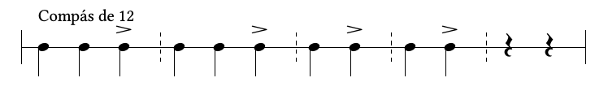
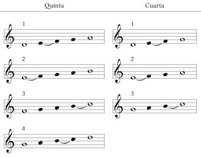
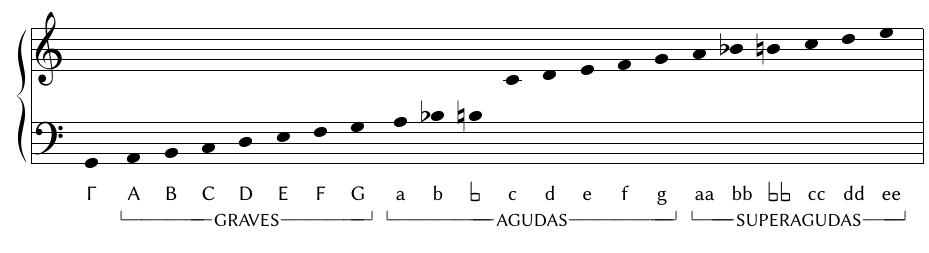
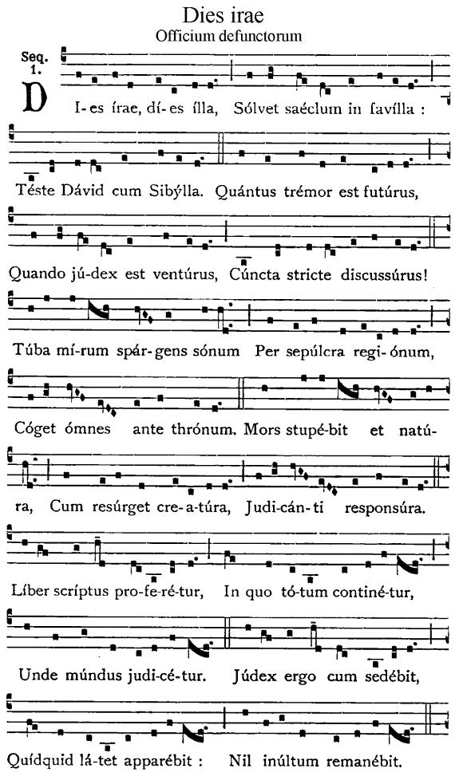
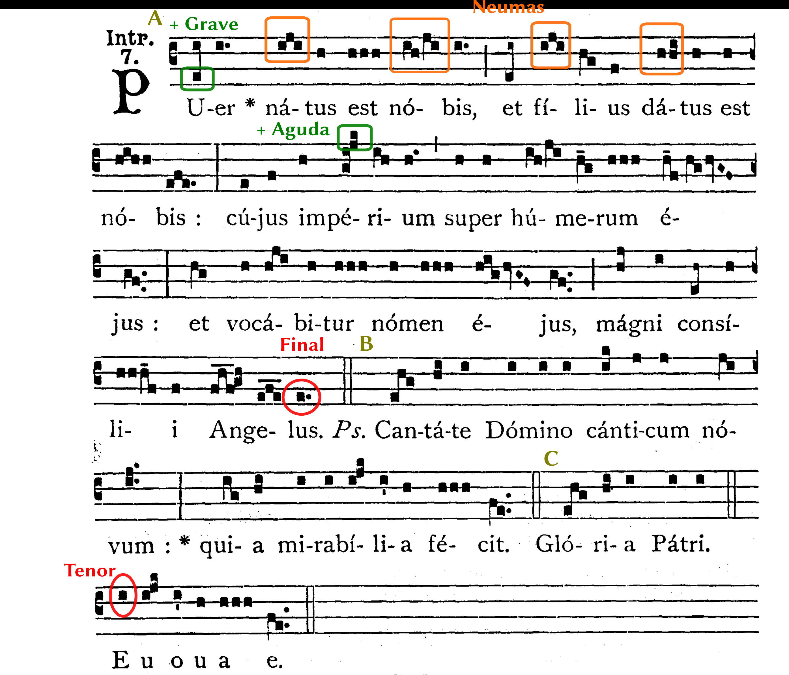

---
#####################
##  output format  ##
#####################
# The lines below makes the 'knit' button build the entire thesis 
# Edit the line 'thesis_formats <- "pdf"' to the formats you want
# The format options are: 'pdf', 'bs4', 'gitbook', 'word'
# E.g. you can build both pdf and html with 'thesis_formats <- c("pdf", "bs4")'
knit: (function(input, ...) {
    thesis_formats <- c("pdf", "gitbook");
    
    source("scripts_and_filters/knit-functions.R");
    knit_thesis(input, thesis_formats, ...)
  })

#####################
## thesis metadata ##
#####################
title: |
  Historia I \
  Apuntes e materiais didácticos
author: "Roberto Prado Martínez"
college: https://aulademusica.netlify.app
university: Conservatorios Profesionais de Música
university-logo: templates/beltcrest.pdf
university-logo-width: 5cm
submitted-text: Apuntes e materiais didácticos
degree: Ensinanzas Profesionais de Música
degreedate: 2021 - 2022
abstract: |
  `r paste(readLines("front-and-back-matter/_abstract.Rmd"), collapse = '\n  ')`
acknowledgements: |
  `r paste(readLines("front-and-back-matter/_acknowledgements.Rmd"), collapse = '\n  ')`
dedication: A todas aquelas persoas que colaboraron neste traballo
abbreviations: |
  `r paste(readLines("front-and-back-matter/_abbreviations.Rmd"), collapse = '\n  ')`

#######################
## bibliography path ##
#######################
bibliography: [bibliography/references.bib, bibliography/additional-references.bib]

########################
## PDF layout options ###
#########################
### submitting a master's thesis ###
# set masters-submission: true for an alternative, anonymous title page with 
# candidate number and word count
masters-submission: false
candidate-number: 123456
word-count: "10,052"

# if you want to use a different title page altogether, provide a path to a 
# .tex file here and it will override the default Oxford one
# alternative-title-page: templates/alt-title-page-example.tex

### abbreviations ###
abbreviations-width: 3.2cm
abbreviations-heading: Glosario


### citation and bibliography style ###
bibliography-heading-in-pdf: Bibliografía

# biblatex options #
# unless you run into 'biber' error messages, use natbib as it lets you customise your bibliography directly
use-biblatex: true
bib-latex-options: "style=authoryear, sorting=nyt, backend=biber, maxcitenames=2, useprefix, doi=true, isbn=false, uniquename=false" #for science, you might want style=numeric-comp, sorting=none for numerical in-text citation with references in order of appearance

# natbib options #
# natbib runs into fewer errors than biblatex, but to customise your bibliography you need to fiddle with .bst files
use-natbib: false # to use natbib, set this to true, and change "output:bookdown::pdf_book:citation_package:" to "natbib"
natbib-citation-style: authoryear #for science, you might want numbers,square
natbib-bibliography-style: templates/ACM-Reference-Format.bst #e.g. "plainnat", unsrtnat, or path to a .bst file

### correction highlighting ###
corrections: true

### link highlighting ###
colored-not-bordered-links: true # true = highlight text of links - false = highlight links with border

# Set the link text/bord coloring here, in RGB. 
# Comment out a variable to just use whatever the text's existing color is. 
# If you wish NOT to highlight links, set colored-not-bordered-links: true, 
# and comment out the colors below
urlcolor-rgb: "0,0,139"
citecolor-rgb: "0,33,71"
# linkcolor-rgb: "0,33,71"  # coloring normal links looks a bit excessive, as it highlights also all links in the table of contents


### binding / margins ###
# page-layout: nobind #'nobind' for equal margins (PDF output), 'twoside' for two-sided binding (mirror margins and blank pages), leave blank for one-sided binding (left margin > right margin)

page-layout: twoside #'nobind' for equal margins (PDF output), 'twoside' for two-sided binding (mirror margins and blank pages), leave blank for one-sided binding (left margin > right margin)


### position of page numbers ###
ordinary-page-number-foot-or-head: foot #'foot' puts page number in footer, 'head' in header
ordinary-page-number-position: RO, LE  #C = center, R = right, L = left. If page layout is 'twoside', O = odd pages and E = even pages. E.g. RO,LE puts the page number to the right on odd pages and left on even pages
chapter-page-number-foot-or-head: foot #you may want it to be different on the chapter pages
chapter-page-number-position: C

### position of running header ###
running-header: true #indicate current chapter/section in header?
running-header-foot-or-head: head
running-header-position-leftmark: LO #marks the chapter. If layout is 'nobind', only this is used.
running-header-position-rightmark: RE  #marks the section.


### draft mark ###
#draft-mark: false # add a DRAFT mark?
draft-mark: false # add a DRAFT mark?
draft-mark-foot-or-head: foot ##'foot' = in footer, 'head' = in header
draft-mark-position: C

### section numbering ###
section-numbering-depth: 2 # to which depth should headings be numbered?

### tables of content ###
toc-depth: 1 # to which depth should headings be included in table of contents?
lof: true # include list of figures in front matter?
lot: true # include list of tables in front matter?
mini-toc: true  # include mini-table of contents at start of each chapter? (this just prepares it; you must also add \minitoc after the chapter titles)
mini-lot: false  # include mini-list of tables by start of each chapter?
mini-lof: false  # include mini-list of figures by start of each chapter?

### code block spacing ###
space-before-code-block: 10pt
space-after-code-block: 8pt

### linespacing ###
# linespacing: 22pt plus2pt # 22pt is official for submission & library copies
linespacing: 14pt plus3pt # 22pt is official for submission & library copies
frontmatter-linespacing: 17pt plus1pt minus1pt #spacing in roman-numbered pages (acknowledgments, table of contents, etc.)

### other stuff ###
abstractseparate: false  # include front page w/ abstract for examination schools?
includeline-num: false #show line numbering in PDF?


#####################
## output details  ##
#####################
output:
  bookdown::pdf_book:
    citation_package: biblatex
    template: templates/template.tex
    keep_tex: true
    pandoc_args: "--lua-filter=scripts_and_filters/colour_and_highlight.lua"
  bookdown::bs4_book:
    css: 
      - templates/bs4_style.css
      - templates/corrections.css # remove to stop highlighting corrections
    theme:
      primary: "#6D1919"
    repo: https://github.com/ulyngs/oxforddown
    pandoc_args: "--lua-filter=scripts_and_filters/colour_and_highlight.lua"
  bookdown::gitbook:
    css: templates/style.css
    config:
      download: ["pdf"]
      sharing:
        facebook: false
        twitter: false
        all: false
  bookdown::word_document2:
    toc: true   
link-citations: true
documentclass: book
always_allow_html: true #this allows html stuff in word (.docx) output
---


```{r install_packages, include=FALSE}
source('scripts_and_filters/install_packages_if_missing.R')
```

```{r create_chunk_options, include=FALSE, eval=knitr::is_latex_output()}
source('scripts_and_filters/create_chunk_options.R')
source('scripts_and_filters/wrap_lines.R')
```

<!--
Include the create_chunk_options chunk above at the top of your index.Rmd file
This will include code to create additional chunk options (e.g. for adding author references to savequotes)
and to make sure lines in code soft wrap
If you need to create your own additional chunk options, edit the file scripts/create_chunk_options.R
-->

<!-- This chunk includes the front page content in HTML output -->
```{r ebook-welcome, child = 'front-and-back-matter/_welcome-ebook.Rmd', eval=knitr::is_html_output()}
```

<!--chapter:end:index.Rmd-->

---
output:
  bookdown::pdf_document2:
    template: templates/brief_template.tex
    citation_package: biblatex
  bookdown::gitbook:
    css: templates/style.css
    config:
      download: pdf
      sharing:
        facebook: no
        twitter: no
        all: no
  bookdown::html_document2: default
  bookdown::word_document2: default
documentclass: book
#bibliography: [bibliography/references.bib, bibliography/additional-references.bib]
---

# Aproximación á Historia da Música {-}

```{=tex}
\adjustmtc
\markboth{Aproximación á Historia da Música}{}
```

<!-- IMPORTANTE, incluir despois de capítulos non numerados.
Evita que o índice de capítulos e encabezamentos amose os textos do capítulo anterior.
-->

<!-- CITA DE INICIO DE CAPÍTULO (só pdf) -->

```{block type='savequote', quote_author='(ref:cita-dante)', include=knitr::is_latex_output()}
O obxetivo de toda obra artística é axudar a cantos viven neste mundo a abandonar as súas miserias e conducilos á verdadeira felicidade...
```

(ref:cita-dante) --- Dante Alighieri. *Carta al Gran Can de la Scala de Verona*, no preámbulo ao Paraíso.

<!-- 
Notes for adding an opening quote in PDF output:
i) add the reference for the quote with the chunk option quote_author="my author name",
ii) include=knitr::opts_knit$get('rmarkdown.pandoc.to') == 'latex' means that these quotes are only included when output is latex (in HTML output, it would appear by the end of the previous page)
iii) You can't use markdown syntax inside chunk options, so if you want to e.g. italicise a book name in the quote reference use a 'text reference': Create a named piece of text with '(ref:label-name) My text', then link to this in the chunk option with quote_author='(ref:label-name)'
-->

<!--
 PENDIENTE: Mover ao apartado PRESENTACIÓN!
A finalidade da Historia da Música é escoitar música, captar as características das distintas correntes estéticas de cada época, comprender a música e relacionala coas correntes estéticas, comprender e coñecer os feitos históricos e movementos socioculturais máis destacados así como o contexto no que se orixinaron, permite valorar a importancia que a música ten na sociedade e igualmente a relación entre a música e o resto de artes.
Comezamos este curso facendo un percorrido histórico, artístico e musical polas épocas anteriores á actual, coa finalidade de coñecer e comprender mellor a música e os elementos que forman parte dunha obra de arte musical. Faremos un percorrido pola música de diferentes épocas e civilizacións, centrándonos na música occidental e a súa evolución ata os nosos días, tendo en conta a importanacia da cultura musical na Península Ibérica e igualmente en Galicia.  
Nos primeiros capítulos, trataremos a orixe da música e a música na prehistoria, prestando especial atención ás primeiras evidencias conservadas de música escrita que foron descifradas e comprendidas (desde a idade da memoria); veremos as principais teorías sobre música da Antigüidade e finalmente trataremos en profundidade a evolución da música escrita desde a Idade Media (idade da notación) ata o Renacemento.
-->

## Definicións e conceptos previos {-} 

O concepto de «música» recibe diferentes tratamentos e acepcións ao longo da historia; as definicións e significados que se dan, son moitos e variados. A pesares de ser algo do que vivimos rodeados, non existe polo momento unha definición única, universal e consensuada que transmita o seu significado; as diferentes culturas e sociedades do mundo actual, teñen ideas dispares sobre a música ao igual que ocorre nas civilizacións de épocas anteriores á actual.  

A música[^def:mousike], na mitoloxía grega, era considerada unha *tekné* (técnica, habilidade, destreza, arte…) que engloba tanto a artistas como teóricos. Nos períodos heleno e helenístico, a música terá un papel central na sociedade civil e relixiosa da época, promovendo o entretemento e formando parte de razoamentos científico-filosóficos. Platón, (entre os séculos V-VI a.c) concibe a música como a "arte educativa por excelencia que se insire na alma e forma a virtude"; no século VI, Boecio percibe a música como a "habilidade de examinar [...] a diversidade de sons [...] por medio da razón e os sentidos". Santo Tomás no século XIII, considera a música como "a máis noble das ciencias humanas [...] que ocupa o primeiro lugar entre as artes liberais". Xa no século XVIII, Rousseau plantea a música como "a arte de combinar sons de xeito agradable ó oído". Pau Casals (s.XIX-XX), mantiña que "a música, esa marabillosa linguaxe universal, debería ser unha fonte de comunicación". 

Como vemos, as percepcións sobre a música varian ao longo do tempo, a pesares de manter todas rasgos comúns. Non será ata os anos noventa do século XX, cando se establezan as primeiras definicións concretas e complexas sobre este concepto. Musicólogos, etnomusicólogos e investigadores coinciden en moitos aspectos sobre a música. Neste sentido, a profesora López Cobas afirma:

>
As definicións e conceptos sobre música eran difusos e dependían, en grande medida, da época, o lugar e sobre todo, dos diferentes puntos de vista. Durante a Idade Media os trobadores e músicos ambulantes non eran considerados músicos coma hoxe en día, senón filósofos, capaces de manexar os conceptos teóricos de harmonía. [...]  
Non obstante, [...] as definicións de música poden ser moi variadas e complexas, xa que existe unha multiplicidade de enfoques que non fan máis que apoiar o feito de que o fenómeno musical é unha manifestación de grande riqueza[^ref:lopez-cobas-musica].  

### A música como linguaxe universal {-}

O ser humano sinte a necesidade de expresarse e comunicarse. A música, como o resto de artes, é unha linguaxe a través da que expresarnos e comunicarnos: é un medio de comunicación. Igual que un idioma emprega a palabra para crear estruturas gramaticais, a música emprega o son e as súas múltiples combinacións para expresar ideas, sentimentos, conceptos, etc. A mensaxe musical, abrangue aspectos e disciplinas variadas:

> 
[...] en realidade, a definición de Música esténdese moito máis alá destes límites desde o mesmo momento en que por primeira vez o home emitiu un son valéndose dun instrumento. Esas harmonías e melodías non só eran un son belo, unha expresión de Beleza, senón que estableceron unha forma de linguaxe, unha nova maneira de expresarse e de sentir, así como de transmitir sensacións, imaxes e conceptos que abarcan desde a simple intención de comunicarse, ata a Filosofía, a Política, a Ética ou os complicados principios  cosmolóxicos, sen esquecer o papel tan importante que desempeñou dentro da Relixión ao longo da historia. Por todo iso, a Música é merecedora de ser considerada unha forma de linguaxe, así como unha disciplina científica e o seu estudo é necesario para coñecer o desenvolvemento dunha parcela da cultura do ser humano e comprender mellor a evolución do mesmo dentro da historia e a súa necesidade de comunicación.[^ref:gutierrez-macho]

Considerada como arte, ciencia e linguaxe universal, sabemos que é un medio de expresión sen límites capaz de chegar ao máis íntimo de cada persoa, de transmitir diferentes estados de ánimo e emocións. Escoitar e facer música, desenvolve a sensibilidade, a creatividade e a capacidade de abstracción ou análise:

>  
Propícianos a descubrir o noso propio mundo interior, a comunicación con “o outro” ou “os outros” e a captación e apreciación do mundo que nos rodea. A música, xa sexa mediante o comportamento de interpretación, de escoita ou de composición, se esta é adecuada, condúcenos a unha "reharmonización" do estado de ánimo e dos sentimentos.[^ref:josefa-moreno]

### A creación artístico-musical {-}
<!--TODO: IMAXE SOBRE ARTE ABSTRACTA, ETC.-->

A música é unha **arte abstracta** que posúe un grao de abstracción superior a calquera outra, e polo tanto, é unha **arte espiritual**, **humana** e **universal**. Precisa, certos coñecementos específicos para chegar a comprender plenamente a realidade científica que lle da forma; é unha **arte dinámica**[^cita:arte-estatica] que transcorre no tempo; o oínte, necesita ir interiorizando a obra a medida que a escoita, e así poder captala íntegramente; igualmente, é unha **arte viva** capaz de facer presente calquera tempo histórico.

>
Coas palabras dinse cousas humanas; coa música exprésase iso que ninguén coñece nin pode definir, pero que en todos existe en maior ou menor forza. A música é a arte por natureza. Podería dicirse que é o campo eterno das ideas... Para poder falar dela, necesítase unha gran preparación espiritual e, sobre todo, estar unido intimamente aos seus segredos.[^cita:Lorca-musica]

Cando afirmamos que a música é ciencia e arte ao mesmo tempo, referímonos a que dunha mesma obra podemos facer unha análise rigurosa, ténica, formal, estilística, etc. e igualmente, disfrutar do pracer estético de escoitar sen máis. Polo tanto, estes dous aspectos ---científico e artístico--- chegan nun todo: a obra de arte musical. 

### Perspectivas e significado da «música» {-}
<!--TODO: PENDIENTE DE METER IMAXES-->

Ao longo da historia, existen diversos puntos de vista ou perspectivas sobre a música. Para comprender o concepto e a importancia que esta terá sobre a sociedade de cada época, compre coñecer algunhas das reflexións que darán lugar ás diferentes concepcións sobre música que hoxe coñecemos. 

Música en relación co tempo.
:    A definición tradicional, establece que:  
"A música é a arte que se expresa combinando os sons co tempo".

Música como arte.
:    Richard Wagner, compositor alemán do s. XIX, consideraba:  
"o son vén do corazón e a súa linguaxe artística natural é a música. A melodía é a lingua absoluta, a través da que o músico fala a todos os corazóns".

Música como expresión de sentimentos.
:    Kant, filósofo alemán do século XVIII, comentaba ao respecto:  
"A música é a linguaxe do sentimento. A música é a arte de expresar unha agradable sensación de sentimentos por medio dos sons".  

Música como feito musical.
:    O filósofo francés Descartes, alá polo século XVII, afirmaba sobre a música o seguinte:  
"A mesma cousa que a uns invita a bailar a outros pode facer chorar. Pois isto non provén senón da asociación de ideas na nosa mente; como aqueles que algunha vez se divertiron bailando con certa peza, tan pronto como a volvan a escoltar volverán ás ganas de bailar; pola contra, se algún só oíu gallardas cando lle aconteceu algo malo, volverá a entristecerse cando as escoite de novo".

Música como ciencia.
:    Pitágoras, filósofo grego do século V a.c. afirmaba:  
"os números son as cousas; agora ben, a música é número. O mundo é música; o cosmos é unha lira sublime de sete cordas."

Como podemos ver, os puntos de vista sobre a música son variados e dependen da época que se trate. Hugo Riemann, musicógrafo[^def:musicografo] alemán do século XIX, afonda na definición mesturando algunhas das perspectivas anteriores, afirmando así o seguinte: 

>
A música é, ao mesmo tempo, unha arte e unha ciencia. Como arte, é a manifestación da *beleza* por medio dos sons; pero esta manifestación descansa nunha ciencia exacta, formada polo conxunto de leis que rexen a produción dos sons, ao mesmo tempo que as súas relacións de altura e duración.

### Temporalidade e memoria auditiva {-}
<!--TODO: IMAXE SOBRE TEMPORALIDADE E MEMORIA AUDITIVA-->

As diferentes perspectivas sobre a música, introducen un concepto fundamental: a «temporalidade». Para que a música exista, debe desenvolverse ao longo do tempo. Podemos afirmar, que renace cada vez que se interpreta e vive un proceso de reactivación constante, como arte dinámica que é.   

A «memoria auditiva» xoga igualmente un papel fundamental na percepción da música. Como oíntes, se non retemos na memoria algúns dos compoñentes fundamentais da música, (ritmo, melodía ou timbre, ...) difícilmente a poderemos apreciar ben e captar o significado.
<!--
```{r banda-caricatura-1, echo=FALSE, fig.align='center', fig.pos='ht',  fig.cap="A música é un feito social e cultural. - (fonte:pellicer.fremm.org)", fig.scap="A música é un feito social e cultural", out.width="100%"}
knitr::include_graphics('figures/ud-00/banda-caricatura.jpg')
```
-->

<!---DESCARTADO POLO MOMENTO:
Música
:    
A [Real Adacemia Galega da lingua][RAG], define a [«música»][rag:música] como:

> Arte de combinar harmoniosamente os sons, segundo unhas regras preestablecidas.

Outras definicións establecen que:

>A música [...] é a [arte](https://es.wikipedia.org/wiki/Arte) de organizar sensible e lóxicamente unha combinación coherente de [sons](https://es.wikipedia.org/wiki/Sonido) e [silencios](https://es.wikipedia.org/wiki/Silencio_(sonido)) respetando os principios fundamentais da [melodía](https://es.wikipedia.org/wiki/Melodía), a [harmonía](https://es.wikipedia.org/wiki/Armonía) e o [ritmo](https://es.wikipedia.org/wiki/Ritmo), [...]. [^ref:Wikipedia(Música)]

```{r figura-exemplo1, echo=FALSE, fig.align='center', fig.cap="Insertar imaxes en RStudio.", out.width="65%"}
knitr::include_graphics('figures/ud-00/photo.png')
```

```{block type='correction'}

Podemos concluír que, a música é unha combinación ordenada de ritmo, melodía e harmonía, agradable ao oído humano.

```

--->

### Relación entre historia e música {-}
<!--TODO: METER IMAXES PARA COMPLETAR O TEMA -->
<!--
O concepto de «música» varía segundo a percepción que se tiña da mesma en cada cada época.
-->
Un dos obxectivos do estudo da Historia da Música, é **coñecer a evolución da música ao longo da historia da humanidade**. Cando abordemos o seu estudo, o principal problema será atopar unha definición universal de «música», tal como vimos con anterioridade, pois o concepto de música varía dunha cultura a outra. 
Por outra banda, o estudo ---histórico ou non--- da música pode enfocarse de diferentes maneiras: centrándonos nas obras musicais ou na súa utilización, nas persoas que as desenvolveron ou no ambiente social que as propiciou e tamén, atendendo aos criterios que utilizamos para seleccionar a música que imos estudar no curso. Todas estas cuestións fan aínda máis difícil o estudo histórico da música.

<!--
> _La **Historia de la música** es el estudio de las diferentes tradiciones en la música y su orden en el planeta_.
>
> [...] _aquella disciplina que trata el estudio de la evolución de las diferentes tradiciones musicales a lo largo del tiempo_.
-->
A [Real Academia Española da lingua][RAE] (RAE) considera e define [«historia»][rae:historia] como:

> 1.- *Narración y exposición de los acontecimientos pasados y dignos de memoria, sean públicos o privados*.  
> 2.- *Disciplina que estudia y narra cronológicamente los acontecimientos pasados*  
> 3.- *Conjunto de los sucesos o hechos políticos, sociales, económicos, culturales, etc., de un pueblo o de una nación*.  
> 5.- *Conjunto de los acontecimientos ocurridos a alguien a lo largo de su vida o en un período de ella* [^ref:RAE(2020)]

A [Real Adacemia Galega da lingua][RAG] (RAG), define [«historia»][rag:historia] do seguinte xeito:

> 1. Conxunto de feitos ocorridos no pasado, que afectan a toda a humanidade, a un grupo, unha persoa, unha institución, a unha faceta concreta dese pasado etc.  
> 2. Ciencia que estuda eses feitos. [^ref:RAG(2020)]

Afirmaremos, tendo en conta o indicado pola RAE e RAG así como as diferentes perspectivas da música vistas ata o momento, que a finalidade da Historia da Música occidental é o estudo da evolución das diferentes manifestacións musicais (tradición musical) das culturas de occidente no devir do tempo.

## Obxectivos e problemática da materia {-}

Un dos principais obxectivos da Historia da Música, é o **estudo da evolución da música ao longo da historia da humanidade**. O problema fundamental, consiste en atopar unha definición de «música», dado que non significa e non se refire ao mesmo en tódalas culturas. Algunhas inclúen dentro do concepto, aspectos como a danza, a poesía, (...) e outras culturas, pola contra, non empregan ningún término para referírense á música en sí.  

Por outra parte, a «historia da música occidental» que estudamos, exclúe moitas manifestacións musicais, entre elas a música popular e a música tradicional, (tanto europeas como non europeas) e a música clásica oriental (chinesa, xaponesa ou india), por citar algúns casos. O campo de estudo, redúcese exclusivamente á "música culta" europea, a pesares de si estudar algunha música non europea que segue certos cánones europeos.

<!-- %%% Oculto comentario de Francisco Callejo (2021/2022) %%%

Son frecuentes as discusións entre musicólogos, historiadores e grades entendidos sobre a música para lograr unha definición universal da música, pero é complicado universalizar este concepto dada a diversidade de culturas e pobos. O profesor Francisco Callejo, expón esta problemática:

> [...] el primer problema que nos encontramos es acordar una definición universal de *música*: el concepto de música varía de una cultura a otra; por ejemplo, la mayor parte de los musulmanes no considerarían música la llamada a la oración del almuédano, que a los oídos occidentales suena similar a muchas salmodias medievales; los toques de campanas de las iglesias cristianas, por el  contrario, no son considerados como manifestaciones musicales en occidente, aunque a muchos africanos les recordarían melodías suyas. [^ref:Callejo(2017)]

Como vemos no exemplo anterior, o que se considera música para unha cultura, pode non selo para outra e viceversa. Pensemos nestas dúas preguntas, relacionadas co exemplo de Callejo:

- considerdamos como música todo aquelo que alguén considera como tal? (caso do *almuédano* [^cita:almuédano] e as campás)
- consideramos como música, pola contra, só o que todos consideramos música?

-->

### A actividade musical e o produto musical {-}

Unha das cuestións que teremos en conta en primeiro lugar, será diferenciar entre música como actividade e música como resultado desa actividade. En primeiro lugar, diferenciaremos a música como **actividade**, onde unha ou máis persoas participan creando, interpretando ou escoitando música; en comparación coa música como **produto** isto é, o resultado desta actividade é algo sólido, coa posibilidade de ser escrito a través de sistemas de notación, dando como resultado unha obra musical por exemplo. Neste caso obtemos un produto (obra musical) resultante dunha actividade (composición).  

A actividade musical pode considerarse como un proceso bastante complexo, que abarca varias fases: **produción**, **difusión** e **consumo**. 

Para comprender esta actividade ---como proceso creativo--- veremos un exemplo, tendo en conta as fases indicadas no parágrafo anterior. Imaxinemos que escribimos unha sinxela melodía que se nos ocorreu e non queremos olvidar (**composición**). Despois de ensaiar repetidas veces a obra (**interpretación**), decidimos compartir a nosa creación, realizando unha serie de concertos públicos (**audición**) que resultan un éxito.  

No anterior exemplo, relacionamos as diferentes fases do proceso (produción, difusión e consumo) coas súas equivalentes actividades (composición, interpretación e audición) tal que, producimos unha obra cando compoñemos unha sinxela melodía; interpretándoa comeza a difusión e finalmente, por medio dos concertos (audición) fomentamos o seu consumo.


| FASE       | ACTIVIDADE      |
| ---------- | --------------- |
| Produción  | Composición     |
| Difusión   | Interpretación  |
| Consumo    | Audición        |


Para estudar a actividade musical centrarémonos nas tres fases do proceso: trataremos a produción, faremos referencia aos intérpretes, técnicas (...) e, sobre todo veremos os contextos de escoita nos que se desenvolveron, empregando como medio a audición activa de diferentes obras.

### Música de tadición oral e notación musical {-}

A posibilidade de estudar históricamente a música, parte da existencia dunha tradición oral e dunha transmisión dela ao longo do tempo. En case todas as culturas e tempos, a música transmítese por medio da escoita e repetición: é o que se coñece como **transmisión oral**(propio da idade da memoria). Existe tamén, a posibilidade de transmitir e almacenar a música con varios métodos de escritura musical, dando lugar a **transmisión escrita** (idade de notación).

### Música culta e música popular {-}

A actividade musical, prodúcese en todos os grupos sociais e nun gran número de situacións diferentes. Algunhas manifestacións musicais adquiren segundo a época un maior prestixio social, ben pola súa relación e vinculación coa alta sociedade, ou ben polas súas características de formación e profesionalización. Estamos a diferencar a «música académica» coñecida como «música clásica» ou «música culta», fronte a unha enorme variedade de «música popular», considerada de menor prestixio. O estudo da música, debería abarcar todos os estilos, pero neste caso trataremos só o estudo de estilos académicos.

### O enfoque eurocéntrico {-}

Cando estudamos a historia da música, centrámonos nos produtos musicais escritos de tradición académica europea. O resto ---actividade musical, transmisión oral, música popular ou non europea--- pertencen ao campo de estudo da Etnomusicoloxía[^cita:etnomusicoloxia], que normalmente non aplica o enfoque histórico.

Este enfoque «eurocéntrico» da Historia da Música, deixa de lado numerosas manifestacións musicais tanto académicas como populares de fóra de Europa, que nalgúns casos tiveron unha forte influencia no propio desenvolvemento da música europea; se ben teremos en consideración, que foi no continente europeo onde se crearon os principais tratados e estudos sobre música.  

### Canon e repertorio musical {-}

No século XIX desenvolvéronse dúas ideas ou conceptos importantes a ter en conta: o *canon* e o *repertorio*. O primeiro fai referencia ao conxunto de compositores e obras que estudaremos; o segundo é o conxunto de obras que, por unha ou outra razón, seguimos estudando e interpretando. Ámbolos dous conceptos, derivan de certos criterios de "calidade musical" malia que son á vez, produtos culturais de orixe europeo, creados en certos contextos políticos, sociais ou ideolóxicos específicos de épocas concretas.

O feito de que se exclúa a música non europea ou popular ---enfoque eurocéntrico--- lévanos a pensar na discriminación étnica clasista, que mantiveron certos musicólogos, intérpretes, críticos, (...) do século XIX. Outro problema co que nos atopamos é o que supón a exclusión do canon, das mulleres compositoras[^cita:exclusion_muller]; ao longo da historia da música, veremos como foron sometidas ao igual que outros compositores[^cita:exclusion_compo], a unha discriminación, en parte debida a que non se axustaban ao modelo ou idea de evolución da música occidental da época. Sen dúbida, outra das ideas que marcaron este concepto de canon, foi a valoración dos nacionalismos[^cita:nacionalismos], o que explica que ao longo da historia, predominase certa música sobre outra.

<!---## A periodización na historia da música {-}--->

```{r child = "unidades-didacticas/unidade-00/periodizacion.md"}
```

<!--ENTREGADO 4ºA: 28-9-21--->
<!--PENDIENTE DE REVISIÓN PARA ENTREGAR TEMARIO CURSO PRÓXIMO-->
<!---
%%%%%%%%%%%%%%%%%%%%%
CITAS E NOTAS DO TEMA
%%%%%%%%%%%%%%%%%%%%%
-->


[^def:mousike]:
O término «música» [...] deriva do grego *mousike* (*techne*) (arte das musas), feminino de *mousikos* «pertencente ás musas», de *Mousa* «Musa».

[^def:musicografo]:O dicciónario da lingua galega ([digalego](https://digalego.xunta.gal/gl/termo/44511/musicografo-fa)), define o termino como: "Persoa que escribe sobre música, xeralmente cun carácter científico ou crítico".

<!---CITAS:--->

[^cita:Lorca-musica]: Para García Lorca (1977) a música tiña un carácter difícilmente explicable, máis se non coñecemos os seus elementos internos.

[^cita:arte-estatica]:  As artes estáticas como a pintura, precisan dun lugar determinado, un espazo, que permite ao espectador contemplalas o tempo que queira e captalas dun golpe coa mirada. Segundo a clasificación tradicional das belas artes, son artes estáticas ou do espazo: a pintura, a escultura e arquitectura por exemplo. Como artes dinámicas, consideramos: a poesía, danza, música e o cine por exemplo.

[^cita:memoria-auditiva]: Para que a música exista, debe desenvolverse no tempo e, permitir así que o oínte a poida apreciar. A "memoria auditiva" xoga aquí un papel importante, pois o oínte non poderá apreciar ben a música, se non retén na memoria algúns dos seus compoñentes como poden ser, a melodía, o ritmo ou timbre.

[^cita:arte-viva]: A música renace con cada interpretación, e está constantemente nun proceso de reactivación. O resultado, depende tanto dos intérpretes coma do público e por iso, podemos definir a música de dous xeitos: coma obxecto autónomo (produto) e coma proceso (actividade).  


[^cita:liberdade:creadora]: Dunha mesma obra podemos escoitar diferentes versións, de igual calidade ou non, cada unha delas con un "toque" persoal de cada intérprete ou agrupación.

[^cita:definiónhistoria]: Consulta da [RAE](https://dle.rae.es/historia#otras), ofrece varias posibles definicións de Historia.

[^cita:exclusion_muller]:As mulleres foron silenciadas e discriminadas musicalmente ao longo da historia; nunca foi aceptada dentro do canon do s. XIX.

[^cita:exclusion_compo]:Ao longo dos diferentes períodos da historia da música, moitos compositores e obras foron discriminados e censurados. Nalgúns casos por seren demasiado conservadores ou demasiado avanzados para o seu tempo; noutros, por tomar camiños musicais que ninguén seguiu (polo menos nese momento) moi lonxe da marca do canon.

[^cita:nacionalismos]: A idea do nacional ou nacionalista tamén influíu na creación do canon. O feito de que as universidades máis importantes de finais do século XIX e principios do XX fosen as de Alemaña e que a escola historiográfica alemá dominase un período decisivo na historiografía musical, explica a abundancia de compositores xermanos no canon.

[^cita:Musas]:Os gregos definen a música como «a arte das musas»

[^cita:etnomusicoloxia]:A etnomusicoloxía, entre outras finalidades, pretende estudar a música dos pobos e tribos non occidentais, incluíndo sociedades que viven nun grado de desenvolvemento moi similar ao das civilizacións da prehistoria. Por iso, pódese facer unha comparación entre o emprego da música nesas tribos actuais (pigmeos, indíxenas do Brasil, etc...) co que se supón que se facía nos pobos prehistóricos. Este tipo de comparación recibiu o nome de “musicoloxía comparada” (en alemán *Verleigchende Musikwissenchaft*).

[^ref:lopez-cobas-musica]: López Cobas, L.: *Historia da Música*, Ed. Conservatorio Profesional de Música de Ourense, (Setembro, 2019)

[^ref:Callejo(2017)]: Callejo, F.: *Historia de la Música*, Conservatorio Profesional de Música Francisco Guerreo (2017).

[^ref:RAE(2020)]: *Definición de historia*, RAE consultado en <https://www.rae.es> , (Setembro, 2020).

[^ref:Wikipedia(Música)]: Definición de [música](https://es.wikipedia.org/wiki/M%C3%BAsica#Definici%C3%B3n) consultada na wikipedia.

[^ref:RAG(2020)]: *Definición de historia*, RAG consultado en <https://academia.gal/diccionario> , (Setembro 2020)

[^ref:gutierrez-macho]: Gutiérrez Machó, L. M. (2013). La música como lenguaje y medio de comunicación. Ecos del lejano oriente en la vanguardia musical orientalismo y japonismo musical. Entreculturas. Revista de tradución e comunicación intercultural, 5, 15–36.

[^ref:josefa-moreno]: Moreno, J. L. (2003). Psicología de la música y emoción musical. Educatio s. XXI, 20–21, 213.

[RAE]:https://dle.rae.es/ "Enlace á páxina da Real Academia Española da Língua"

[RAG]:https://academia.gal/dicionario "diccionario da Real Academia Galega da Lingua"

[rae:historia]:
https://dle.rae.es/historia#otras "definición de «historia» da Real Academia Española da Língua"

[rag:historia]:
https://academia.gal/dicionario/-/termo/busca/Historia "definición de Historia da Real Academia Galega da língua"

[rag:música]:
https://digalego.xunta.gal/es/termo/44501/m%C3%BAsica "definición de música da Real Academia Galega da língua"

[^cita:almuédano]: [...] o muecín ou almuédano ("gritador") era o musulmán que realizaba tradicionalmente a chamada á oración (_salat_) mediante a voz. Na actualidade, o almuédano foi substituído con frecuencia por un megáfono.  
(Fonte:
[wikiland](https://www.wikiwand.com/gl/Minarete?wprov=srpw1_0))

<!--- Fin de notas a pié de página --->


<!--chapter:end:00-intro.Rmd-->

---
output:
  bookdown::pdf_document2:
    template: templates/brief_template.tex
    citation_package: biblatex
  bookdown::html_document2: default
  bookdown::word_document2: default
  bookdown::gitbook:
    css: templates/style.css
    config:
      download: pdf
      sharing:
        facebook: no
        twitter: no
        all: no
documentclass: book
---

# Orixes da Música Occidental

\minitoc <!-- this will include a mini table of contents-->


```{r child=here::here('unidades-didacticas/unidade-00/fontes-musicais.md')}
```

## A orixe da música

```{r child=here::here('unidades-didacticas/unidade-00/fontes-musicais.md')}
```

## A música durante a Prehistoria

```{r child=here::here('unidades-didacticas/unidade-01/prehistoria.md')}
```

## A música nas primeiras civilizacións

### Exipto

### Mesopotamia

### O antigo Oriente

### O pobo Hebreo

## Actividades e audicións

## Resumo

<!--chapter:end:01-unidade-01.Rmd-->

---
#########################################
# options for knitting a single chapter #
#########################################
output:
  bookdown::pdf_document2:
    template: templates/brief_template.tex
    citation_package: biblatex
  bookdown::html_document2: default
  bookdown::word_document2: default
documentclass: book
#bibliography: [bibliography/references.bib, bibliography/additional-references.bib]
---

# A música en Grecia e Roma

Obxectivos.

* Comprender que a música é parte da historia do home.
* Coñecer o contexto histórico-cultural e o significado da música na sociedade grecorromana.
* Saber comentar as características dos instrumentos e da música desta época, a través da audición ou da partitura.
* Entender os conceptos derivados da teoría musical.
* Entender a importancia das fontes literarias e iconográficas para poder extraer conclusións respecto ao papel da música na antiga Grecia e Roma.

## A música na sociedade e culturas grega

### As fontes de información

<!-- PENDIENTE DE FACER O ESQUEMA DA UNIDADE -->


<!--chapter:end:02-unidade-02.Rmd-->

---
output:
  #bookdown::html_document2: default
  #bookdown::word_document2: default
  bookdown::pdf_document2:
    template: templates/brief_template.tex
    citation_package: biblatex
documentclass: book
#bibliography: [bibliography/references.bib, bibliography/additional-references.bib]
---

<!-- Última actualización: Febreiro 2022 -->

<!--
- Para incluir as imaxes e non se movan, incluír código seguinte:

```{r banda-caricatura-1, echo=FALSE, fig.align='center', fig.pos='ht',  fig.cap="Este é un modelo para inserir imaxes. - (fonte:pellicer.fremm.org)", fig.scap="Etiqueta da figura para índice", out.width="100%"}
knitr::include_graphics('figures/ud-00/banda-caricatura.jpg')
```
-->

<!-- 
TODO:
- Cambiar o título desta unidade
- Engadir os contidos que faltan

# A monodia relixiosa medieval -->
# Conceptos sobre a monodia medieval {.unnumbered}

\minitoc 

<!-- Descomentar os obxectivos

Obxectivos.

* Coñecer o contexto histórico no que se orixinaron os cantos dos diversos ritos occidentais.
* Comprender a importancia da monodia medieval na música occidental.
* Coñecer o proceso de creación, implantación e difusión do canto gregoriano e o seu contexto histórico.
* Explicar as súas características e facer unha aproximación analítica de calquera peza gregoriana que se lle presente mediante partitura ou audición.
* Ler en notación cadrada.
* Comprender o pensamento estético e o significado da música na igrexa primitiva.

-->
<!--
Contidos.

1. A orixe do canto litúrxico en Occidente. As liturxias rexionais en Oriente. O canto bizantino.
2. A reforma carolinxia e a difusión do gregoriano.
3. A Liturxia Romana. A Misa: o Propio e o Ordinario. Os Oficios. O pensamento musical na igrexa.
4. A notación pneumática. A notación cadrada. O sistema de solmisación de Guido d’Arezzo. Os modos eclesiásticos.
5. Características xerais do estilo musical.
6. Recitativo litúrxico. A salmodia.
7. Clases, formas e tipos de canto relixioso. Cantos do Oficio: antífonas, responsorios, himnos.
8. A Misa. Cantos do Propio e do Ordinario.
9. A expansión da liturxia: tropos, secuencias e dramas litúrxicos.

-->

## Os sistemas modais {.unnumbered}

### Concepto de modo {.unnumbered}

-   **Modalidade**. A modalidade é un sistema de organización musical baseado nos intervalos. Este concepto está relacionado especialmente coa *melodía*, se temos en conta que esta é unha sucesión ordenada de intervalos.

-   **Modo**. Nos sistemas modais, o concepto básico é o **de modo**. Consiste na organización dos intervalos en grupos nos que certas notas teñen unha importancia especial.

### Organización do modo {.unnumbered}

Os modos, baséanse en pequenos grupos de notas que abarcan en total un intervalo de cuarta ou quinta (ás veces terceira). Entre as dúas notas extremas sitúanse outras que dividen o conxunto en pequenos intervalos, que non teñen por que axustarse necesariamente a tonos ou ao semitonos.


Estes pequenos grupos únense a outros, ben utilizando as notas extremas como notas comúns, ou ben cunha certa separación entre ambos (habitualmente dun tono). Este conxunto de dúas ou máis unidades, dá lugar ao ámbito completo do modo, que pode ser dunha oitava ou maior.


### O ritmo nos sistemas modais {.unnumbered}

As definicións antigas da música facían referencia á arte (ou a ciencia) *de medir ben*. Esta medida debíase facer en dúas dimensións: na da **altura** dos sons, entoando correctamente os intervalos; e na da **duración** dos sons, levando adecuadamente o ritmo. Ámbalas dimensións definen a *melodía*, que é o elemento fundamental nas músicas modais.

#### Tipos de ritmo {.unnumbered}

Consideramos dous estilos fundamentais de ritmo:

-   Ritmo **libre**:

  As duracións dos sons non se axustan a ningún pulso, podendo alongarse ou acurtarse a vontade dos intérpretes. Na música vocal, o ritmo adoita axustarse ás necesidades do texto. Denomínaselle ás veces **ritmo *non mensural*** ou *non medido*.

-   Ritmo **medido**:

    As duracións dos sons axústanse a un pulso, que pode ser regular ou flexible. Na música vocal, os elementos prosódicos (acento, cantidade silábica) poden determinar a forma de axustarse ao pulso. Denomínaselle tamén **ritmo *mensural***.

#### Os ciclos rítmicos {.unnumbered}

Na música mensural, o pulso pode presentar diversas diferenzas (por ejempl, forte/débil). Estes pulsos diferentes organízanse en grupos que se repiten con regularidade, constituíndo así os*ciclos*.

A forma máis simple de ciclo rítmico é o *compás* da música occidental: grupos de dous, tres ou catro pulsos nos que o primeiro é forte e os demais débiles.


Habitualmente os ciclos rítmicos están constituídos en varios niveis:

-   Un primeiro nivel constitúeno pequenos grupos de dous ou tres (ás veces máis) pulsos organizados ao redor de características como duración, acento ou timbre.
-   Un segundo nivel fórmano agrupacións deses pequenos grupos en series máis longas, que poden chegar ás veces a ser *moi* longas.

Algúns exemplos de ciclos rítmicos complexos, son o *compás de doce* habitual en moitos estilos de música flamenca, ou os ritmos da música turca ou india.



#### Os modos rítmicos medievais {.unnumbered}

Nos tratados medievais sobre música, xunto ao ritmo e á melodía (que habitualmente denominaban *harmonía*), incluíase a **métrica** isto é, a organización sonora das palabras propia da poesía; debido a que a música era maioritariamente vocal, e o ritmo dependía desa organización.

No século XIII estableceuse unha organización rítmica baseada en modos, do mesmo xeito que a organización melódica. Estes modos derivaban dos pés métricos da poesía latina e eran seis:


<!--SISTEMA MODAL MEDIEVAL -->

## O sistema modal medieval {.unnumbered}

Os primeiros libros de teoría musical do Occidente europeo corresponden ao século IX; entre eles destacan os dous tratados anónimos titulados *Musica enchiriadis* («Manual de música») e *Scolica enchiriadis* («Comentarios ao manual»), a partir dos cales se desenvólve unha importante corrente de literatura técnica musical, que explica o sistema sobre o que se compón a música monódica da Idade Media.

### As *especies* de intervalos {.unnumbered}

O sistema modal medieval parte da **modalidade**, e tomaba como referencia os intervalos básicos de quinta e cuarta, así como a oitava. Os teóricos medievais partían das distintas **especies** destes intervalos, diferenciadas pola posición que ocupaba o semitono, como se pode ver na figura X.



### Os modos medievais {.unnumbered}

As catro especies de quinta, son a base dos **catro modos básicos** da música medieval:

1.  *protus* («primeiro»)
2.  *deuterus* («segundo»)
3.  *tritus* («terceiro»)
4.  *tetrardus* («cuarto»)

Algúns teóricos, aplicaron os nomes da antiga teoría musical grega (con significado distinto) a estas catro especies da quinta, resultando: *dórico*, *frigio*, *lidio* , *mixolidio*.

Combinando cada especie de quinta cunha de cuarta, obtemos o que se coñece como modo. Segundo a súa combinación, podemos falar de **modos *auténticos*** (se a especie de cuarta vai despois da de quinta), ou **modos *plagales*** (se a especie de cuarta vai antes da especie de quinta). Para diferenciar os plagales dos anténticos, antepoñemos o prefixo *hipo-* ao nome grego correspondente (*hipo-*dórico, *hipo*-frixio, ... ) tal como se indica na táboa do sistema modal medieval.

O sistema completo quedaba entón da forma:


Se ben é certo, que na práctica o máis habitual era referirse aos modos cos números do 1 ao 8, nos tratados teóricos empregábanse tanto a denominación eclesiástica como a grega.

### *Tenor*, *Finalis* e ámbito da melodía {.unnumbered}

A melodía do canto, abarca o ámbito da oitava. Adoita utilizar unha interválica sinxela; graos conxuntos ou saltos de terceira e só ocasionalmente aparecen saltos de quinta ou de cuarta, normalmente só nos comezos de frase.

Unha das notas da melodía, era considerada como a nota principal do modo que se coñece co nome de *final* (na que remata a melodía). Outras notas da melodía, servían de soporte --ou eixos melódicos-- sobre os que se move a melodía; no canto gregoriano unha destas notas toma especial importancia e recibe o nome de *tenor* («soporte» en latín).

Para determinar o modo no sistema medieval, debemos considerar:

1.  A nota **final**, que determina en cal do catro modos básicos está a melodía.
2.  O **ámbito**, por encima da final no caso dos modos auténticos e ao redor dela nos plagales.
3.  A nota **tenor** e outras que puidesen servir para as cadencias.
4.  O uso de certos **xiros melódicos** característicos (incluídas as cadencias).

### O estilo {.unnumbered}

O estilo dunha peza viña determinado --ademais de polo modo-- por outros elementos tales como a relación entre melodía e texto, que daba lugar a dous estilos principais:

1.  **Estilo silábico**: a cada sílaba do texto correspóndelle unha nota ou como máximo dúas.
2.  **Estilo ornamentado**: algunhas sílabas do texto, prolónganse con varias notas denominadas *melismas*.

Aínda que cada modo destaca certas notas e ten un ámbito determinado, teremos en conta que non se trata de alturas reais, senón de intervalos isto é; calquera modo podía cantarse transportado a calquera altura, sempre que se respectase a distribución dos intervalos.

### A escrita {.unnumbered}

En principio, o sistema completo abarcaba dúas oitavas. Na escrita, utilizáronse as letras do alfabeto latino para designar as notas en orde ascendente. Co tempo, o sistema foise ampliando ata abarcar algo máis de dúas oitavas, diferenciadas polo uso de maiúsculas e minúsculas ou pola duplicación das letras.

O *si* era unha nota de afinación variable: para evitar o tritono co fa podíase rebaixar medio ton, converténdoo así nun «si suave» (en latín *b molle*), que se escribía cunha «b» redonda para diferencialo do «si duro» (*b durum*) que se escribía cunha «b» cadrada (*b quadratum*); estes signos son os antecedentes dos actuais *bemol*, *becuadro* e *sostido*.



No século XI, o monxe e mestre de coro italiano **Guido d'Arezzo**, para facilitar a aprendizaxe das melodías, que seguían memorizándose, inventou un sistema que asociaba determinadas sílabas con notas e as súas combinacións con intervalos; para iso utilizou seis sílabas sacadas do texto dun himno relixioso: *ut re mi fa sol la*. Nesta sucesión de seis sílabas todos os intervalos eran dun tono excepto o intervalo central *mi-fa*, que era dun semitono.

A serie podía comezar na nota *dó*, na nota *fa* co «*si* suave» e na nota *sol* co «*si* duro», resultando así o tres tipos **de hexacordos**:


Posto que os hexacordos podían comezar en notas diferentes, en melodías máis amplas utilizábase un sistema de paso dun hexacordo a outro chamado **solmisación**.

## A notación musical medieval {.unnumbered}

### A notación {.unnumbered}

Durante toda a Idade Media ---e mesmo despois--- a música seguiría transmitíndose oralmente. No século IX, en varios mosteiros de Occidente, desenvolveríase un sistema de escritura musical novo, que evolucionaría ao longo dos séculos ata desembocar no sistema actual. A principal razón deste desenvolvemento, foi a implantación do repertorio de canto chamado «gregoriano», pero non a única. Pretendíase tamén unificar a interpretación musical litúrxica en todos os territorios que dependían da Igrexa de Roma.

#### Os neumas {.unnumbered}

As notacións máis antigas utilizaban uns signos chamados **neumas** que se escribían sobre as liñas do propio texto que se debía cantar. Estes neumas «debuxaban» o perfil melódico do canto, pero non con precisión a melodía que se aprendía por escoita e memorización.

Este primeiro sistema de notación presentaba numerosas variantes, dependendo do lugar (mosteiro ou rexión) en que se elaboraba cada manuscrito. Algunhas destas variantes, as chamadas **adiastemáticas**, centrábanse nas calidades da interpretación sen atender á interválica; outras, as chamadas **diastemáticas**, utilizaban diversos sistemas (puntos, liñas...) para tratar de indicar a amplitude relativa dos intervalos.

Na primeira metade do século XI, **Guido d'Arezzo** reuniu varias técnicas que facilitaban a lectura a primeira vista e por tanto a aprendizaxe dos cantos; as principais características da súa proposta eran as seguintes:

-   Os neumas situábanse sobre unha pauta de liñas **paralelas** que marcaban a distancia dunha terceira, e a lonxitude dos seus trazos indicaba a amplitude do intervalo.
-   As notas contiguas aos semitonos indicábanse con liñas de cores específicas: o *fa* en cor vermella, o *dó* en cor amarela.
-   Á esquerda desas liñas escribíanse **letras crave**, que indicaban esas mesmas notas: a **F** para o *fa* e a **C** para o *dó*.
-   Á dereita de cada pauta escribíase un pequeno signo, chamado **custos**, que indicaba a primeira nota da seguinte pauta e facilitaba así a entonación correcta do intervalo.

O **sistema guidoniano** tivo gran éxito e estendeuse inmediatamente por todo Occidente, aínda que as diversas notacións neumáticas seguíronse utilizando nalgúns lugares mesmo ata o século XVI.

Da notación guidoniana derivaron outras, como a notación alemá de cravo **de ferradura** ou a **notación cadrada** francesa, que naceu no século XII e que aínda se utiliza nos libros de canto gregoriano. Esta última adaptouse posteriormente para as cancións trovadorescas e outros xéneros de música profana. A partir do século XIII, as novas técnicas da música polifónica farán evolucionar a notacións, especialmente no aspecto rítmico.

\newpage

<!--
## Orixe do canto litúrxico en Occidente

### Os tipos de cantos

### O canto bizantino
-->

## Consideracións sobre o Canto Gregoriano {.unnumbered}

### Características que definen o canto gregoriano {.unnumbered}

O canto gregoriano, como todo o canto litúrxico medieval, presenta as seguintes características:

-   É un **canto monódico**, é dicir, utilízase unha soa liña melódica tanto para o canto solista como para o canto a un tempo.
-   O **ritmo** é **flexible**, dependendo do texto que se canta; non hai compás nin pulso regular, e tanto o fraseo como a distribución de acentos axústanse ás necesidades de declamación do texto.
-   O **ámbito** non supera normalmente a **oitava** (excepto en cantos para solistas, que poden superala nunha cuarta ou quinta).
-   Está baseado no **sistema modal** e foi descrito e organizado por teóricos musicais case sempre do ámbito monástico.
-   A melodía móvese por graos **conxuntos** ou **saltos de terceira**; ocasionalmente aparecen saltos de cuarta ou quinta, normalmente nos comezos. Son inhabituais intervalos máis amplos.
-   O perfil melódico de cada canto organízase ao redor de dous eixos: a **nota final**, na que termina e con frecuencia tamén comeza o canto, e a chamada **nota tenor** («soporte» en latín), sobre a que se desenvolve a melodía. Esta nota está normalmente unha quinta sobre a final nos modos auténticos e unha terceira por baixo desta nos plagales, excepto cando recae sobre a nota *si*, que se pasa ao do.

#### Estilos de canto {.unnumbered}

Segundo a relación entre o texto e a melodía, desenvólvense tres estilos de canto:

-   **Silábico:** é o estilo máis simple: a cada sílaba do texto correspóndenlle unha ou dúas notas.
-   **Neumático:** estilo adornado; a cada sílaba correspóndenlle varias notas (normalmente de dúas a seis).
-   **Melismático:** estilo moi adornado; algunhas sílabas teñen melismas extensos, ás veces de decenas de notas; no resto adoita predominar o estilo neumático.

Nun mesmo canto mestúranse varios estilos, pero un deles predomina e é o que caracteriza a ese canto.

#### Estilos de interpretación {.unnumbered}

Hai tamén tres estilos de interpretación (chamados tamén estilos de salmodia):

-   **Directa**: cántanse todos os versos (ou versículos) sen interrupción, por un coro ou máis frecuentemente un solista.
-   **Antifonal**: alternan dous coros (ou dous pequenos grupos de cantantes, máis exactamente) cantando os versos impares e pares ou ben versos e un refrán.
-   **Responsorial**: alternan un solista e un coro, normalmente cantando aquel os versos e este o refrán.

<!-- TODO: incluir na seguinte revisión:
### A liturxia romana
-->

### O repertorio do canto gregoriano {.unnumbered}

O repertorio gregoriano está formado fundamentalmente polos cantos que se interpretaban nas dúas grandes cerimonias litúrxicas: a misa e o oficio.

#### Cantos da misa {.unnumbered}

Os cantos da misa dividíanse en dous grandes grupos: aqueles que se repetían a diario, durante todo o ano, ou en certas épocas chamados **cantos do ordinario**, interpretados polos asistentes; e aqueles que variaban en función da festa, do día ou da semana do ano litúrxico, chamados **cantos do propio**, cantados normalmente polas *scholae* (coros profesionais).

-   Os cantos do propio adóitanse clasificar en dous grupos:

    1.  Antifonales (ou procesionais): cantados pola *schola* durante cerimonias de duración variable; son o **introito**, o **ofertorio** e a **comunión**. Adoitan ser neumáticos e o ámbito móvese ao redor da oitava.
    2.  Responsoriales (ou de meditación): cantados por solistas antes da lectura do evanxeo. Son o **gradual**, o **aleluia** e **o tracto**. Estes dous últimos eran excluíntes: cando se cantaba un non se cantaba o outro, en función da época do ano litúrxico. Todos son melismáticos e ás veces superan o ámbito da oitava.

Non debe confundirse este uso dos termos "antifonal" e "responsorial" cos estilos de interpretación citados antes.

-   Os cantos do ordinario son cinco, que se coñecen polas palabras con que se inician os seus textos: **Kyrie**, **Gloria**, **Credo**, **Sanctus** e **Agnus Dei**.

    Son cantos moi antigos e na súa orixe eran cantados por tódolos asistentes. A partir do século XI compuxéronse centenares de melodías novas para eles, posiblemente porque xa non os cantaba a comunidade senón a *schola*. Posteriormente serían tamén o núcleo principal na composición de misas polifónicas e concertadas.

#### Cantos do oficio {.unnumbered}

Entre tódalas obrigas das comunidades monásticas, atopábase a de reunirse para o rezo varias veces ao día; estes momentos denominábanse *horas* e en conxunto constituían o *oficio*. Desenvolvíase normalmente en oito sesións diarias, das que as máis importantes eran **vésperas** (na posta de sol), **maitines** (na medianoite) e **laudes** (coa saída do sol).

Se ben cada hora tiña unha estrutura diferente, os cantos do oficio pódense agrupar en varios tipos:

-   **Salmos e cánticos**. Entoábanse mantendo a forma salmódica. A diferenza entre salmos e cánticos é litúrxica, segundo a procedencia do texto, pero musicalmente son semellantes.

-   **Antífonas**. Son o xénero máis numeroso do repertorio: eran cantos breves, de ámbito reducido, con intervalos melódicos pequenos, en estilo silábico, destinados ao canto por toda a comunidade. Cantábanse normalmente como introdución e conclusión dos salmos e cánticos.

-   **Responsorios**. Cantos de meditación, habitualmente en estilo melismático ou neumático e interpretados por solistas. Forman o segundo conxunto en cantidade despois das antífonas.

-   **Himnos**. Cantos estróficos, divididos habitualmente en estrofas de catro versos de oito sílabas, de igual melodía. Foron moi populares e existe un gran repertorio, malia non contar nos inicios coa aceptación das autoridades relixiosas, empregándose nunha parte marxinal da liturxia. Probablemente a súa popularidade puido deberse á súa semellanza cos cantos populares.

### Autoría dos cantos {.unnumbered}

A gran maioría das melodías do repertorio gregoriano e as dos seus predecesores son anónimas, en parte debido o escaso interese que os músicos medievais --e os artistas en xeral-- tiñan en canto á cuestión da autoría. Coñecemos varios nomes de compositores: entre eles, **Notker de San Gall** (s. IX-X), ou **Hildegard de Bingen** (s.XII) destacada escritora, científica e conselleira de papas e emperadores.


## Expansións do canto gregoriano {.unnumbered}

Co paso do tempo, os músicos de igrexa continuaron creando música nova, que se engadía de diversas formas ás melodías gregorianas; desde pezas completamente novas, ben por novas festividades, ben para momentos que non tiñan cantos, como por exemplo as procesións. Neste último caso inclúense os cantos denominados ***conductus***.

De entre as técnicas e formas que aparecen neste contexto, destacan os **tropos**, as **secuencias** e os **dramas litúrxicos**.

### Tropos {.unnumbered}

*Tropo* designa actualmente un conxunto diverso de técnicas de ampliación dos cantos do repertorio gregoriano; na súa época, estas técnicas recibiron distintas denominacións.

Consiste en engadir música ou música e letra a un canto da misa ou do oficio. A súa práctica comeza en Francia no s. IX e difúndese rápidamente. É habitual no [*Kyrie*](https://open.spotify.com/track/0wTT2YyDjlqmjHe1HOIacE) e no [*Benedicamus Domino*](https://es.wikipedia.org/wiki/Benedicamus_domino).

As técnicas de tropar son fundamentalmente tres:

-   Adición de música. Consiste en engadir melismas a algunha ou algunhas das sílabas dun canto (con máis frecuencia, as últimas ou as primeiras). É a máis antiga e foi en orixe unha técnica de improvisación

-   Adición de texto: neste caso, non se engade un melisma senón texto nun canto, transformando este melisma nunha pasaxe en estilo silábico; recibía os nomes de prosa ou *prosula*.

-   Adición de música e texto. É a técnica máis importante, e a que recibiu propiamente o nome de tropo . Consistía en engadir pasaxes breves (ás veces non tan breves) de texto con música, que se situaban ao comezo ou ao final dun canto, ou ben se intercalaban entre os versos de leste.

Como exemplo desta técnica atopamos o *Kyrie fons bonitatis*, resultado de tropar con texto o *Kyrie*:

```{r kyrie-1, echo=FALSE, fig.align='center', fig.pos='ht',  fig.cap="Melodía orixinal do Kyrie", fig.scap="Melodía do *Kyrie*", out.width="100%"}
knitr::include_graphics('figures/ud-03/Kyrie-1.png')
```

A versión tropada, quedaría polo tanto do seguinte xeito no [*Kyrie fons bonitatis*](https://es.wikipedia.org/wiki/Kyrie_eleison "Enlace á Wikipedia"): [(audición)](https://open.spotify.com/track/74ztOxzqhvEStzW4pqZII0?si=fbe1ed03f9bf4d6c "Enlace á audición no Spotify")

```{r kyrie-fons-bonitatis, echo=FALSE, fig.align='center', fig.pos='ht',  fig.cap="Melodía tropada do Kyrie", fig.scap="Melodía tropada do Kyrie fons bonitatis", out.width="100%"}
knitr::include_graphics('figures/ud-03/Kyrie-fons-bonitatis.png')
```

```{=html}
<!--

-->
```
Os tropos tiveron un gran desenvolvemento desde o século IX ata o XVI, cando foron prohibidos polo concilio de Trento. Os cantos que se tropaban con máis frecuencia eran os cantos procesionais da misa (Introito, Ofertorio e Comunión) e os responsorios do oficio. Tamén se tropaban os cantos do ordinario da misa, a excepción do Credo.

### Secuencias {.unnumbered}

As secuencias son cantos independentes de nova composición que se interpretaban despois do aleluia na misa. A súa orixe puido estar relacionada cos tropos: en principio, a *sequentia* aparece como un melisma engadido á última sílaba da palabra *aleluia*; este melisma foi despois tropado e convertido en canto silábico, para finalmente independizarse completamente. Etimolóxicamente, *sequentia* significa "o que segue" (melisma que segue ao aleluia).

As secuencias, son silábicas e consisten na repetición pareada: cada unidade melódica, repítese dúas veces con texto diferente antes de aparecer a seguinte, que pode ser totalmente distinta, salvo na primeira e última frase (a bb cc dd ... n). Esta sería a forma primitiva que recibe o nome de **forma de secuencia** e relaciónase con outras formas musicais da época, non só relixiosas.

A partir do século XIII o texto estrutúrase en estrofas co mesmo esquema métrico e rítmico, ben con unha mesma melodía ou alternando varias e recibe o nome de **forma estrófica**.

Do mesmo xeito que os tropos, as secuencias foron prohibidas polo concilio de Trento, agás as seguintes:

-   *Victimae paschali laudes* (Pascua)
-   *Veni Sancte Spiritus* (Pentecostés)
-   *Lauda Sion* (Corpus Christi)
-   [*Dies Irae*](https://gl.wikipedia.org/wiki/Dies_irae "Enlace á wikipedia") (Misa de defuntos) [(audición)](https://open.spotify.com/track/7IDZBDMZEkVzqHx3gpQ9yj?si=ca6c04c67bbc4f23 "Enlace á audición no Spotify")

Un dos exemplos máis coñecidos de *sequentia* é o *Dies irae (Officium defunctorum)* da misa de defuntos.

```{r Dies-irae, echo=FALSE, fig.align='center', fig.pos='ht',  fig.cap="Exemplo da secuencia Dies Irae", fig.scap="Secuencia Dies irae", out.width="75%"}

```

### O drama litúrxico {.unnumbered}

O que coñecemos actualmente como *drama litúrxico* é un tipo de composición dialogada, cantada na súa totalidade, que se representaba durante algunha cerimonia relixiosa en forma teatral. Datan de entre os séculos X e XVI; son dramas relixiosos en latín, que se representan nos tempos litúrxicos de Nadal e Semana Santa e probablemente a súa orixe proceda do desarrollo dramático de tropos dialogados.

A orixe do drama litúrxico adóitase relacionar cunha composición coñecida como *Quem quaeritis*. Trátase dun breve diálogo entre uns anxos e as mulleres que buscan a Cristo no sepulcro o día de Resurrección. Nesta representación, o texto interpretábase por dous grupos de cantores que alternaban, representando os papeis de anxos e mulleres. *Quem quaeritis* foi un referente do drama litúrxico; entre os séculos XII e XIII, comeza un importante auxe de obras musicais dialogadas e representadas, que incorporan historias bíblicas ou alegóricas, con multitude de personaxes e de extensión considerable. O *Ludus Danielis* (s.XII) é un exemplo, onde por primeira vez aparecen escenas colectivas nas que se entoan gran cantidade de melodías, a maioría imitacións do canto gregoriano e dos tropos, así com secuencias. *Ordo virtutum*, de **Hildegard de Bingen**, compositora e escritora do século XII, é outro exemplo. Como xénero non litúrxico, é máis probable que se admitise o uso de instrumentos como forma de aproximar aos fieles, os misterios das *Sagradas Escrituras*.

\newpage

## Actividades e audicións{-}

### Aspectos sobre a notación cadrada {-}

A notación cadrada é unha evolución de notacións neumáticas anteriores, que aparece en Francia no século XII.

#### A escrita e grafía

A escrita deste tipo de notación realízase sobre pauta de catro liñas paralelas que se coñece co nome de **tetragrama**; as liñas e espazos están a distancia de terceira ao igual que no pentagrama actual. 

Ao principio do tetragrama, atopamos a **clave** que identifica a altura das notas. As dúas empregadas son as de **Dó** e **Fa**, que indistintamente se sitúan en calquera das catro liñas.

```{r notacion-cadrada, echo=FALSE, fig.align='center', fig.pos='ht',  fig.cap="Notación cadrada e claves» ", fig.scap="Notación cadrada", out.width="50%"}
knitr::include_graphics('figures/ud-03/notacion-cadrada-claves.eps')
```

Os signos que indican as notas, son os **neumas**, que ben poden indicar un único son ou varios cantados sobre a mesma sílaba. Os nomes das notas son os indicados na figura \@ref(fig:notación-cadrada-notas). 


```{r notacion-cadrada-notas, echo=FALSE, fig.align='center', fig.pos='ht',  fig.cap="Nomenclatura de notación cadrada", fig.scap="Notación cadrada, notas", out.width="75%"}
knitr::include_graphics('figures/ud-03/notacion-cadrada-notas.eps')
```

#### Transcrición a notación actual 

En canto á transcrición de melodías en notación cadrada, debemos ter en conta os seguintes puntos:

- A notación cadrada non indica a duración das notas e polo tanto, empregaremos unha única figura nas transcricións; habitualmente cabezas de negra.
- O bemol aparece sempre diante do neuma; non aparece diante da nota e polo tanto aplícase  únicamente á palabra da que forma parte o neuma.
- As notas que pertencen a un mesmo neuma van unidas con ligadura
- Os neumas extensos están formados por grupos de neumas simples; a ligadura polo tanto aplícase a cada neuma simple.
- O signo que aparece ao final de cada tetragrama, recibe o nome de *custus* (custos) e indica a primeira nota do seguinte tetragrama, facilitando así a entoación do intervalo. Non se transcribe.
- O fraseo e respiración ven indicado por barras e semibarras que se transcriben igual.
- O resto de signos, como liñas, puntos e demáis, se aparecen non se transcriben.

---

Para realizar unha transcrición a notación actual teremos en conta este sistema. Podemos ver dous exemplos de transcrición de notación cadrada a notación actual nas figuras \@ref(fig:notacion-cadrada-exemplo1) e \@ref(fig:notacion-cadrada-exemplo2).


```{r notacion-cadrada-exemplo1, echo=FALSE, fig.align='center', fig.pos='ht',  fig.cap="Exemplo de transcrición de notación cadrada a notación actual", fig.scap="Exemplo 1 de transcrición", out.width="75%"}
knitr::include_graphics('figures/ud-03/notacion-cadrada-exemplo1.eps')
```


```{r notacion-cadrada-exemplo2, echo=FALSE, fig.align='center', fig.pos='ht',  fig.cap="Exemplo de transcrición de notación cadrada a notación actual", fig.scap="Exemplo 2 de transcrición", out.width="75%"}
knitr::include_graphics('figures/ud-03/notacion-cadrada-exemplo2.eps')
```

### Análise e comentario de audicóns con partitura {-}

Para realizar unha análise de audición con partitura dunha obra, primeiramente faremos unha lectura a vista da información que nos ofrece a partitura; ollaremos a escrita prestando especial atención a tódolos elementos que observamos, tratando de identificalos.  
Escoitaremos de seguido a obra tomando como guía a partitura, observando o perfil melódico, pausas, relación música texto, etc.   

Trátase de realizar unha escoita activa da obra, prestando atención a tódolos elementos que nos permitan obter a máxima información posible para determinar o modo, o ámbito, estilo e forma, e finalmente clasificar a obra dentro do repertorio.  

Con todo o anterior, debemos determinar entre outros aspectos:  

1. **Modo** ao que pertence o canto
2. **Ámbito** total da melodía
3. **Estilo** de canto segundo ornamentación
4. **Forma** ou estrutura formal
5. **Clasificación** no repertorio

---

\newpage

#### Audición comentada do Introito "*Puer nátus est nóbis*" {-}
\vspace*{0.25cm}

Como exemplo e modelo de análise e comentario da audición, tomaremos un *introito* gregoriano correspondente á misa da mañá do día de Nadal: «Puer natus est nobis». 

A figura \@ref(fig:Puer-natus-est) é unha transcrición da orixinal.

\par
\vspace*{0.35cm}

```{r Puer-natus-est, echo=FALSE, fig.align='center', fig.pos='ht',  fig.cap="Transcrición do «Puer natus est nobis» ", fig.scap="«Puer natus est nobis»", out.width="100%"}
knitr::include_graphics('figures/audicions/Puer-natus.eps')
```

---

<!-- COMENTARIO E ANÁLISE DO PUER NATUS EST NOBIS -->

```{r child=here::here('unidades-didacticas/unidade-03/HM1-Analise Puer natus est nobis.md')}
```

<!-- PARTITURA DA AUDICIÓN - COMANTADA -->


```{r Puer-natus-comentado, echo=FALSE, fig.align='center', fig.pos='ht',  fig.cap="Análise da partitura do «Puer natus est nobis» ", fig.scap="Análise «Puer natus est nobis»", out.width="100%"}

```

\newpage
<!-- PENDIENTE DE ENGADIR -->
<!-- #### Exemplo no.2: Gradual "*Vidérunt ómnes*" {-}

O exemplo da figura \@ref(fig:Puer-natus-est), pertence ao Gradual "*Vidérunt ómnes*". 
-->

<!--chapter:end:03-unidade-03.Rmd-->

---
output:
  #bookdown::html_document2: default
  #bookdown::word_document2: default
  bookdown::pdf_document2:
    template: templates/brief_template.tex
    citation_package: biblatex
documentclass: book
#bibliography: [bibliography/references.bib, bibliography/additional-references.bib]
---

# Audicións {-} 
\minitoc <!-- this will include a mini table of contents-->

## Audición no.1 A Chantar {-}

```{r kyrie-fons-bonitatis, echo=FALSE, fig.align='center', fig.pos='ht',  fig.cap="", fig.scap="Partitura audición: A chantar", out.width="100%"}
knitr::include_graphics('figures/audicions/achantar.pdf')
```


<!--chapter:end:04-unidade-04-copia.Rmd-->

---
output:
  #bookdown::html_document2: default
  #bookdown::word_document2: default
  bookdown::pdf_document2:
    template: templates/brief_template.tex
    citation_package: biblatex
documentclass: book
#bibliography: [bibliography/references.bib, bibliography/additional-references.bib]
---

<!-- Última actualización: Febreiro 2022 -->

<!--
- Para incluir as imaxes e non se movan, incluír código seguinte:

```{r banda-caricatura-1, echo=FALSE, fig.align='center', fig.pos='ht',  fig.cap="Este é un modelo para inserir imaxes. - (fonte:pellicer.fremm.org)", fig.scap="Etiqueta da figura para índice", out.width="100%"}
knitr::include_graphics('figures/ud-00/banda-caricatura.jpg')
```
-->

<!-- 
TODO:
- Cambiar o título desta unidade
- Engadir os contidos que faltan

# A monodia relixiosa medieval -->
# Conceptos sobre a monodia medieval {.unnumbered}

\minitoc 

<!-- Descomentar os obxectivos

Obxectivos.

* Coñecer o contexto histórico no que se orixinaron os cantos dos diversos ritos occidentais.
* Comprender a importancia da monodia medieval na música occidental.
* Coñecer o proceso de creación, implantación e difusión do canto gregoriano e o seu contexto histórico.
* Explicar as súas características e facer unha aproximación analítica de calquera peza gregoriana que se lle presente mediante partitura ou audición.
* Ler en notación cadrada.
* Comprender o pensamento estético e o significado da música na igrexa primitiva.

-->
<!--
Contidos.

1. A orixe do canto litúrxico en Occidente. As liturxias rexionais en Oriente. O canto bizantino.
2. A reforma carolinxia e a difusión do gregoriano.
3. A Liturxia Romana. A Misa: o Propio e o Ordinario. Os Oficios. O pensamento musical na igrexa.
4. A notación pneumática. A notación cadrada. O sistema de solmisación de Guido d’Arezzo. Os modos eclesiásticos.
5. Características xerais do estilo musical.
6. Recitativo litúrxico. A salmodia.
7. Clases, formas e tipos de canto relixioso. Cantos do Oficio: antífonas, responsorios, himnos.
8. A Misa. Cantos do Propio e do Ordinario.
9. A expansión da liturxia: tropos, secuencias e dramas litúrxicos.

-->

## Os sistemas modais {.unnumbered}

### Concepto de modo {.unnumbered}

-   **Modalidade**. A modalidade é un sistema de organización musical baseado nos intervalos. Este concepto está relacionado especialmente coa *melodía*, se temos en conta que esta é unha sucesión ordenada de intervalos.

-   **Modo**. Nos sistemas modais, o concepto básico é o **de modo**. Consiste na organización dos intervalos en grupos nos que certas notas teñen unha importancia especial.

### Organización do modo {.unnumbered}

Os modos, baséanse en pequenos grupos de notas que abarcan en total un intervalo de cuarta ou quinta (ás veces terceira). Entre as dúas notas extremas sitúanse outras que dividen o conxunto en pequenos intervalos, que non teñen por que axustarse necesariamente a tonos ou ao semitonos.


Estes pequenos grupos únense a outros, ben utilizando as notas extremas como notas comúns, ou ben cunha certa separación entre ambos (habitualmente dun tono). Este conxunto de dúas ou máis unidades, dá lugar ao ámbito completo do modo, que pode ser dunha oitava ou maior.


### O ritmo nos sistemas modais {.unnumbered}

As definicións antigas da música facían referencia á arte (ou a ciencia) *de medir ben*. Esta medida debíase facer en dúas dimensións: na da **altura** dos sons, entoando correctamente os intervalos; e na da **duración** dos sons, levando adecuadamente o ritmo. Ámbalas dimensións definen a *melodía*, que é o elemento fundamental nas músicas modais.

#### Tipos de ritmo {.unnumbered}

Consideramos dous estilos fundamentais de ritmo:

-   Ritmo **libre**:

  As duracións dos sons non se axustan a ningún pulso, podendo alongarse ou acurtarse a vontade dos intérpretes. Na música vocal, o ritmo adoita axustarse ás necesidades do texto. Denomínaselle ás veces **ritmo *non mensural*** ou *non medido*.

-   Ritmo **medido**:

    As duracións dos sons axústanse a un pulso, que pode ser regular ou flexible. Na música vocal, os elementos prosódicos (acento, cantidade silábica) poden determinar a forma de axustarse ao pulso. Denomínaselle tamén **ritmo *mensural***.

#### Os ciclos rítmicos {.unnumbered}

Na música mensural, o pulso pode presentar diversas diferenzas (por ejempl, forte/débil). Estes pulsos diferentes organízanse en grupos que se repiten con regularidade, constituíndo así os*ciclos*.

A forma máis simple de ciclo rítmico é o *compás* da música occidental: grupos de dous, tres ou catro pulsos nos que o primeiro é forte e os demais débiles.


Habitualmente os ciclos rítmicos están constituídos en varios niveis:

-   Un primeiro nivel constitúeno pequenos grupos de dous ou tres (ás veces máis) pulsos organizados ao redor de características como duración, acento ou timbre.
-   Un segundo nivel fórmano agrupacións deses pequenos grupos en series máis longas, que poden chegar ás veces a ser *moi* longas.

Algúns exemplos de ciclos rítmicos complexos, son o *compás de doce* habitual en moitos estilos de música flamenca, ou os ritmos da música turca ou india.


#### Os modos rítmicos medievais {.unnumbered}

Nos tratados medievais sobre música, xunto ao ritmo e á melodía (que habitualmente denominaban *harmonía*), incluíase a **métrica** isto é, a organización sonora das palabras propia da poesía; debido a que a música era maioritariamente vocal, e o ritmo dependía desa organización.

No século XIII estableceuse unha organización rítmica baseada en modos, do mesmo xeito que a organización melódica. Estes modos derivaban dos pés métricos da poesía latina e eran seis:


<!--SISTEMA MODAL MEDIEVAL -->

## O sistema modal medieval {.unnumbered}

Os primeiros libros de teoría musical do Occidente europeo corresponden ao século IX; entre eles destacan os dous tratados anónimos titulados *Musica enchiriadis* («Manual de música») e *Scolica enchiriadis* («Comentarios ao manual»), a partir dos cales se desenvólve unha importante corrente de literatura técnica musical, que explica o sistema sobre o que se compón a música monódica da Idade Media.

### As *especies* de intervalos {.unnumbered}

O sistema modal medieval parte da **modalidade**, e tomaba como referencia os intervalos básicos de quinta e cuarta, así como a oitava. Os teóricos medievais partían das distintas **especies** destes intervalos, diferenciadas pola posición que ocupaba o semitono, como se pode ver na figura X.


### Os modos medievais {.unnumbered}

As catro especies de quinta, son a base dos **catro modos básicos** da música medieval:

1.  *protus* («primeiro»)
2.  *deuterus* («segundo»)
3.  *tritus* («terceiro»)
4.  *tetrardus* («cuarto»)

Algúns teóricos, aplicaron os nomes da antiga teoría musical grega (con significado distinto) a estas catro especies da quinta, resultando: *dórico*, *frigio*, *lidio* , *mixolidio*.

Combinando cada especie de quinta cunha de cuarta, obtemos o que se coñece como modo. Segundo a súa combinación, podemos falar de **modos *auténticos*** (se a especie de cuarta vai despois da de quinta), ou **modos *plagales*** (se a especie de cuarta vai antes da especie de quinta). Para diferenciar os plagales dos anténticos, antepoñemos o prefixo *hipo-* ao nome grego correspondente (*hipo-*dórico, *hipo*-frixio, ... ) tal como se indica na táboa do sistema modal medieval.

O sistema completo quedaba entón da forma:


Se ben é certo, que na práctica o máis habitual era referirse aos modos cos números do 1 ao 8, nos tratados teóricos empregábanse tanto a denominación eclesiástica como a grega.

### *Tenor*, *Finalis* e ámbito da melodía {.unnumbered}

A melodía do canto, abarca o ámbito da oitava. Adoita utilizar unha interválica sinxela; graos conxuntos ou saltos de terceira e só ocasionalmente aparecen saltos de quinta ou de cuarta, normalmente só nos comezos de frase.

Unha das notas da melodía, era considerada como a nota principal do modo que se coñece co nome de *final* (na que remata a melodía). Outras notas da melodía, servían de soporte --ou eixos melódicos-- sobre os que se move a melodía; no canto gregoriano unha destas notas toma especial importancia e recibe o nome de *tenor* («soporte» en latín).

Para determinar o modo no sistema medieval, debemos considerar:

1.  A nota **final**, que determina en cal do catro modos básicos está a melodía.
2.  O **ámbito**, por encima da final no caso dos modos auténticos e ao redor dela nos plagales.
3.  A nota **tenor** e outras que puidesen servir para as cadencias.
4.  O uso de certos **xiros melódicos** característicos (incluídas as cadencias).

### O estilo {.unnumbered}

O estilo dunha peza viña determinado --ademais de polo modo-- por outros elementos tales como a relación entre melodía e texto, que daba lugar a dous estilos principais:

1.  **Estilo silábico**: a cada sílaba do texto correspóndelle unha nota ou como máximo dúas.
2.  **Estilo ornamentado**: algunhas sílabas do texto, prolónganse con varias notas denominadas *melismas*.

Aínda que cada modo destaca certas notas e ten un ámbito determinado, teremos en conta que non se trata de alturas reais, senón de intervalos isto é; calquera modo podía cantarse transportado a calquera altura, sempre que se respectase a distribución dos intervalos.

### A escrita {.unnumbered}

En principio, o sistema completo abarcaba dúas oitavas. Na escrita, utilizáronse as letras do alfabeto latino para designar as notas en orde ascendente. Co tempo, o sistema foise ampliando ata abarcar algo máis de dúas oitavas, diferenciadas polo uso de maiúsculas e minúsculas ou pola duplicación das letras.

O *si* era unha nota de afinación variable: para evitar o tritono co fa podíase rebaixar medio ton, converténdoo así nun «si suave» (en latín *b molle*), que se escribía cunha «b» redonda para diferencialo do «si duro» (*b durum*) que se escribía cunha «b» cadrada (*b quadratum*); estes signos son os antecedentes dos actuais *bemol*, *becuadro* e *sostido*.


No século XI, o monxe e mestre de coro italiano **Guido d'Arezzo**, para facilitar a aprendizaxe das melodías, que seguían memorizándose, inventou un sistema que asociaba determinadas sílabas con notas e as súas combinacións con intervalos; para iso utilizou seis sílabas sacadas do texto dun himno relixioso: *ut re mi fa sol la*. Nesta sucesión de seis sílabas todos os intervalos eran dun tono excepto o intervalo central *mi-fa*, que era dun semitono.

A serie podía comezar na nota *dó*, na nota *fa* co «*si* suave» e na nota *sol* co «*si* duro», resultando así o tres tipos **de hexacordos**:


Posto que os hexacordos podían comezar en notas diferentes, en melodías máis amplas utilizábase un sistema de paso dun hexacordo a outro chamado **solmisación**.

## A notación musical medieval {.unnumbered}

### A notación {.unnumbered}

Durante toda a Idade Media ---e mesmo despois--- a música seguiría transmitíndose oralmente. No século IX, en varios mosteiros de Occidente, desenvolveríase un sistema de escritura musical novo, que evolucionaría ao longo dos séculos ata desembocar no sistema actual. A principal razón deste desenvolvemento, foi a implantación do repertorio de canto chamado «gregoriano», pero non a única. Pretendíase tamén unificar a interpretación musical litúrxica en todos os territorios que dependían da Igrexa de Roma.

#### Os neumas {.unnumbered}

As notacións máis antigas utilizaban uns signos chamados **neumas** que se escribían sobre as liñas do propio texto que se debía cantar. Estes neumas «debuxaban» o perfil melódico do canto, pero non con precisión a melodía que se aprendía por escoita e memorización.

Este primeiro sistema de notación presentaba numerosas variantes, dependendo do lugar (mosteiro ou rexión) en que se elaboraba cada manuscrito. Algunhas destas variantes, as chamadas **adiastemáticas**, centrábanse nas calidades da interpretación sen atender á interválica; outras, as chamadas **diastemáticas**, utilizaban diversos sistemas (puntos, liñas...) para tratar de indicar a amplitude relativa dos intervalos.

Na primeira metade do século XI, **Guido d'Arezzo** reuniu varias técnicas que facilitaban a lectura a primeira vista e por tanto a aprendizaxe dos cantos; as principais características da súa proposta eran as seguintes:

-   Os neumas situábanse sobre unha pauta de liñas **paralelas** que marcaban a distancia dunha terceira, e a lonxitude dos seus trazos indicaba a amplitude do intervalo.
-   As notas contiguas aos semitonos indicábanse con liñas de cores específicas: o *fa* en cor vermella, o *dó* en cor amarela.
-   Á esquerda desas liñas escribíanse **letras crave**, que indicaban esas mesmas notas: a **F** para o *fa* e a **C** para o *dó*.
-   Á dereita de cada pauta escribíase un pequeno signo, chamado **custos**, que indicaba a primeira nota da seguinte pauta e facilitaba así a entonación correcta do intervalo.

O **sistema guidoniano** tivo gran éxito e estendeuse inmediatamente por todo Occidente, aínda que as diversas notacións neumáticas seguíronse utilizando nalgúns lugares mesmo ata o século XVI.

Da notación guidoniana derivaron outras, como a notación alemá de cravo **de ferradura** ou a **notación cadrada** francesa, que naceu no século XII e que aínda se utiliza nos libros de canto gregoriano. Esta última adaptouse posteriormente para as cancións trovadorescas e outros xéneros de música profana. A partir do século XIII, as novas técnicas da música polifónica farán evolucionar a notacións, especialmente no aspecto rítmico.

\newpage

<!--
## Orixe do canto litúrxico en Occidente

### Os tipos de cantos

### O canto bizantino
-->

## Consideracións sobre o Canto Gregoriano {.unnumbered}

### Características que definen o canto gregoriano {.unnumbered}

O canto gregoriano, como todo o canto litúrxico medieval, presenta as seguintes características:

-   É un **canto monódico**, é dicir, utilízase unha soa liña melódica tanto para o canto solista como para o canto a un tempo.
-   O **ritmo** é **flexible**, dependendo do texto que se canta; non hai compás nin pulso regular, e tanto o fraseo como a distribución de acentos axústanse ás necesidades de declamación do texto.
-   O **ámbito** non supera normalmente a **oitava** (excepto en cantos para solistas, que poden superala nunha cuarta ou quinta).
-   Está baseado no **sistema modal** e foi descrito e organizado por teóricos musicais case sempre do ámbito monástico.
-   A melodía móvese por graos **conxuntos** ou **saltos de terceira**; ocasionalmente aparecen saltos de cuarta ou quinta, normalmente nos comezos. Son inhabituais intervalos máis amplos.
-   O perfil melódico de cada canto organízase ao redor de dous eixos: a **nota final**, na que termina e con frecuencia tamén comeza o canto, e a chamada **nota tenor** («soporte» en latín), sobre a que se desenvolve a melodía. Esta nota está normalmente unha quinta sobre a final nos modos auténticos e unha terceira por baixo desta nos plagales, excepto cando recae sobre a nota *si*, que se pasa ao do.

#### Estilos de canto {.unnumbered}

Segundo a relación entre o texto e a melodía, desenvólvense tres estilos de canto:

-   **Silábico:** é o estilo máis simple: a cada sílaba do texto correspóndenlle unha ou dúas notas.
-   **Neumático:** estilo adornado; a cada sílaba correspóndenlle varias notas (normalmente de dúas a seis).
-   **Melismático:** estilo moi adornado; algunhas sílabas teñen melismas extensos, ás veces de decenas de notas; no resto adoita predominar o estilo neumático.

Nun mesmo canto mestúranse varios estilos, pero un deles predomina e é o que caracteriza a ese canto.

#### Estilos de interpretación {.unnumbered}

Hai tamén tres estilos de interpretación (chamados tamén estilos de salmodia):

-   **Directa**: cántanse todos os versos (ou versículos) sen interrupción, por un coro ou máis frecuentemente un solista.
-   **Antifonal**: alternan dous coros (ou dous pequenos grupos de cantantes, máis exactamente) cantando os versos impares e pares ou ben versos e un refrán.
-   **Responsorial**: alternan un solista e un coro, normalmente cantando aquel os versos e este o refrán.

<!-- TODO: incluir na seguinte revisión:
### A liturxia romana
-->

### O repertorio do canto gregoriano {.unnumbered}

O repertorio gregoriano está formado fundamentalmente polos cantos que se interpretaban nas dúas grandes cerimonias litúrxicas: a misa e o oficio.

#### Cantos da misa {.unnumbered}

Os cantos da misa dividíanse en dous grandes grupos: aqueles que se repetían a diario, durante todo o ano, ou en certas épocas chamados **cantos do ordinario**, interpretados polos asistentes; e aqueles que variaban en función da festa, do día ou da semana do ano litúrxico, chamados **cantos do propio**, cantados normalmente polas *scholae* (coros profesionais).

-   Os cantos do propio adóitanse clasificar en dous grupos:

    1.  Antifonales (ou procesionais): cantados pola *schola* durante cerimonias de duración variable; son o **introito**, o **ofertorio** e a **comunión**. Adoitan ser neumáticos e o ámbito móvese ao redor da oitava.
    2.  Responsoriales (ou de meditación): cantados por solistas antes da lectura do evanxeo. Son o **gradual**, o **aleluia** e **o tracto**. Estes dous últimos eran excluíntes: cando se cantaba un non se cantaba o outro, en función da época do ano litúrxico. Todos son melismáticos e ás veces superan o ámbito da oitava.

Non debe confundirse este uso dos termos "antifonal" e "responsorial" cos estilos de interpretación citados antes.

-   Os cantos do ordinario son cinco, que se coñecen polas palabras con que se inician os seus textos: **Kyrie**, **Gloria**, **Credo**, **Sanctus** e **Agnus Dei**.

    Son cantos moi antigos e na súa orixe eran cantados por tódolos asistentes. A partir do século XI compuxéronse centenares de melodías novas para eles, posiblemente porque xa non os cantaba a comunidade senón a *schola*. Posteriormente serían tamén o núcleo principal na composición de misas polifónicas e concertadas.

#### Cantos do oficio {.unnumbered}

Entre tódalas obrigas das comunidades monásticas, atopábase a de reunirse para o rezo varias veces ao día; estes momentos denominábanse *horas* e en conxunto constituían o *oficio*. Desenvolvíase normalmente en oito sesións diarias, das que as máis importantes eran **vésperas** (na posta de sol), **maitines** (na medianoite) e **laudes** (coa saída do sol).

Se ben cada hora tiña unha estrutura diferente, os cantos do oficio pódense agrupar en varios tipos:

-   **Salmos e cánticos**. Entoábanse mantendo a forma salmódica. A diferenza entre salmos e cánticos é litúrxica, segundo a procedencia do texto, pero musicalmente son semellantes.

-   **Antífonas**. Son o xénero máis numeroso do repertorio: eran cantos breves, de ámbito reducido, con intervalos melódicos pequenos, en estilo silábico, destinados ao canto por toda a comunidade. Cantábanse normalmente como introdución e conclusión dos salmos e cánticos.

-   **Responsorios**. Cantos de meditación, habitualmente en estilo melismático ou neumático e interpretados por solistas. Forman o segundo conxunto en cantidade despois das antífonas.

-   **Himnos**. Cantos estróficos, divididos habitualmente en estrofas de catro versos de oito sílabas, de igual melodía. Foron moi populares e existe un gran repertorio, malia non contar nos inicios coa aceptación das autoridades relixiosas, empregándose nunha parte marxinal da liturxia. Probablemente a súa popularidade puido deberse á súa semellanza cos cantos populares.

### Autoría dos cantos {.unnumbered}

A gran maioría das melodías do repertorio gregoriano e as dos seus predecesores son anónimas, en parte debido o escaso interese que os músicos medievais --e os artistas en xeral-- tiñan en canto á cuestión da autoría. Coñecemos varios nomes de compositores: entre eles, **Notker de San Gall** (s. IX-X), ou **Hildegard de Bingen** (s.XII) destacada escritora, científica e conselleira de papas e emperadores.


## Expansións do canto gregoriano {.unnumbered}

Co paso do tempo, os músicos de igrexa continuaron creando música nova, que se engadía de diversas formas ás melodías gregorianas; desde pezas completamente novas, ben por novas festividades, ben para momentos que non tiñan cantos, como por exemplo as procesións. Neste último caso inclúense os cantos denominados ***conductus***.

De entre as técnicas e formas que aparecen neste contexto, destacan os **tropos**, as **secuencias** e os **dramas litúrxicos**.

### Tropos {.unnumbered}

*Tropo* designa actualmente un conxunto diverso de técnicas de ampliación dos cantos do repertorio gregoriano; na súa época, estas técnicas recibiron distintas denominacións.

Consiste en engadir música ou música e letra a un canto da misa ou do oficio. A súa práctica comeza en Francia no s. IX e difúndese rápidamente. É habitual no [*Kyrie*](https://open.spotify.com/track/0wTT2YyDjlqmjHe1HOIacE) e no [*Benedicamus Domino*](https://es.wikipedia.org/wiki/Benedicamus_domino).

As técnicas de tropar son fundamentalmente tres:

-   Adición de música. Consiste en engadir melismas a algunha ou algunhas das sílabas dun canto (con máis frecuencia, as últimas ou as primeiras). É a máis antiga e foi en orixe unha técnica de improvisación

-   Adición de texto: neste caso, non se engade un melisma senón texto nun canto, transformando este melisma nunha pasaxe en estilo silábico; recibía os nomes de prosa ou *prosula*.

-   Adición de música e texto. É a técnica máis importante, e a que recibiu propiamente o nome de tropo . Consistía en engadir pasaxes breves (ás veces non tan breves) de texto con música, que se situaban ao comezo ou ao final dun canto, ou ben se intercalaban entre os versos de leste.

Como exemplo desta técnica atopamos o *Kyrie fons bonitatis*, resultado de tropar con texto o *Kyrie*:

```{r kyrie-1, echo=FALSE, fig.align='center', fig.pos='ht',  fig.cap="Melodía orixinal do Kyrie", fig.scap="Melodía do *Kyrie*", out.width="100%"}
knitr::include_graphics('figures/ud-03/Kyrie-1.png')
```

A versión tropada, quedaría polo tanto do seguinte xeito no [*Kyrie fons bonitatis*](https://es.wikipedia.org/wiki/Kyrie_eleison "Enlace á Wikipedia"): [(audición)](https://open.spotify.com/track/74ztOxzqhvEStzW4pqZII0?si=fbe1ed03f9bf4d6c "Enlace á audición no Spotify")

```{r kyrie-fons-bonitatis, echo=FALSE, fig.align='center', fig.pos='ht',  fig.cap="Melodía tropada do Kyrie", fig.scap="Melodía tropada do Kyrie fons bonitatis", out.width="100%"}
knitr::include_graphics('figures/ud-03/Kyrie-fons-bonitatis.png')
```

```{=html}
<!--

-->
```
Os tropos tiveron un gran desenvolvemento desde o século IX ata o XVI, cando foron prohibidos polo concilio de Trento. Os cantos que se tropaban con máis frecuencia eran os cantos procesionais da misa (Introito, Ofertorio e Comunión) e os responsorios do oficio. Tamén se tropaban os cantos do ordinario da misa, a excepción do Credo.

### Secuencias {.unnumbered}

As secuencias son cantos independentes de nova composición que se interpretaban despois do aleluia na misa. A súa orixe puido estar relacionada cos tropos: en principio, a *sequentia* aparece como un melisma engadido á última sílaba da palabra *aleluia*; este melisma foi despois tropado e convertido en canto silábico, para finalmente independizarse completamente. Etimolóxicamente, *sequentia* significa "o que segue" (melisma que segue ao aleluia).

As secuencias, son silábicas e consisten na repetición pareada: cada unidade melódica, repítese dúas veces con texto diferente antes de aparecer a seguinte, que pode ser totalmente distinta, salvo na primeira e última frase (a bb cc dd ... n). Esta sería a forma primitiva que recibe o nome de **forma de secuencia** e relaciónase con outras formas musicais da época, non só relixiosas.

A partir do século XIII o texto estrutúrase en estrofas co mesmo esquema métrico e rítmico, ben con unha mesma melodía ou alternando varias e recibe o nome de **forma estrófica**.

Do mesmo xeito que os tropos, as secuencias foron prohibidas polo concilio de Trento, agás as seguintes:

-   *Victimae paschali laudes* (Pascua)
-   *Veni Sancte Spiritus* (Pentecostés)
-   *Lauda Sion* (Corpus Christi)
-   [*Dies Irae*](https://gl.wikipedia.org/wiki/Dies_irae "Enlace á wikipedia") (Misa de defuntos) [(audición)](https://open.spotify.com/track/7IDZBDMZEkVzqHx3gpQ9yj?si=ca6c04c67bbc4f23 "Enlace á audición no Spotify")

Un dos exemplos máis coñecidos de *sequentia* é o *Dies irae (Officium defunctorum)* da misa de defuntos.

```{r Dies-irae, echo=FALSE, fig.align='center', fig.pos='ht',  fig.cap="Exemplo da secuencia Dies Irae", fig.scap="Secuencia Dies irae", out.width="75%"}

```

### O drama litúrxico {.unnumbered}

O que coñecemos actualmente como *drama litúrxico* é un tipo de composición dialogada, cantada na súa totalidade, que se representaba durante algunha cerimonia relixiosa en forma teatral. Datan de entre os séculos X e XVI; son dramas relixiosos en latín, que se representan nos tempos litúrxicos de Nadal e Semana Santa e probablemente a súa orixe proceda do desarrollo dramático de tropos dialogados.

A orixe do drama litúrxico adóitase relacionar cunha composición coñecida como *Quem quaeritis*. Trátase dun breve diálogo entre uns anxos e as mulleres que buscan a Cristo no sepulcro o día de Resurrección. Nesta representación, o texto interpretábase por dous grupos de cantores que alternaban, representando os papeis de anxos e mulleres. *Quem quaeritis* foi un referente do drama litúrxico; entre os séculos XII e XIII, comeza un importante auxe de obras musicais dialogadas e representadas, que incorporan historias bíblicas ou alegóricas, con multitude de personaxes e de extensión considerable. O *Ludus Danielis* (s.XII) é un exemplo, onde por primeira vez aparecen escenas colectivas nas que se entoan gran cantidade de melodías, a maioría imitacións do canto gregoriano e dos tropos, así com secuencias. *Ordo virtutum*, de **Hildegard de Bingen**, compositora e escritora do século XII, é outro exemplo. Como xénero non litúrxico, é máis probable que se admitise o uso de instrumentos como forma de aproximar aos fieles, os misterios das *Sagradas Escrituras*.

\newpage

## Actividades e audicións desta unidade {-}

### Listado de audicións {-}


### Análise e comentario de audición con partitura {-}

Para realizar unha análise da obra, primeiramente faremos unha lectura a vista da información que nos ofrece; ollaremos a escrita prestando especial atención a tódolos elementos que observamos, tratando de identificalos. Dado que se trata dunha análise de audición con partitura, escoitaremos de seguido a obra tomando como guía a partitura, observando o perfil melódico, pausas, relación música texto, etc.   

Trátase de realizar unha escoita activa da obra, prestando atención a tódolos elementos que nos permitan obter a máxima información posible para determinar o modo, o ámbito, estilo e forma, para finalmente clasificar a obra dentro do repertorio.  

Debemos determinar:  

1. **modo** ao que pertence o canto
2. **ámbito** total da melodía
3. **estilo** de canto segundo ornamentación
4. **forma** ou estrutura formal
5. **clasificación** no repertorio

---
\newpage

#### Audición comentada do Introito "*Puer nátus est nóbis*" {-}
\vspace*{0.25cm}

Realizaremos a análise e comentario da audición, prestando atención á partitura e os elementos que observamos na mesma.
\par
\vspace*{0.35cm}

```{r Puer-natus-est, echo=FALSE, fig.align='center', fig.pos='ht',  fig.cap="Introito do Puer natus est nobis", fig.scap="Puer natus est  nobis", out.width="100%"}
knitr::include_graphics('figures/audicions/Puer-natus.eps')
```

---

<!-- ANÁLISE DO PUER NATUS EST NOBIS -->

```{r child=here::here('unidades-didacticas/unidade-03/HM1-Analise Puer natus est nobis.md')}
```


 
#### Exemplo no.2: Gradual "*Vidérunt ómnes*" {-}

O exemplo da figura \@ref(fig:Puer-natus-est), pertence ao Gradual "*Vidérunt ómnes*". 

```{r Viderunt-omnes, echo=FALSE, fig.align='center', fig.pos='h',  fig.cap="Fragmento do Gradual Vidérunt ómnes", fig.scap="Vidérunt ómnes", out.width="100%"}


<!--chapter:end:04-unidade-04.Rmd-->

---
output:
  #bookdown::html_document2: default
  #bookdown::word_document2: default
  bookdown::pdf_document2: 
    template: templates/brief_template.tex
    citation_package: biblatex
documentclass: book
#bibliography: [bibliography/references.bib, bibliography/additional-references.bib]
---

  
# Customisations and extensions
\minitoc <!-- this will include a mini table of contents-->

<!-- LaTeX normally does not indent the first line after a heading - however, it does so after the mini table of contents. You can manually tell it not to with \noindent -->

\noindent This chapter describes a number of additional tips and tricks as well as possible customizations to the `oxforddown` thesis.

## Front matter
### Shorten captions shown in the list of figures (PDF)
You might want your list of figures (which follows the table of contents) to have shorter (or just different) figure descriptions than the actual figure captions.

Do this using the chunk option `fig.scap` ('short caption'), for example `{r captain-image, fig.cap="A very long and descriptive (and potentially boring) caption that doesn't fit in the list of figures, but helps the reader understand what the figure communicates.", fig.scap="A concise description for the list of figures"`


### Shorten captions shown in the list of tables (PDF)
You might want your list of tables (which follows the list of figures in your thesis front matter) to have shorter (or just different) table descriptions than the actual table captions.

If you are using `knitr::kable` to generate a table, you can do this with the argument `caption.short`, e.g.:

```r
knitr::kable(mtcars,
              caption = "A very long and descriptive (and potentially
              boring) caption that doesn't fit in the list of figures,
              but helps the reader understand what the figure 
              communicates.",
              caption.short = "A concise description for the list of tables")
```

## Shorten running header (PDF)
You might want a chapter's running header (i.e. the header showing the title of the current chapter at the top of page) to be shorter (or just different) to the actual chapter title.

Do this by adding the latex command `\chaptermark{My shorter version}` after your chapter title.

For example, chapter \@ref(cites-and-refs)'s running header is simply 'Cites and cross-refs', because it begins like this:

```markdown
# Citations, cross-references, and collaboration {#cites-and-refs} 
\chaptermark{Cites and cross-refs}
```

## Unnumbered chapters
To make chapters unnumbered (normally only relevant to the Introduction and/or the Conclusion), follow the chapter header with `{-}`, e.g. `# Introduction {-}`.

When you do this, you must also follow the heading with these two latex commands:
```latex
\adjustmtc
\markboth{The Name of Your Unnumbered Chapter}{}
```

Otherwise the chapter's mini table of contents and the running header will show the previous chapter.


## Beginning chapters with quotes (PDF)
The OxThesis LaTeX template lets you inject some wittiness into your thesis by including a block of type `savequote` at the beginning of chapters. 
To do this, use the syntax ```` ```{block type='savequote'} ````.^[For more on custom block types, see the relevant section in [_Authoring Books with R Markdown_](https://bookdown.org/yihui/bookdown/custom-blocks.html).]

Add the reference for the quote with the chunk option `quote_author="my author name"`. 
You will also want to add the chunk option `include=knitr::is_latex_output()` so that quotes are only included in PDF output.

It's not possible to use markdown syntax inside chunk options, so if you want to e.g. italicise a book name in the reference use a ['text reference'](https://bookdown.org/yihui/bookdown/markdown-extensions-by-bookdown.html#text-references): Create a named piece of text with '(ref:label-name) My text', then point to this in the chunk option with `quote_author='(ref:label-name)'`.


## Highlighting corrections (HTML & PDF)
For when it comes time to do corrections, you may want to highlight changes made when you submit a post-viva, corrected copy to your examiners so they can quickly verify you've completed the task. 
You can do so like this:

### Short, inline corrections
Highlight **short, inline corrections** by doing `[like this]{.correction}` --- the text between the square brackets will then [be highlighted in blue]{.correction} in the output.

Note that pandoc might get confused by citations and cross-references inside inline corrections.
In particular, it might get confused by `"[what @Shea2014 said]{.correction}"` which becomes [what @Shea2014 said]{.correction}
In such cases, you can use LaTeX syntax directly. 
The correction highlighting uses the [soul](https://ctan.org/pkg/soul) package, so you can do like this:

- If using biblatex for references, use `"\hl{what \textcite{Shea2014} said}`
- If using natbib for references, use `"\hl{what \cite{Shea2014} said}`

Using raw LaTeX has the drawback of corrections then not showing up in HTML output at all, but you might only care about correction highlighting in the PDF for your examiners anyway!


### Blocks of added or changed material
Highlight entire **blocks of added or changed material** by putting them in a block of type `correction`, using the syntax ```` ```{block type='correction'} ````.^[In the **.tex** file for PDF output, this will put the content between `\begin{correction}` and `\end{correction}`; in gitbook output it will be put between `<div class="correction">` and `</div>`.]
Like so:

```{block type='correction', include=knitr::is_latex_output() | knitr::is_html_output()}
For larger chunks, like this paragraph or indeed entire figures, you can use the `correction` block type. This environment **highlights paragraph-sized and larger blocks** with the same blue colour.
```

*Note that correction blocks cannot be included in word output.*

### Stopping corrections from being highlighted
To turn off correction highlighting, go to the YAML header of **index.Rmd**, then:

- PDF output: set `corrections: false` \
- HTML output: remove or comment out `- templates/corrections.css`


## Apply custom font color and highlighting to text (HTML & PDF)
The lua filter that adds the functionality to highlight corrections adds two more tricks:
you can apply your own choice of colour to highlight text, or change the font color.
The syntax is as follows:

> Here's `[some text in pink highlighting]{highlight="pink"}` \
> Becomes: Here's [some text in pink highlighting]{highlight="pink"}.

> `[Here's some text with blue font]{color="blue"}` \
> Becomes: [Here's some text with blue font]{color="blue"}

> Finally --- never, ever actually do this -- `[here's some text with black highlighting and yellow font]{highlight="black" color="yellow"}` \
> Becomes: [here's some text with black highlighting and yellow font]{highlight="black" color="yellow"}

The file **scripts_and_filters/colour_and_highlight.lua** implements this, if you want to fiddle around with it.
It works with both PDF and HTML output.


## Including another paper in your thesis - embed a PDF document {#embed-pdf}

You may want to embed existing PDF documents into the thesis, for example if your department allows a 'portfolio' style thesis and you need to include an existing typeset publication as a chapter. 

In gitbook output, you can simply use `knitr::include_graphics` and it should include a scrollable (and downloadable) PDF.
You will probably want to set the chunk options `out.width='100%'` and `out.height='1000px'`:

```{r, eval=knitr::is_html_output(), out.width='100%', out.height='1000px'}
knitr::include_graphics("figures/sample-content/pdf_embed_example/Lyngs2020_FB.pdf")
```
<br>

In LaTeX output, however, this approach can cause odd behaviour.
Therefore, when you build your thesis to PDF, split the PDF into an alphanumerically sorted sequence of **single-page** PDF files (you can do this automatically with the package `pdftools`). You can then use the appropriate LaTeX command to insert them, as shown below (for brevity, in the `oxforddown` PDF sample content we're only including two pages).
*Note that the chunk option `results='asis'` must be set.*
You may also want to remove margins from the PDF files, which you can do with Adobe Acrobat (paid version) and likely other software.

```{r, echo=TRUE, results='asis', eval=knitr::is_latex_output(), linewidth = 70}
# install.packages(pdftools)
# split PDF into pages stored in figures/sample-content/pdf_embed_example/split/
# pdftools::pdf_split("figures/sample-content/pdf_embed_example/Lyngs2020_FB.pdf",
#        output = "figures/sample-content/pdf_embed_example/split/")

# grab the pages
pages <- list.files("figures/sample-content/pdf_embed_example/split", full.names = TRUE)

# set how wide you want the inserted PDFs to be: 
# 1.0 is 100 per cent of the oxforddown PDF page width;
# you may want to make it a bit bigger
pdf_width <- 1.2

# for each PDF page, insert it nicely and
# end with a page break
cat(stringr::str_c("\\newpage \\begin{center} \\makebox[\\linewidth][c]{\\includegraphics[width=", pdf_width, "\\linewidth]{", pages, "}} \\end{center}"))

```


## Including another paper in your thesis - R Markdown child document {#embed-rmd}

Sometimes you want to include another paper you are currently writing as a chapter in your thesis.
Above \@ref(embed-pdf), we described the simplest way to do this: include the other paper as a pdf.
However, in some cases you instead want to include the R Markdown source from this paper, and have it compiled within your thesis.
This is a little bit more tricky, because you need to keep careful track of your file paths, but it is possible by [including the paper as a child document](https://bookdown.org/yihui/rmarkdown-cookbook/child-document.html).
There are four main steps: 

1. Include the paper as a child document
1. Make file paths compatible with knitting the article on its own, as well as when it's include in your thesis
1. Make header levels correct
1. Make figure widths correct

### An example paper in another folder
Take this simple example (files for this are in [this GitHub repository](https://github.com/ulyngs/oxforddown-external-article)):

```markdown 
|--paper_to_include
|  |--my_paper.Rmd
|  |--data
|  |  |--cat_salt.csv
|  |--figures
|  |  |--cat.jpg
|
|--thesis
```

As the chart suggests, you have another folder, **paper_to_include/** living in the same containing folder as your thesis folder.
In the **paper_to_include** folder, the file **my_paper.Rmd** is where you write the paper.
In **my_paper.Rmd**, you read in a CSV file found in the subfolder **data/cats.csv**, and also an image from the subfolder **figures/cat.jpg**.

### Step 1: Include paper as a child document
In your thesis folder, create an Rmd file for the chapter where you want to include another paper. 
Add one or more code chunks that include R Markdown files from that paper as child documents:

````markdown
# Including an external chapter 

`r ''````{r child = "../paper_to_include/my_paper.Rmd"}
```
````


### Step 2: Make file paths compatible
Use [parameters](https://rmarkdown.rstudio.com/lesson-6.html) to adjust the file path of images based on values you set in the YAML header of an R Markdown file.
In **my_paper.Rmd**, create a parameter called `other_path` and set it to an empty string:

```yaml
---
title: "A fabulous article in a different folder"
params:
  other_path: ""
---
```

In **my_paper.Rmd**, put this at the start of the filepath when you read in data or include images:

```r
library(tidyverse)
library(knitr)

cat_data <- read_csv(str_c(params$other_path, "data/cats.csv"))
include_graphics(str_c(params$other_path, "figures/cat.jpg"))
```

Finally, in your thesis folder's **index.Rmd** file, also create the parameter `other_path`.
But here, set it to where the **paper_to_include/** folder is relative to your thesis folder:

```yaml
params:
  other_path: "../paper_to_include/"
```

#### Note on HTML output
Note that if you want to host an HTML version on your thesis online, you will need to include graphics in the content that you host online - the internet obviously won't be able to see filepaths that are just referring to stuff in another folder on your computer!


### Step 3: Make sure header levels are correct
Unless the paper you want to include is also written as a book, your header levels are probably going to be off.
That is, the level 1 headers (\# Some header) you use for main sections in the other paper turns into chaper titles when included in your thesis.

To avoid this, first _increment all heading levels by one in **paper_to_include/my_paper.Rmd**_ (\# Some header -> \#\# Some header).
Then in **paper_to_include/** create a [lua filter](https://bookdown.org/yihui/rmarkdown-cookbook/lua-filters.html#lua-filters) that decrements header levels by one: Create a text file, save it as **reduce_header_level.lua**, and give it the content below.

```lua
function Header(el)
  if (el.level <= 1) then
    error("I don't know how to decrease the level of h1")
  end
  el.level = el.level - 1
  return el
end
```

In the YAML header of **paper_to_include/my_paper.Rmd**, use this filter:

```yaml
---
title: "A fabulous article in a different folder"
params:
  other_path: ""
output:
  pdf_document: 
    pandoc_args: ["--lua-filter=reduce_header_level.lua"]
---
```

Now, your header levels will be correct both when you knit the paper on its own and when its included in your thesis.

NOTE: There might be no need to use a lua filter to shift heading - it seems you could simply use `pandoc_args: ["--shift-heading-level-by=-1"]` (see https://pandoc.org/MANUAL.html#reader-options)

### Step 4. Make sure figure widths are correct
It might be that your figure widths when knitting your paper on its own, and when including it in your thesis, need to be different.
You can again use parameters to set figure widths.

Imagine you want figure width to be 80% of the page width when knitting your paper on its own, but 100% in your thesis.
In **paper_to_include/my_paper.Rmd**, first add a parameter we could call `out_width` and set it to the string "80%":

```yaml
---
title: "A fabulous article in a different folder"
params:
  other_path: ""
  out_width: "80%"
output:
  pdf_document: 
    pandoc_args: ["--lua-filter=reduce_header_level.lua"]
---
```

Then, make sure use that parameter to set the output width when you include figures in **paper_to_include/my_paper.Rmd**:

````markdown
`r ''````{r, out.width=params$out_width, fig.cap="A very funny cat"}
include_graphics(str_c(params$other_path, "figures/cat.jpg"))
```
````

Finally, create the parameter `out_width` in your thesis' **index.Rmd** file:

```yaml
params:
  other_path: "../paper_to_include/"
  out_width: "80%"
```

Now, the output width of your figure will be 80% when knitting your paper on its own, and 100% when knitting it as child document of your thesis.


## Customizing referencing 

### Using a .csl file with pandoc instead of biblatex
The `oxforddown` package uses biblatex in LaTeX for referencing. 
It is also possible to use pandoc for referencing by providing a .csl file in the YAML header of **index.Rmd** (likely requiring commenting out the biblatex code in **templates/template.tex**). 
This may be helpful for those who have a .csl file describing the referencing format for a particular journal. 
However, note that this approach does not support chapter bibliographies (see Section \@ref(biblatex-custom)).

```YAML
csl: ecology.csl
```

### Customizing biblatex and adding chapter bibliographies {#biblatex-custom}

This section provides one example of customizing biblatex. Much of this code was combined from searches on Stack Exchange and other sources (e.g. [here](https://tex.stackexchange.com/questions/10682/suppress-in-biblatex)).

In **templates/template.tex**, one can replace the existing biblatex calls with the following to achieve referencing that looks like this: 

(Charmantier and Gienapp 2014)

Charmantier, A. and P. Gienapp (2014). Climate change and timing of avian breeding and migration: evolutionary versus plastic changes. Evolutionary Applications 7(1):15–28. doi: 10.1111/eva.12126.


```latex
\usepackage[backend=biber,
    bibencoding=utf8,
    refsection=chapter, % referencing by chapter
    style=authoryear, 
    firstinits=true,
    isbn=false,
    doi=true,
    url=false,
    eprint=false,
    related=false,
    dashed=false,
    clearlang=true,
    maxcitenames=2,
    mincitenames=1,
    maxbibnames=10,
    abbreviate=false,
    minbibnames=3,
    uniquelist=minyear,
    sortcites=true,
    date=year
]{biblatex}
\AtEveryBibitem{%
  \clearlist{language}%
  \clearfield{note}
}

\DeclareFieldFormat{titlecase}{\MakeTitleCase{#1}}

\newrobustcmd{\MakeTitleCase}[1]{%
  \ifthenelse{\ifcurrentfield{booktitle}\OR\ifcurrentfield{booksubtitle}%
    \OR\ifcurrentfield{maintitle}\OR\ifcurrentfield{mainsubtitle}%
    \OR\ifcurrentfield{journaltitle}\OR\ifcurrentfield{journalsubtitle}%
    \OR\ifcurrentfield{issuetitle}\OR\ifcurrentfield{issuesubtitle}%
    \OR\ifentrytype{book}\OR\ifentrytype{mvbook}\OR\ifentrytype{bookinbook}%
    \OR\ifentrytype{booklet}\OR\ifentrytype{suppbook}%
    \OR\ifentrytype{collection}\OR\ifentrytype{mvcollection}%
    \OR\ifentrytype{suppcollection}\OR\ifentrytype{manual}%
    \OR\ifentrytype{periodical}\OR\ifentrytype{suppperiodical}%
    \OR\ifentrytype{proceedings}\OR\ifentrytype{mvproceedings}%
    \OR\ifentrytype{reference}\OR\ifentrytype{mvreference}%
    \OR\ifentrytype{report}\OR\ifentrytype{thesis}}
    {#1}
    {\MakeSentenceCase{#1}}}
    
% \renewbibmacro{in:}{}
% suppress "in" for articles
% 
\renewbibmacro{in:}{%
  \ifentrytype{article}{}{\printtext{\bibstring{in}\intitlepunct}}}
%-- no "quotes" around titles of chapters/article titles
\DeclareFieldFormat[article, inbook, incollection, inproceedings, misc, thesis, unpublished]
{title}{#1}
%-- no punctuation after volume
\DeclareFieldFormat[article]
{volume}{{#1}}
%-- puts number/issue between brackets
\DeclareFieldFormat[article, inbook, incollection, inproceedings, misc, thesis, unpublished]
{number}{\mkbibparens{#1}} 
%-- and then for articles directly the pages w/o any "pages" or "pp." 
\DeclareFieldFormat[article]
{pages}{#1}
%-- for some types replace "pages" by "p."
\DeclareFieldFormat[inproceedings, incollection, inbook]
{pages}{p. #1}
%-- format 16(4):224--225 for articles
\renewbibmacro*{volume+number+eid}{
  \printfield{volume}%
  \printfield{number}%
  \printunit{\addcolon}
}
```

If you would like chapter bibliographies, in addition insert the following code at the end of each chapter, and comment out the entire REFERENCES section at the end of template.tex.

```latex
\printbibliography[segment=\therefsection,heading=subbibliography]
```

## Customizing the page headers and footers (PDF)

This can now be done directly in **index.Rmd**'s YAML header.
If you are a LaTeX expert and need further customisation that what's currently provided, you can tweak the relevant sections of **templates/template.tex** - the relevant code is beneath the line that begins `\usepackage{fancyhdr}`.

## Diving in to the OxThesis LaTeX template (PDF)
For LaTeX minded people, you can read through **templates/template.tex** to see which additional customisation options are available as well as **templates/ociamthesis.cls** which supplies the base class.
For example, **template.tex** provides an option for master's degree submissions, which changes identifying information to candidate number and includes a word count. 
At the time of writing, you must set this directly in **template.tex** rather than from the YAML header in **index.Rmd**.


## Customising to a different university
### The minimal route
If the front matter in the OxThesis LaTeX template is suitable to your university, customising `oxforddown` to your needs could be as simple as putting the name of your institution and the path to your university's logo in **index.Rmd**:

```yaml
university: University of You
university-logo: figures/your-logo-here.pdf
```

### Replacing the entire title page with your required content
If you have a **.tex** file with some required front matter from your university that you want to replace the OxThesis template's title page altogether, you can provide a filepath to this file in **index.Rmd**.
`oxforddown`'s sample content includes and example of this --- if you use the YAML below, your front matter will look like this:

```yaml
alternative-title-page: front-and-back-matter/alt-title-page-example.tex
````

```{r, echo=FALSE, eval=knitr::is_html_output(), out.width='100%', out.height='1000px'}
knitr::include_graphics("figures/sample-content/alt_frontmatter_example/alt-frontmatter-example.pdf")
```

\noindent
```{r, echo=FALSE, out.width='100%', out.height='1000px', results='asis', eval=knitr::is_latex_output}
# grab the pages
pages <- list.files("figures/sample-content/alt_frontmatter_example/split", full.names = TRUE)

pdf_width <- 0.32

cat(stringr::str_c("\\fbox{\\includegraphics[width=", pdf_width, "\\linewidth]{", pages, "}}"))
```

<!--chapter:end:05-unidade-05.Rmd-->

---
output:
  #bookdown::html_document2: default
  #bookdown::word_document2: default
  bookdown::pdf_document2: 
    template: templates/brief_template.tex
    citation_package: biblatex
documentclass: book
#bibliography: [bibliography/references.bib, bibliography/additional-references.bib]
---
  
# Troubleshooting

This chapter describes common errors you may run into, and how to fix them.

## Error: Failed to build the bibliography via biber
This can happen if you've had a failed build, perhaps in relation to RStudio shutting down abruptly.

Try doing this:

1. type `make clean-knits` in the terminal tab (or run `file.remove(list.files(pattern = "*.(log|mtc|maf|aux|bbl|blg|xml)"))` in the R console) to clean up files generated by LaTeX during a build
2. restart your computer 

If this does not solve the problem, try using the [natbib](https://www.overleaf.com/learn/latex/Bibliography_management_with_natbib) LaTeX package instead of [biblatex](https://www.overleaf.com/learn/latex/Articles/Getting_started_with_BibLaTeX) for handling references.
To do this, go to **index.Rmd** and 

1. set `use-biblatex: false` and `use-natbib: true`
2. set `citation_package: natbib` under 

```yaml
output:
  bookdown::pdf_book:
    citation_package: natbib
```

<!--chapter:end:06-unidade-06.Rmd-->

---
#########################################
# options for knitting a single chapter #
#########################################
output:
  #bookdown::html_document2: default
  #bookdown::word_document2: default
  bookdown::pdf_document2:
    template: templates/brief_template.tex
documentclass: book
#bibliography: [bibliography/references.bib, bibliography/additional-references.bib]
---

# Unidade 7

<!--chapter:end:07-unidade-07.Rmd-->

---
#########################################
# options for knitting a single chapter #
#########################################
output:
  #bookdown::html_document2: default
  #bookdown::word_document2: default
  bookdown::pdf_document2:
    template: templates/brief_template.tex
documentclass: book
#bibliography: [bibliography/references.bib, bibliography/additional-references.bib]
---

# Unidade 8

<!--chapter:end:08-unidade-08.Rmd-->

---
#########################################
# options for knitting a single chapter #
#########################################
output:
  #bookdown::html_document2: default
  #bookdown::word_document2: default
  bookdown::pdf_document2:
    template: templates/brief_template.tex
documentclass: book
#bibliography: [bibliography/references.bib, bibliography/additional-references.bib]
---

# Unidade 9

<!--chapter:end:09-unidade-09.Rmd-->

---
#########################################
# options for knitting a single chapter #
#########################################
output:
  #bookdown::html_document2: default
  #bookdown::word_document2: default
  bookdown::pdf_document2:
    template: templates/brief_template.tex
documentclass: book
#bibliography: [bibliography/references.bib, bibliography/additional-references.bib]
---

# Unidade 10


<!--chapter:end:10-unidade-10.Rmd-->

`r if(knitr:::is_latex_output()) '\\startappendices'`

`r if(!knitr:::is_latex_output()) '# (APPENDIX) Appendix {-}'` 

<!-- If you feel it necessary to include an appendix, it goes here. The first appendix should include the commands above. -->


# The First Appendix

This first appendix includes an R chunk that was hidden in the document (using `echo = FALSE`) to help with readibility:

**In 02-rmd-basics-code.Rmd**

```{r ref.label='chunk-parts', eval=FALSE, echo = TRUE}
```

**And here's another one from the same chapter, i.e. Chapter \@ref(code):**

```{r ref.label='oxford-logo-rotated', eval=FALSE, echo = TRUE}
```


# The Second Appendix, for Fun

<!--chapter:end:front-and-back-matter/98-appendices.Rmd-->

`r if(!knitr:::is_latex_output()) '# References {-}'`

<!-- If you're outputting to LaTeX, the heading and references will be generated by the OxThesis LaTeX template. This .Rmd file serves only to add the References headline to gitbook output before  the references are added by pandoc -->

<!--chapter:end:front-and-back-matter/99-references.Rmd-->

