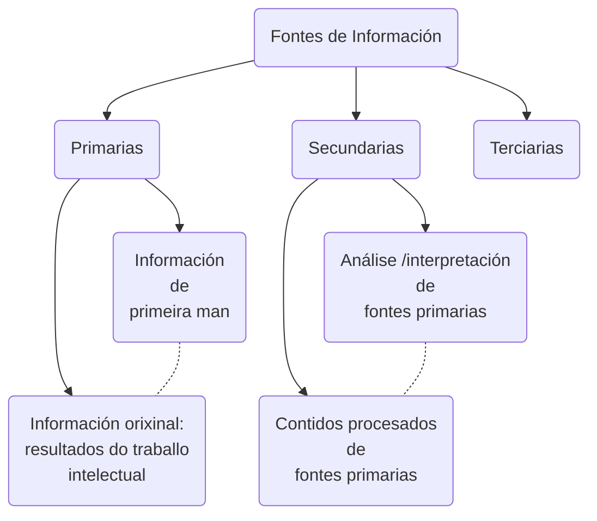

## Fontes de información {-}

### Definición {-}

Todos aqueles recursos que nos proporcionan datos sobre a música nas civilizacións e épocas anteriores á actual e que servirán de base do coñecemento histórico, son considerados fontes de información.
Son un instrumento para a procura e o acceso á información polo que hai que saber buscar e analizar as fontes que atopemos, para poder valorar a súa maior ou menor utilidade.

### Clasificación {-}

Dependendo do nivel de procura que fagamos, atoparemos diferentes tipos de fontes de información:
- **Fontes primarias**. Conteñen información orixinal que foi publicada por primeira vez e non foi filtrada, interpretada ou avaliada por ninguén máis. Son produto dunha investigación ou dunha actividade creativa.  
Son exemplos de documentos primarios, as monografías, libros, as publicacións en serie (periódicos, revistas etc.), actas de congresos, teses doutorais, traballos fin de grao, etc.
- **Fontes secundarias**. Conteñen información primaria, sintetizada e reorganizada. 
Están especialmente deseñadas para facilitar e maximizar o
acceso ás fontes primarias ou aos seus contidos.
A través deste tipo de fontes podemos acceder ás primarias cando non é posible acceder por unha ou outra razón.
Empregaremos as fontes secundarias para ampliar o contido da información dunha fonte primaria.  
Son exemplos de documentos secundarios, os catálogos de bibliotecas, bibliografías comerciais, índices de publicacións periódicas, índices de citas, etc.
- **Fontes Terciarias**: Conteñen información sobre as fontes secundarias.
Polo xeral, son listados que fan referencia a documentos secundarios.
A maneira máis sinxela de entendelo, sería pensar nunha bibliografía de bibliografías.
Son as menos traballadas, e naceron para poder dar acceso á gran proliferación de documentos secundarios.  
Son exemplos deste tipo de fontes, as guías de bases de datos, guías de obras de referencia e bibliografía de bibliografías, entre outras.

