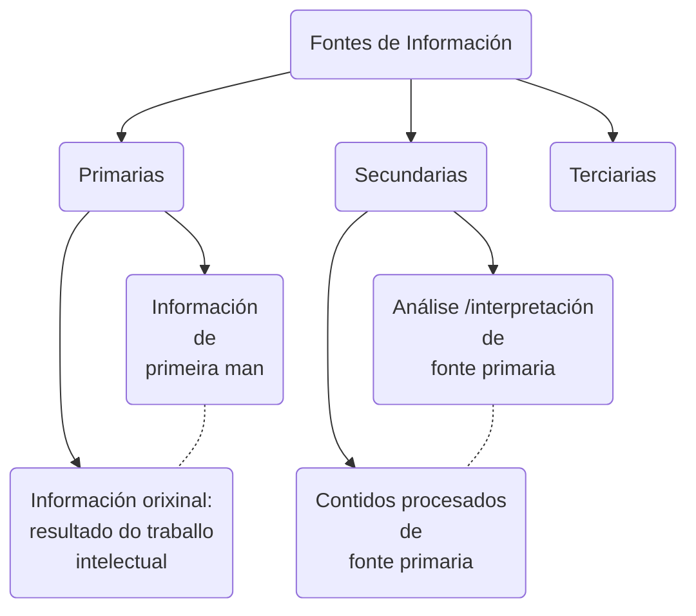

<!-- 
OBXECTIVO XERAL: 

- Coñecer o papel fundamental das fontes musicais á hora de elaborar a Historia da Música dende a Antigüedade ata a actualidade. 

OBXECTIVOS DIDÁCTICOS:

- Comprender o concepto de fonte musical 
- Dintinguir os diferentes tipos de fontes musicais: escritas, iconográficas e sonoras.

CONTIDOS:

- As fontes como ferramentas para narrar a Historia da Música 
- Tipos de fontes: escritas, sonoras e iconográficas
- Análise de diferentes tipos de fontes musicais 
- Comentario sobre a problemática que entrañan algunhas fontes desde diferentes puntos de vista: estado de conservación, criterios estéticos, etc.… 
- Valoración dos diferentes tipos de fontes musicais como ferramenta indispensable para unha correcta construcción da Historia da Música. 
-->

## As fontes de información histórica {-}

A actividade musical é tan antiga como a especie humana. Salvo a época prehistórica, da que só se teñen vagas nocións por restos de posibles instrumentos atopados en xacementos e por pinturas rupestres, o coñecemento da música das culturas antigas ven dado polo que denominamos «fontes de información».

Unha fonte de información é todo aquilo que nos proporciona datos para reconstruír feitos e as bases do coñecemento. Podemos afirmar que son un instrumento para o coñecemento, a procura e o acceso á información. Dependendo do nivel de procura que fagamos, atoparemos diferentes fontes de información.
 
Metemos código

### As fontes como ferramenta para o estudo da Música na Prehistoria e Antigüidade {-}

En **historiografía**, denomínanse «fontes» a todo o que aporta información para o estudo dunha determinada cultura.  
No caso da Historia da Música das Civilizacións da Prehistoria e a Antigüidade, as fontes son moi variadas. Así, falaremos de fontes de tipo iconográfico, como pinturas e esculturas; documentos escritos, como xeroglíficos e inscripcións en tumbas ou templos; literarios como a Biblia, (entre outros); restos arqueolóxicos, como é o caso de fragmentos de instrumentos desa época atopados en sarcófagos.

Consideramos como principais fontes de información, as seguintes:

1. **Arqueoloxía**. Os restos arqueolóxicos proporcionan importante información sobre a música de épocas antigas. Os máis importantes son os instrumentos musicais —ou partes de eles— que non se destruíron co paso do tempo; pero tamén se atopan restos de edificios e lugares onde se interpretaba música ou se danzaba. Entre os restos arqueolóxicos atópanse tamén as mostras máis antigas de notación musical.
2. **Iconografía**. A pintura, a escultura, os relevos e outras obras das artes visuais proporcionan información sobre instrumentos musicais, contextos e prácticas de interpretación, danzas, etc.
3. **Literatura**. A literatura, entendida como o conxunto de todo o escrito, ofrece abundante información musical: por exemplo, descríbense escenas musicais ou se plasma o pensamento sobre música; e os textos da música vocal mostran a estrutura rítmica, aínda que non se conserven as melodías. Dentro da literatura hai que incluír tamén as obras técnicas sobre música (tratados, métodos, etc.).
4. **Etnomusicoloxía**. A  etnomusicología, o estudo das músicas de tradición oral actuais, pode ás veces axudar á comprensión da actividade musical antiga. Aínda que non é correcto supoñer que en condicións de vida iguais desenvólvense culturas musicais iguais, ás veces o coñecemento das músicas tradicionais actuais pode proporcionar detalles sobre técnicas de interpretación de instrumentos antigos ou sobre movementos de danza, por exemplo.

Case todos os libros sobre Historia da Música, comezan narrando as circunstancias da Música na Idade Media. Este feito, transmite a idea de que a orixe da música na cultura occidental está relacionado co canto gregoriano. Ata hai ben pouco, eran contados os manuais que trataban a importancia da cultura musical da Antigüidade Grega. Que pasa entón coa música anterior? Que sabemos sobre as danzas e os "concertos cortesáns" da época dos faraóns? Que instrumentos empregaban nas celebracións funerarias e nas ofrendas aos deuses?

### Tipos de fontes de información {-}

A maioría das fontes con información musical das que dispoñemos, son **fontes indirectas**. Denomínanse así, aos restos que nos informan sobre os costumes e a vida musical que tiña determinada cultura. Así, por exemplo, unha pintura mural atopada no interior das pirámides, na que aparece representada unha agrupación instrumental é unha valiosa fonte de información, dado que podemos extraer diversa información como, que tipo de instrumentos se empregaban para interpretar música de conxunto, para quen e en que ocasión a interpretaban, o número de cordas que tiñan as arpas, a forma na que estaban construídas, a postura da intérprete, así como a causa de por que tocaba sobre unha tarima, etc. Esta é unha fonte de información indirecta.

Outro exemplo de fonte indirecta atopámola nos documentos escritos da época como é o caso da Biblia. En determinados salmos como o 33, fai mención a instrumentos empregados no culto como as cítaras (instrumento de corda pulsada), as arpas e as liras.

Existen moi poucas fontes, que nos falen sobre a música en si mesma é dicir, que nos indiquen as notas que se cantaban en determinado ritual ou danza. Só podemos falar de **fontes directas** cando os documentos nos achegan información musical, e para iso ten que haber algún tipo de notación, e o noso sistema de notación musical, xurdiu tras un longo proceso de evolución nos mosteiros durante a Idade Media. Esta, é a razón de que o manuais de historia da música comezan a relatar a orixe da música occidental na época medieval.  

Hoxe en día, sabemos que culturas das Civilizacións Avanzadas da Antigüedad como a grega ou a exipcia crearon a súa propia maneira de anotar os sons mediante letras do alfabeto ou mediante signos quironímicos.

