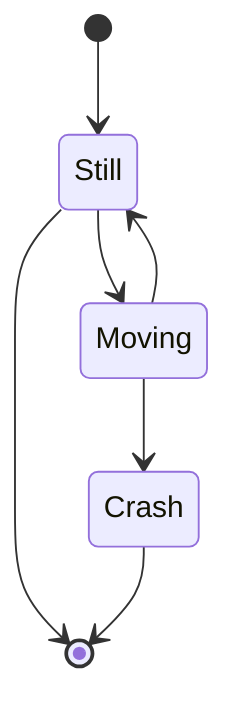

<!-- 
OBXECTIVO XERAL: 

- Coñecer o papel fundamental das fontes musicais á hora de elaborar a Historia da Música dende a Antigüedade ata a actualidade. 

OBXECTIVOS DIDÁCTICOS:

- Comprender o concepto de fonte musical 
- Dintinguir os diferentes tipos de fontes musicais: escritas, iconográficas e sonoras.

CONTIDOS:

- As fontes como ferramentas para narrar a Historia da Música 
- Tipos de fontes: escritas, sonoras e iconográficas
- Análise de diferentes tipos de fontes musicais 
- Comentario sobre a problemática que entrañan algunhas fontes desde diferentes puntos de vista: estado de conservación, criterios estéticos, etc.… 
- Valoración dos diferentes tipos de fontes musicais como ferramenta indispensable para unha correcta construcción da Historia da Música. 
-->

## As fontes de información histórica {-}

A actividade musical é tan antiga como a especie humana. Salvo a época prehistórica, da que só se teñen vagas nocións por restos de posibles instrumentos atopados en xacementos e por pinturas rupestres, o coñecemento da música das culturas antigas ven dado polo que denominamos «fontes de información».  

### Fontes para o estudo da Música na Prehistoria e Antigüidade {-}

En **historiografía**, denomínanse «fontes» a todo o que aporta información para o estudo dunha determinada cultura.  
No caso da Historia da Música das Civilizacións da Prehistoria e a Antigüidade, as fontes son moi variadas. Así, falaremos de fontes de tipo iconográfico, como pinturas e esculturas; documentos escritos, como xeroglíficos e inscripcións en tumbas ou templos; literarios como a Biblia, (entre outros); restos arqueolóxicos, como é o caso de fragmentos de instrumentos desa época atopados en sarcófagos.

Dentro do noso ámbito de estudo, consideramos como principais fontes de información as seguintes:

1. **Arqueoloxía**. Os restos arqueolóxicos proporcionan importante información sobre a música de épocas antigas. Os máis importantes son os instrumentos musicais —ou partes deles— que non se destruíron co paso do tempo; pero tamén se atopan restos de edificios e lugares onde se interpretaba música e danza. Entre os restos arqueolóxicos atópanse tamén as mostras máis antigas de notación musical.
2. **Iconografía**. A pintura, a escultura e outras obras das artes visuais proporcionan información sobre instrumentos musicais, contextos e prácticas de interpretación, danzas, etc.
3. **Literatura**. A literatura, entendida como o conxunto de todo o escrito, ofrece abundante información musical: algunhas fontes literarias describen escenas ou pensamentos musicais e tamén ideas sobre música; os textos da música vocal indican a estrutura rítmica, malia que non se conserven as melodías. Dentro da literatura hai que incluír tamén as obras técnicas sobre música como tratados, métodos, etc.
4. **Etnomusicoloxía**. A  etnomusicología, o estudo das músicas de tradición oral actuais, pode axudar á comprensión da actividade musical antiga. Aínda que non é correcto supoñer que en condicións de vida iguais desenvólvense culturas musicais iguais, ás veces o coñecemento das músicas tradicionais actuais pode proporcionar detalles sobre técnicas de interpretación de instrumentos antigos ou sobre movementos de danza, por exemplo.

```
mermaid
graph TB;
    Aa(Fontes de Información);
    B(Arqueoloxía);
    C(Iconografía);
    D(Literatura);
    E(Etnomusicoloxía);
    
    A-->B
    A-->C
    A-->D
    A-->E

```



Case todos os libros sobre Historia da Música, comezan narrando as circunstancias da Música na Idade Media. Este feito, transmite a idea de que a orixe da música na cultura occidental está relacionado co canto gregoriano. Ata hai ben pouco, eran contados os manuais que trataban a importancia da cultura musical da Antigüidade Grega. Que pasa entón coa música anterior? Que sabemos sobre as danzas e os "concertos cortesáns" da época dos faraóns? Que instrumentos empregaban nas celebracións funerarias e nas ofrendas aos deuses?

